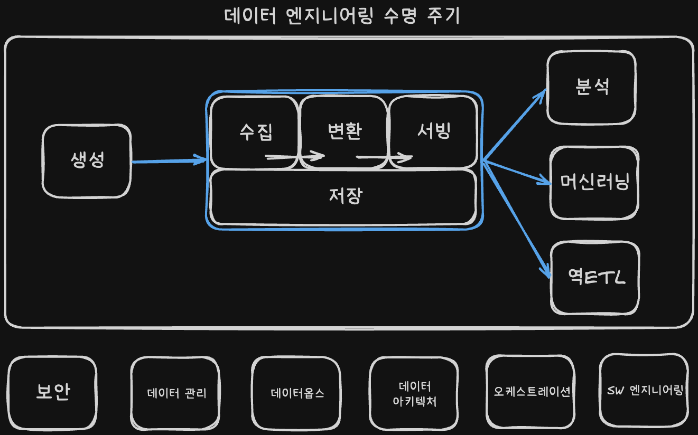

# 1장 데이터 엔지니어링 상세

# 1. 데이터 엔지니어링이란?

## 1.1 데이터 엔지니어링 정의

- 데이터 엔지니어링은 원시 데이터를 가져와서 사용 사례(ex. 분석, 머신러닝)를 지원하는, 고품질의 일관된 정보를 생성하는 시스템과 프로세스의 개발⋅구현⋅유지 관리
- 데이터 엔지니어는 원천 시스템에서 데이터를 가져와서 사용 사례(ex. 분석, 머신러닝)에 데이터를 제공하는 데이터 엔지니어링 수명 주기를 관리

---

## 1.2 데이터 엔지니어링 수명 주기

🔹 데이터 엔지니어링 수명 주기의 의미

- 데이터 엔지니어링 수명 주기를 통해 데이터 엔지니어들이 역할을 파악할 수 있음
- 데이터 엔지니어링 수명 주기는 기술이 아니라 데이터와 데이터가 제공해야 하는 최종 목표

🔹 데이터 엔지니어링 수명 주기의 단계

- 데이터 생성
- 데이터 저장
- 데이터 수집
- 데이터 변환
- 데이터 서빙

🔹 드러나지 않는 요소

- 데이터 엔지니어링 수명 주기에 걸쳐 드러나지 않는 요소라는 개념도 포함됨
- 보안, 데이터 관리, 데이터옵스, 데이터 아키텍처, 오케스트레이션, SW 엔지니어링

---

## 1.3 데이터 엔지니어의 진화

- 현재와 미래의 데이터 엔지니어링을 이해하기 위해 해당 분야가 어떻게 발전했는지 파악해야함
- 공통된 주제는 끊임없이 다시 나타나며, 오래된 것들은 다시 새로워짐

🔹 1980년부터 2000년까지: 데이터 웨어하우징에서 웹으로

- 데이터 엔지니어링의 뿌리는 데이터 웨어하우스, BI, ETL
- 이 시기에 SQL, 관계형 데이터베이스, 데이터 모델링이 핵심 기반으로 자리 잡음
- 킴벌·인먼의 모델링 방식은 지금도 중요한 기본기
- 1990년대 웹의 확산으로 데이터가 급격히 늘어나며, 기존 백엔드 시스템이 규모 한계에 부딪히기 시작함

🔹 2000년대 초: 현대 데이터 엔지니어링의 탄생

- 데이터 폭증으로 기존 단일 DB/웨어하우스 방식만으로는 버티기 어려웠음
- 그래서 분산 저장·분산 처리가 핵심 기술로 떠오름
- 구글의 GFS, MapReduce, 야후의 Hadoop, 아마존의 S3, EC2가 현대 데이터 엔지니어링의 기반을 만들었음
- 이 시기부터 데이터 엔지니어는 대용량 데이터를 처리하는 시스템 엔지니어 성격이 강해짐

🔹 2000년대와 2010년대: 빅데이터 엔지니어링

- 하둡, 스파크, 카산드라, 프레스토 등 다양한 빅데이터 도구가 빠르게 확산됨
- 배치 처리 중심에서 점차 이벤트 스트리밍·실시간 처리로 확장
- 하지만 현업에서는 작은 문제에도 빅데이터 기술을 과하게 쓰는 경우가 많았음
- 결국 중요한 건 최신 도구 자체보다 문제 크기에 맞는 기술 선택이라는 점이 드러났음
- 빅데이터 엔지니어의 많은 시간이 가치 전달보다 복잡한 운영과 관리에 쓰이기도 함

🔹 2020년대: 데이터 수명 주기를 위한 엔지니어링

- 최근 흐름은 복잡한 인프라를 직접 운영하기보다 관리형 서비스, 모듈형 도구, 추상화된 스택을 조합하는 방향
- 데이터 엔지니어는 이제 단순 파이프라인 개발자가 아니라 데이터 수명주기 전체를 관리하는 역할로 확장
- 중요 영역도 보안, 데이터 품질, 거버넌스, 오케스트레이션, DataOps, 아키텍처로 넓어졌음
- 이제 핵심은 “큰 데이터를 다룬다”보다 신뢰할 수 있고, 잘 관리되며, 쉽게 활용 가능한 데이터를 만드는 것
- 개인정보보호, 익명화, 규정 준수까지 데이터 엔지니어가 고려해야 하는 시대

🔹 주니어 데이터 엔지니어 관점에서 기억할 점

- SQL과 데이터 모델링은 여전히 가장 중요한 기본기
- 기술 유행보다 왜 이 기술이 등장했는지를 이해하는 게 더 중요함
- 큰 시스템을 만들수록 결국 중요한 건 확장성보다 운영 단순성, 데이터 품질, 신뢰성
- 데이터 엔지니어의 역할의 확장 : 데이터 처리 ⇒ 데이터 수명 주기 관리

---
