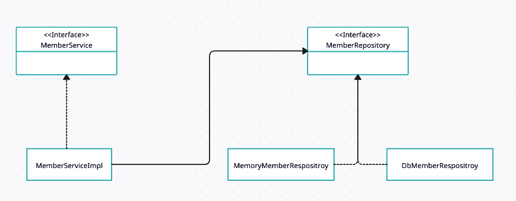
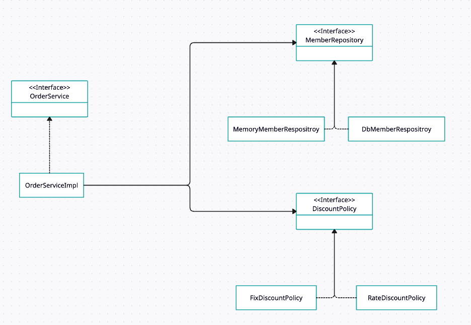

# 섹션 3. 스프링 핵심 원리 이해 - 예제 만들기

# 1. 프로젝트 생성

✅ 무엇을 구현했는가?

- Gradle(Groovy) 기반의 스프링 부트 프로젝트 생성([start.spring.io](http://start.spring.io))
- 의존관계 없이 생성

✅ 왜 이렇게 설계했는가?

- 스프링 부트는 프로젝트 세팅을 간소화해주며, 이후의 환경 구성과 실행을 쉽게 해주기 때문
- 우선 java로만 예제를 만들고 → 추후에 스프링을 사용해 고도화할 예정

# 2. 비즈니스 요구사항과 설계

### 📌 1. 회원(Member) 기능

✅ 핵심 요구사항

- 사용자는 회원을 가입하고, 가입한 회원을 조회할 수 있어야 함
- 회원은 두 가지 등급 중 하나로 분류됨
    - 일반 회원
    - VIP 회원

✅ 데이터 저장 방식

- 회원 정보를 저장할 수 있는 자체 DB 구축 가능
- 또는 외부 시스템과 연동하여 관리할 수도 있음 (미확정 사항)

### 📌 2. 주문(Order) 및 할인 정책(DiscountPolicy)

✅ 주문 기능

- 회원은 상품을 주문할 수 있음

✅ 할인 정책

- 회원 등급에 따라 할인 정책이 다르게 적용되어야 함
- 초기에 적용할 기본 정책:
    - VIP 회원은 1,000원 고정 할인
    - 일반 회원은 할인 없음

✅ 할인 정책의 유연성

- 할인 정책은 변경 가능성이 매우 높음
    - 회사의 최종 할인 정책은 아직 정해지지 않음
    - 오픈 직전까지 확정되지 않을 수 있음
    - 최악의 경우, 할인 자체를 적용하지 않을 수도 있음

### 📌 정리

✅ 무엇을 구현했는가?

- 회원 관리와 주문 시스템에 대한 도메인 요구사항 도출
- 등급에 따른 할인 정책 정의

✅ 왜 이렇게 설계했는가?

- 할인 정책과 저장소 구현 방식이 아직 `미확정`이기 때문에 ⇒ `인터페이스` 기반으로 유연하게 설계

# 3. 회원 도메인 설계

### 📌 정리

# 4. 회원 도메인 개발

### 📌 정리

✅ 무엇을 구현했는가?

- 클래스 : `Member`, `Grade`(enum) `MemoryMemberRepository`(구현체)
- 인터페이스 : `MemberRepository`, `MemberService`

✅ 왜 이렇게 설계했는가?

- DB는 나중에 변경 가능함 → ∴ `MemberRepository` 인터페이스 도입
- `MemberService` : 서비스 계층은 유지보수를 위해 인터페이스와 구현을 분리한 것

# 5. 회원 도메인 실행과 테스트

### 📌 정리

✅ 무엇을 구현했는가?

- `MemberApp`으로 회원 가입 흐름 테스트
- `MemberServiceTest`로 JUnit 단위 테스트 작성

✅ 문제점

- 현재 `MemberServiceImpl`이 `MemoryMemberRepository`에 직접 의존 → OCP, DIP 원칙 위반
- 클라이언트 코드가 저장소 구현체에 의존하게 되므로 변경에 약한 구조임

# 6. 주문과 할인 도메인 설계

# 7. 주문과 할인 도메인 개발

### 📌 정리

✅ 무엇을 구현했는가?

- 주문 생성 기능의 흐름과 역할 정리 (회원 조회 → 할인 → 주문 생성)
- `DiscountPolicy` 인터페이스 도입, 정액 할인 정책(`FixDiscountPolicy`) 구현 설계

✅ 왜 이렇게 설계했는가?

- 주문 서비스는 할인 정책에 직접 의존하지 않고 추상화된 역할만 의존
- `OrderServiceImpl`에서 `MemberRepository`와 `DiscountPolicy`를 통해 주문 생성
- 정책이 바뀌어도 주문 서비스 변경 없이 새로운 할인 정책만 구현하면 되도록 설계

# 8. 주문과 할인 도메인 실행과 테스트

### 📌 정리

✅ 무엇을 구현했는가?

- `OrderApp`에서 주문 흐름 실행
- `OrderServiceTest`에서 VIP 고객에 대한 할인 적용 테스트