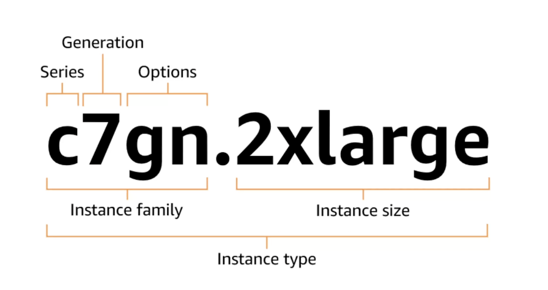

## 📌 EC2 소개

### 🔹 EC2란 

- Elastic Compute Cloud
- 컴퓨팅 리소스
- 특징
  - 다양한 OS 지원
  - 유연성과 확장성
  - 비용 효율성 : 사용한 만큼만 비용 지불
  - 보안성 : VPC, 보안그룹 활용
  - 글로벌 인프라

### 🔹 과금 옵션

- On-Demand
  - 기본값, 약정 없이 사용한 만큼 지불
- Spot
  - EC2 인스턴스 생성 시 선택 가능
  - 남는 EC2 용량을 저렴하게 사용
  - 임시적으로 리소스가 필요한 경우 활용, ex. 데이터 분석, 배치 작업
- Reserved (RI)
  - 비교적 저렴
  - 이미 실행 중인 On-Demand 사용량에 할인 적용

## 📌 Instance Type

### 🔹 Instance Type

- CPU, 메모리, 스토리지 등 다양한 조합으로 표현됨

### 🔹 Instance Family

- Series
- Genration
- Options

> 간단한 의미 및 각 예시로 이해하기

- t3.micro

### 🔹 Instance size

> 간단한 설명

### 🔹 실습

- EC2 > 인스턴스 유형
- 인스턴스 유형별로 다음과 같은 정보를 파악할 수 있음
- 프리티어 사용 가능, CPU, 아키텍처, 메모리, 디스크, 온디멘드 요금 등

## 📌 AMI

### 🔹 AMI란

- Amazon Machine Images
- EC2 인스턴스를 부팅하는데 필요한 소프트웨어를 제공하는 이미지
- AWS 자체 AMI / 커스터마이징 AMI 가능

## 📌 EBS

### 🔹 EBS란

- Elastic Block Store
- EC2에 연결해서 쓸 수 있는 블록 스토리지
- S3를 이용한 스냅샷을 저장하도록 설정할 수도 있음?
- Instance Store
  - 임시 스토리지
  - 매우 빠른 I/O 성능
  - 특정 EC2 인스턴스 타입을 지원
  - 캐시 데이터 등 활용
- 볼륨 생성 후 EC2와 연결해야 함

## 📌 Elastic IP

### 🔹 Elastic IP란

- 탄력적 IP 주소
- 인스턴스에 연결해서 사용하는 정적 IPv4 주소
  - 인스턴스를 중지했다가 다시 시작하면 IP 주소가 변경되는데, 이를 고정시키는 IP 주소
- 리전 당 5개 제한
  - 추가하고자 할 때는 요청
- 사용 여부와 상관없이 모든 탄력적 IP는 과금 대상

### 🔹 실습

- EC2 > 탄력적 IP 주소
  - 탄력적 IP 주소 할당
- EC2 인스턴스와 연결해줘야 함

## 📌 Security Group

### 🔹 Security Group이란

- 인스턴스에 대한 트래픽을 제어하는 가상의 방화벽
  - IP, 포트로 제어
- Inbound 규칙 : 외부에서 AWS 리소스로 들어오는 트래픽을 제어하는 규칙
- Outbound 규칙 : AWS 리소스에서 외부로 나가는 트래픽을 제어하는 규칙
