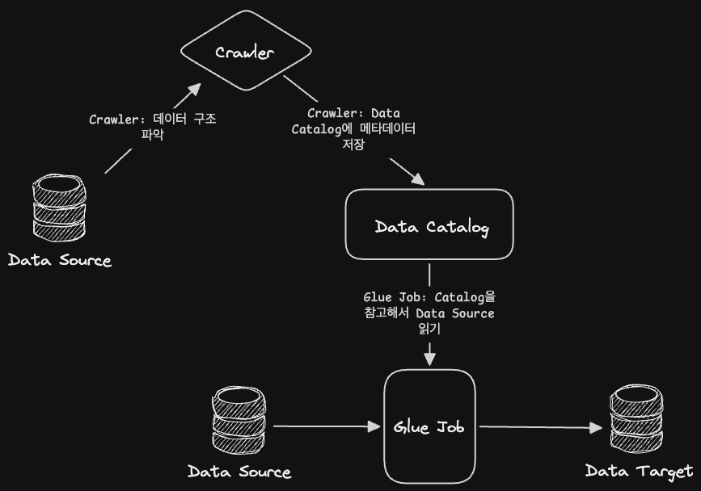
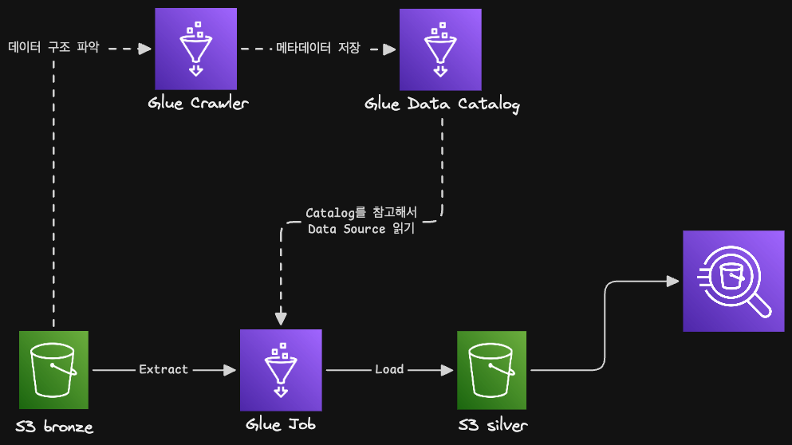
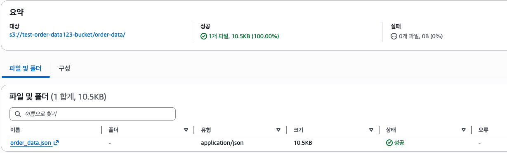
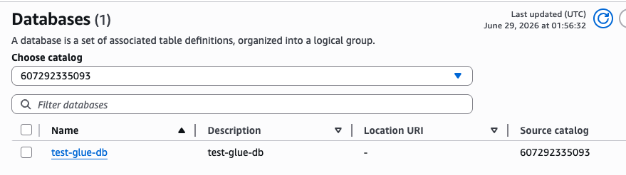
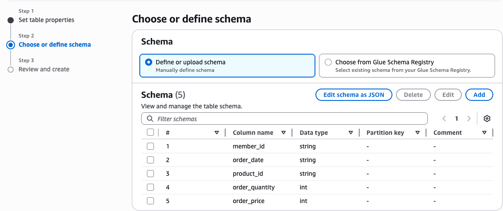
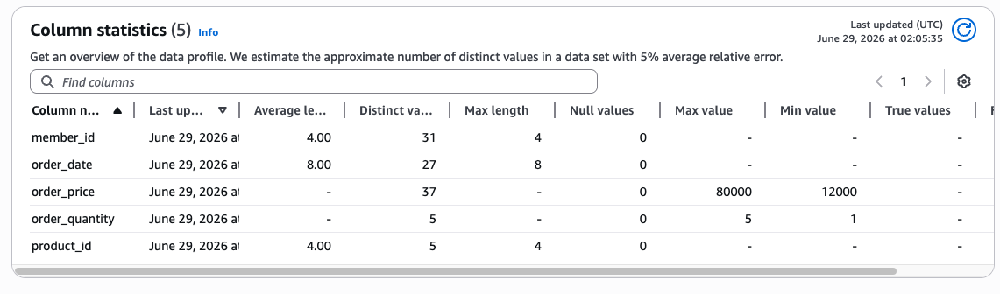
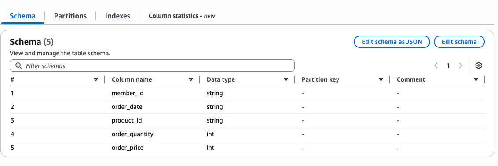

## 📌 AWS Glue 소개

### 🔹 Glue

- 서버리스 데이터 통합 서비스
- 완전 관리형 ETL 서비스
- 데이터 카탈로그, 크롤러, 트리거 등 여러 기능 제공
- Spark 기반 분산 처리 환경 제공 → 대규모 데이터 처리 가능
- 다른 AWS 서비스와의 통합(Athena, S3, Redshift 등)
- 과금 : 기본적으로 사용량에 따라 과금

### 🔹 Glue Architecture

- AWS Glue : 데이터를 찾아서 Catalog에 등록하고, ETL Job으로 변환한 뒤, Target에 적재하는 서버리스 데이어 파이프라인 서비스
  
- 컴포넌트별 역할
  - Data Source : 원본 데이터(S3, RDS, Redshift 등)
  - Crawler : 데이터 탐색기
  - Data Catalog : 데이터 주소록
    - 어디에 어떤 데이터가 있고, 스키마가 무엇인지 저장하는 메타데이터 저장소
  - Job : ETL 실행 단위
    - 데이터 읽기, 변환, 저장 작업
  - Script : 변환 코드 : Python 등으로 작성된 ETL 로직
  - Data Target : 결과 저장소
- 사용 사례 : 광고 로그 데이터 파이프라인
  

  ```
  S3 Bronze 광고 로그
    ↓
  Glue Crawler
    ↓
  Glue Data Catalog 테이블 생성
    ↓
  Glue Job 실행
    ↓
  TSV → Parquet 변환, 컬럼 정리, 날짜 파티셔닝
    ↓
  S3 Silver / Mart 적재
    ↓
  Athena 또는 BI에서 조회
  ```

  - Data Source : `s3://bucket/bronze/ad_clicks/`에 원본 `.tsv` 저장
  - Crawler : `.tsv` 파일을 읽고 `campaign_id`, `click_time` 같은 컬럼 구조 파악
  - Data Catalog : `ad_clicks_raw` 테이블의 메타데이터 저장
  - Job : 원본 데이터를 읽어서 변환 로직 실행
  - Script : 타입 변환, null 처리, Parquet 변환 등
  - Data Target : `s3://bucket/silver/ad_clicks_dt=2026-05-01/`에 저장

## 📌 Data Catalog

### 🔹 Data Catalog

- 메타데이터 저장소
- 크롤러를 이용한 데이터 자동 검색 가능
- Database, Stream Schema 등 제공
- Apache Iceberg를 이용한 테이블 최적화
- 다른 서비스와의 통합

### 🔹 Crawler

- 데이터 카탈로그를 자동으로 생성하기 위해 사용하는 기능
- 데이터 소스를 스캔하여 자동으로 스키마 추론
- S3, RDS, Redshift 등 여러 데이터 소스를 스캔 가능
- 테이블과 파티션 분류
- 온디멘드(한 번 실행) 또는 주기를 설정하여 실행

## 📌 실습 : Data Catalog 생성하기

### 🔹 S3에 데이터 업로드

- 파티션이 없는 구조로 실습
- S3 > 버킷 생성 > 폴더 만들기(member_data) > 객체 업로드
  

### 🔹 Glue

- Data Catalog > Databases > Add Database
  - DB 생성하기
    
- Table 생성
  - 테이블 생성 방법 2가지 : 메뉴얼, crawler
- Add Table
  - 이름 설정
  - DB 설정
  - 테이블 포맷 : Standard or Iceberg
  - Data Store : S3
  - Data location : s3에 있는 경로 선택
  - Data format 선택
  - 스키마 지정
    - Add 해서 Column명과 타입을 다 작성
      
- 이러면 테이블까지 잘 생성됨

### 🔹 통계정보 생성

- 테이블 > 컬럼 통계 정보 > statistics on demand
- IAM Role 생성 > Glue 선택
  - S3FullAccess, GlueServiceRole 선택
- 생성한 롤 선택
- 이후 통계정보 생성됨



### 🔹 크롤러를 이용

- 크롤러 선택 > 크롤러 생성
  - 크롤러 이름
  - Data soruce : mapping not yet
  - add data source : s3
  - location에서 s3 path 선택
  - iam role 선택
  - output : DB 생성
- 크롤러 생성 후 > Crawler runs > run crawler
- 작업이 완료되면 테이블이 새로 하나 생성됨
  - 전에는 스키마를 하나하나 입력해야했지만, 이제는 크롤러가 자동으로 감지해서 정리해줌
    

### 🔹 파티션

- S3 > 버킷 > 폴더 생성 > 세부 폴더 생성
  - 폴더 이름 : order_date=20250202
  - 이 안에 .json 넣기
- Glue > 테이블 > Add Table
  - 테이블 스키마 지정
  - order_date : 파티션키로 설정
- 메뉴얼로 생성하면 파티션은 안보임 → 아테나로 설정해야 가능
- Glue > 크롤러로 같은 데이터를 저장

### 🔹 S3의 파티션 vs RDBMS의 인덱스

- 파티션은 S3에서 읽을 경로를 줄이는 물리적 데이터 배치 전략
- RDBMS도 조회 범위를 축소하는 목적은 같지만, 인덱스라는 별도의 자료구조를 활용
- 파티션은 `order_date=20250122/`와 같은 경로로 분리
- RDBMS는 조건에 맞는 행 위치를 탐색하고, 파티션은 조건에 맞는 디렉터리만 스캔

### 🔹 Glue + Athena의 일반 External table은 Hive 방식과 유사함

- S3에는 데이터가 다음과 같이 저장되어 있음
  ```
  s3://bucket/orders/order_date=20250202/file.json
  s3://bucket/orders/order_date=20250203/file.json
  ```
- Glue Data Catalog에는 다음 메타데이터가 등록됨
  | 메타데이터 | 의미 |
  | ------------------ | ---------------------- |
  | table schema | 컬럼 구조 |
  | partition key | `order_date` |
  | partition value | `20250202`, `20250203` |
  | partition location | 각 S3 경로 |
- 이때 `WHERE order_date = '20250202'` 조건이 있으면 Athena는 전체 S3 경로를 다 읽지 않고 해당 partition 경로만 읽음
- Athena는 Hive style partition을 S3 폴더 기준으로 인식하고, 새로운 파티션을 Glue Data Catalog에 추가

## 📌 Glue ETL

### 🔹 Glue ETL란

- 완전 관리형 서비스
- 자동 코드 생성
- 데이터 카탈로그와 통합 가능
- Apache Spark 기반 엔진
  - 스트리밍 ETL 지원
- Scale-Out 아키텍처

### 🔹 Glue ETL의 ETL

- E (Extract)
  - 다양한 데이터 소스 지원
  - S3, RDS, DynamoDB 등
- T (Transform)
  - 데이터 정제, 조인 등 여러 변환 작업 지원
  - Python, Scala 언어를 이용한 커스텀 스크립트 지원
- L (Load)
  - 데이터 웨어하우스, 데이터 레이크 등 지원

### 🔹 Glue Studio

- 시각적 인터페이스 제공
- Drag & Drop 방식 UI
- 다양한 데이터 소스 연결
- 내장된 변환 기능
- 실행 및 모니터링
- 데이터 품질 제공

### 🔹 The DynamicFrames

- Glue ETL은 Spark 기반 엔진
- DynamicFrames는 Spark 기반의 자료구조
- 다른 AWS 서비스와의 통합하기 위해 Dataframes가 아닌 DynamicFrames가 만들어짐
- ETL에 더 잘 맞는 구조

### 🔹 DataFrames vs DynamicFrames

- DataFrames
  - 구조화된 테이블과 유사
  - 사전에 정의된 스키마 필요
  - 각 행은 동일한 구조
- DynamicFrames
  - Semi-Structured 데이터 처리
  - JSON, Avro 등
  - Spark DataFrames와 상호작용됨
  - DataFrames보다 약 2배 성능이 좋음
