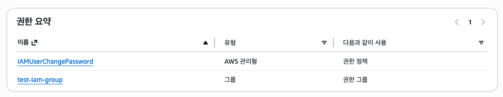
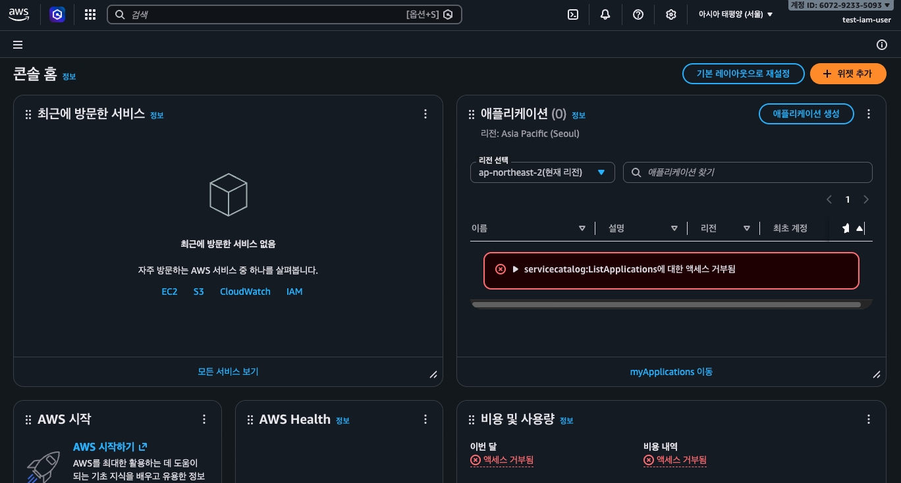
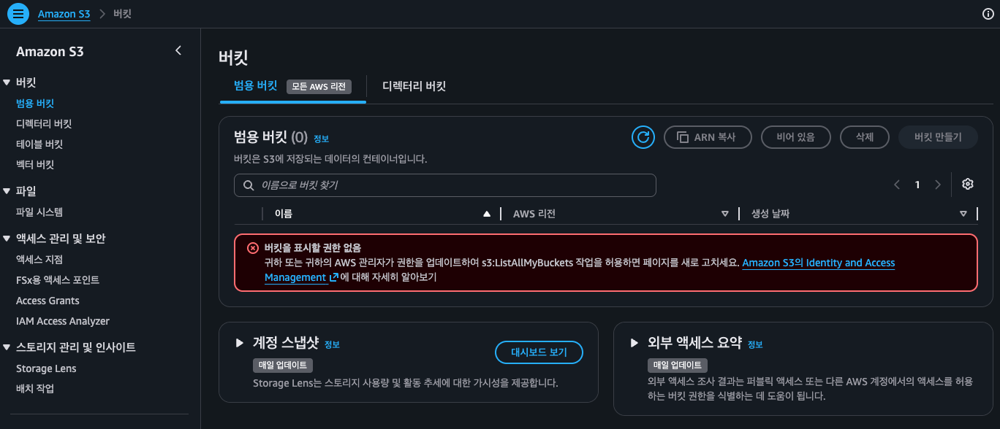
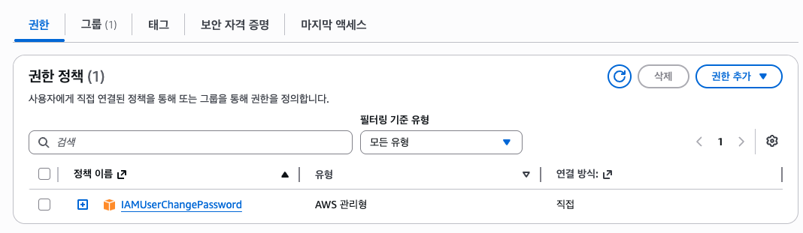
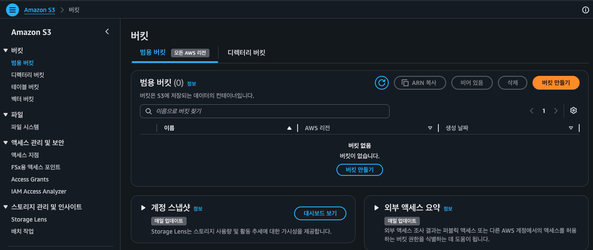

## 📌 IAM 소개

### 🔹 IAM이란

- Identity and Access Management
- 누가, 어떤 AWS 리소스에, 어떤 작업을 할 수 있는가를 제어하는 권한 시스템
- IAM을 사용해서 사용자 및 그룹별 세분화된 권한 관리
- 무료 사용

### 🔹 기본 개념

- User : AWS 계정
- Group : 여러 User를 묶은 집합
- Role : 특정 주체가 임시로 맡는 권한 identity
  - access key, password를 갖지 않음
  - ex. Airflow on EC2가 S3에 데이터를 저장할 때, EC2에 access key를 넣지 않고, EC2에 IAM Role을 부여
  - ex. `my-airflow-ec2-role` : EC2 Airflow가 S3/Glue에 접근할 때 사용함을 나타냄
- Policy : 허용/거부 권한을 정의한 JSON 파일
  - ex. S3 bronze 경로 읽기 허용 정책
- Permission : 실제로 가능한 작업
  - ex. `s3:GetObject`, `s3:PutObject`, `glue:CreateTable`

### 🔹 IAM 사용 방법

- AWS Management Console Access
  - 브라우저에서 AWS 웹 콘솔에 로그인해서 리소스를 조작하는 방식
- SDK & CLI를 이용한 AWS 서비스 접근
  - 코드나 터미널에서 AWS API를 호출하는 방식

## 📌 IAM 실습(유저 생성 및 권한 부여)

### 🔹 IAM 생성

- IAM > IAM 사용자 > 사용자 생성
- 사용자 세부 정보 지정
  - 사용자 이름 입력
  - AWS Management console 권한 제공 선택
- 권한 설정
  - 그룹 생성
- 검토 및 생성
  - 권한 요약
    
    !image.png
- 암호 검색
  - 이 사용자로 aws 콘솔에 접속하려면 이 링크로 접속해서 id, pw를 입력해야 함

### 🔹 일반 사용자 계정으로 로그인

- 시크릿 창에서 링크 및 id, pw로 로그인
  - 현재 그룹에 아무 권한을 설정하지 않았으므로, 다 제한된다고 콘솔에 뜸

### 🔹 루트 계정으로 해당 사용자에게 권한 부여

- 현재 해당 사용자는 권한이 1개 밖에 없음
  
- 권한 추가
  - 직접 정책 연결
  - `AmazonS3FullAccess`
- 이렇게 사용자에게 권한을 부여할 수 있음
- 개발 사용자에게 권한을 줄 수도 있고, 그룹에게 권한을 줄 수도 있음

### 🔹 테스트 사용자 화면에서, 권한 부여된 것 확인

- S3의 버킷 조회 및 생성 가능
  
