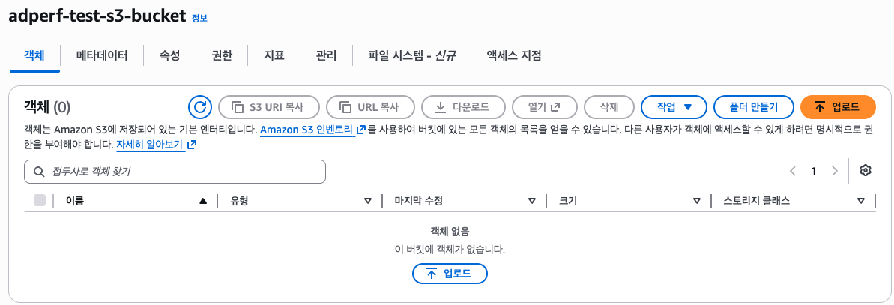
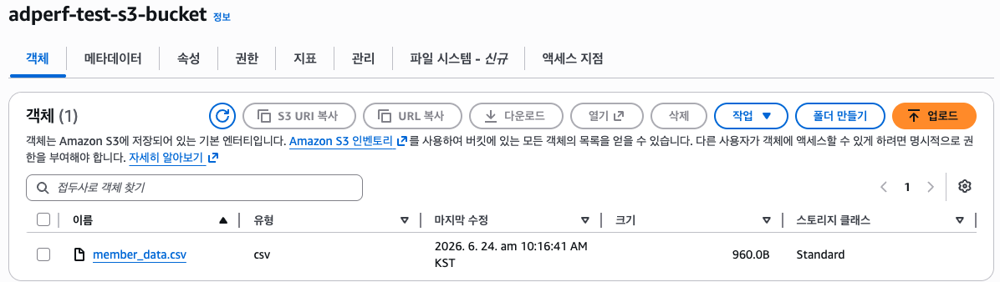
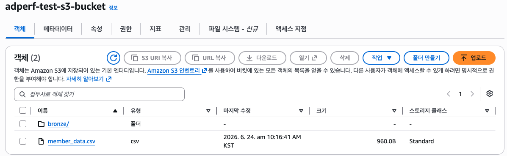
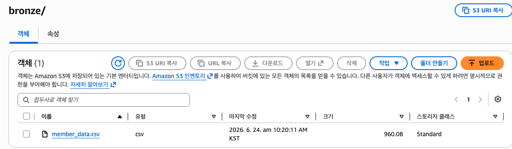
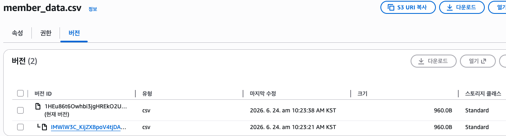

# S3

## 📌 스토리지 비교

### 🔹 객체 스토리지(Object Storage)

- 데이터를 객체로 저장하고 관리
- 구성 : 데이터 + 메타 데이터
- 평면구조로 접근이 빠르고 확장성이 좋음
  - 계층구조가 아니므로
- 확장성 : PB 규모로 유연하게 확장 가능
- 비용 효율성 : 사용한 만큼만 과금
- 내구성 및 가용성 : 데이터 복제 및 분산 저장 가능
- 사용 사례 : 데이터 레이크, 백업, 로그 저장, 웹 호스팅
- AWS의 객체 스토리지 서비스 : S3

### 🔹 파일 스토리지(File Storage)

- 데이터를 파일 단위로 저장하고 관리
- 각 파일은 제한적 메타데이터를 갖고 있음
- 폴더와 디렉토리의 계층 구조에 저장
- 사용자 친화적 : 익숙한 파일 구조
- 공유 및 협업 : 여러 사용자 동시 접근 가능
- 제한된 확장성 : 파일 수가 많아지면 성능 감소
- 사용 사례 : NAS, Amazon EFS

### 🔹 블록 스토리지 (Block Storage)

- 데이터를 일정한 크기의 블록으로 저장
- 파일 시스템 (ext4, NTFS)을 구성해야 함
- 고성능
- 유연성
- 고비용
- 사용 사례 : 가상머신 디스크, Amazon EBS

### 🔹 스토리지 비교

|             | 객체 스토리지                      | 파일 스토리지                    | 블록 스토리지                |
| ----------- | ---------------------------------- | -------------------------------- | ---------------------------- |
| 개념        | 객체로 데이터를 저장               | 파일로 데이터를 저장             | 블록으로 데이터를 저장       |
| 메타 데이터 | 사용자 정의 가능                   | 제한적                           | 매우 제한적                  |
| 확장성 ✅   | 무제한                             | 제한적                           | 중간                         |
| 성능 ✅     | 대용량 처리에 효율적               | 소규모 데이터에 적합             | 고성능, 낮은 지연 시간       |
| 장점        | 데이터 접근이 빠르고 확장성이 좋음 | 사용자 친화적                    | 다양한 접근경로로신속한 검색 |
| 단점        | 객체 수정 불가                     | 데이터 양이 늘어날수록 성능 저하 | 고비용, 관리 부담            |
| 사용사례    | 데이터 레이크                      | NAS                              | SAN                          |
| AWS         | S3                                 | EFS                              | EBS                          |

- 빅데이터 환경에서 중요한 확장성, 성능, 그리고 다양한 형태의 데이터를 저장할 수 있는 스토리지는 객체 스토리지
- 따라서 객체 스토리지를 데이터 레이크로 많이 사용함

## 📌 파일 포맷

### 🔹 파일 포맷

- 데이터를 저장하는 파일에는 여러 포맷이 있음
- ex. CSV, JSON, Avro, ORC, Parquet

### 🔹 CSV(Comma-Separated Values)

- 행과 콤마(`,`)로 구분된 열을 가진 표 형식
  - cf. tsv : Tab으로 구분하는 파일
- 사람이 직접 읽고 수정이 가능함
- 소, 중 규모의 데이터셋에 적합함
- 활용 사례 : 엑셀, Database, Pandas, etc

### 🔹 JSON(JavaScript Object Notation)

- Key-Value 쌍 기반의 정형 또는 반정형 데이터
- 사람이 직접 읽고 수정 가능
- 유연한 스키마
- 소, 중 규모의 데이터셋에 적합함
- 활용 사례 : Web Browsers, RESTful APIs, NoSQL

### 🔹 Avro

- 데이터와 스키마가 저장되어 있는 Binary 포맷
  - 데이터 교환·이벤트 스트리밍·분산 처리에서 구조화된 레코드를 안정적으로 읽고 쓰기 위함
  - 따라서 객체/레코드를 바이너리 형태로 인코딩함
- `.avro` 파일은 스키마를 JSON으로 표현하고, 실제 데이터는 바이너리로 저장
  ```
  .avro file
  ├── Header
  │   ├── avro.schema = 위 JSON 스키마
  │   ├── codec = null/snappy/deflate 등
  │   └── sync marker
  │
  └── Data Blocks
      ├── evt_001, 1001, 125.5, true 의 binary encoding
      ├── evt_002, 1002, 88.0, false 의 binary encoding
      └── ...
  ```
- 스키마가 있어서 프로그램이 데이터를 추측하지 않아도 됨
  - 타입, 필수여부 등 프로그램이 데이터를 처리할 수 있음
- 따라서 빅데이터 처리/실시간 처리에 유용
  - 빅데이터 처리는 데이터가 크고, 처리 주체가 많고, 시간이 지나면서 구조가 변경되므로
  - 실시간 처리에서 Producer, Consumer가 독립적인데 각 컴포넌트의 메세지 호환성 깨짐 문제를 사전에 체크 가능
- 활용 사례 : Apache Kafka, Spark, Flink, etc
  - 행 기반 저장 방식이라서 데이터 마트 구축에는 Avro 보단 Parquet 같은 파일이 더 유용

### 🔹 ORC(Optimized Row Columnar)

- Apache Hive에서 개발된 Binary 포맷
- Columnar, 효율적인 압축
- Apache Hive

### 🔹 Parquet

- Columnar Storage
- 효율적인 압축 제공
- 스키마 지원
- 분산 저장 및 병렬 처리
- 대규모 데이터셋과 분석 엔진
- 활용 사례 : Hadoop, Spark, Hive, Iceberg
  - ORC는 Hive, Parquet는 Spark와 더 잘 맞음

## 📌 S3 소개

### 🔹 AWS S3(Simple Storage Service)

- 객체 스토리지로 무제한 확장 가능
- 99.99999999999%의 내구성
- Versioning, Lifecycle 제공
- 사용한 만큼만 과금

### 🔹 S3 사용 사례

- 백업, 아카이브
- 어플리케이션 호스팅, 정적 웹사이트
- 데이터 레이크 & 분석

### 🔹 사용 방법

- Management Console
- SDK
  - Python 등 프로그래밍 언어로 접근
- CLI

### 🔹 과금

- 스토리지 비용 (GB당 - 스토리지 양, 클래스마다 다름)
- 요청 ( 횟수당 - PUT, COPY, GET, SELECT 등 )
- 데이터 전송 시
- 참고 링크 : https://aws.amazon.com/ko/s3/pricing/

### 🔹 기본 개념

- 버킷
  - 데이터를 담는 최상위 단위
  - 모든 리전을 통틀어 버킷 이름은 고유해야 함
- 객체
  - 버킷에 담는 데이터
  - Key는 전체 경로를 나타냄
    - Key는 Prefix와 object name으로 구성됨
    - `s3://버킷명/{prefix}/{object name}`
    - `s3://버킷명/folder1/sub_folder1/file.txt`
  - 최대 객체 사이즈 : 5 TB ( Multi-part Upload 이용 시 )
  - 객체에는 메타 데이터가 있음 ( Key-Value 쌍, 시스템 또는 사용자 지정)
  - Version ID
- 암호화
  - 암호화 키를 이용한 객체 암호화
  - SSE-S3, SSE-KMS, DSSE-KMS
  - 버킷 암호화, 객체 암호화 지정 가능하지만, 버킷 암호화가 있다면 버킷 암호화가 적용됨
- Versioning
  - 객체의 버전을 적용
  - 롤백이 가능함
  - 버킷 단위로 활성화 가능
- Access Control
  - 버킷 생성 시 정책을 정할 수 있음
  1. IAM을 이용한 특정 AWS 유저에게 제공
  2. 버킷 정책을 이용한 퍼블릭 접근

## 📌 실습 : S3 업로드 및 Versioning

### 🔹 실습 : 버킷 생성

- 리전 선택 > S3 > 버킷 만들기
  - 버킷 이름 지정
  - 객체 소유권 : ACL?
  - 퍼블릭 액세스 차단
  - 버킷 버전 관리 : 비활성화
  - 암호화 : 기본값 암호화 SSE-SSI
    
- 버킷에 파일 업로드
  
- 버킷명으로 DNS 주소를 만들어서 버킷명은 고유해야 함
  

### 🔹 prefix 생성하기

- S3 > 버킷 > 특정 버킷 > 폴더 만들기
  - `bronze`라는 폴더를 생성함
    
- 기존 객체를 폴더로 복사해보기
  - 객체 선택 후 복사 선택
  - 대상 : 생성한 폴더 선택
- 그럼 해당 폴더에 객체가 복사된 것을 볼 수 있음
  
- 그리고 복사된 객체의 URI를 보면, `{prefix}/{object name}`을 확인 가능
  
- 만약에 같은 객체명의 파일을 업로드하면 덮어쓰기가 됨
  - 이를 해결하는게 Versioning 기능

### 🔹 Versioning

- 버킷 > 버킷 만들기
  - 버킷 이름
  - 버킷 버전 관리 : 활성화
- 객체 업로드
- 객체 상세 정보에서 버전 탭을 누르면 정보 확인 가능
- 같은 파일을 업로드
- 버전 탭에서 확인해보면 새로운 버전이 올라온 것을 확인 가능
  
- S3 버저닝의 기준은 객체 이름, 즉 Object Key
  - 폴더명이 포함된 객체 이름까지가 Obejct Key

## 📌 스토리지 클래스

### 🔹 스토리지 클래스

- 데이터 특징과 목적에 따라 클래스 선택
- Standard, IA, Glacier, Intelligent-Tiering 등
- 스토리지 클래스마다 비용은 다름

### 🔹 Standard

- 가장 보편적인 목적
- 자주 접근이 필요한 경우
- 99.99% 내구성
- 저지연과 높은 처리량
- 사용 사례 : 빅데이터 분석, 모바일 & 게임

### 🔹 IA(Infrequent Access)

- 접근이 적지만 빠른 접근이 필요한 경우
- Standard에 비해 비용이 저렴

1. Standard-IA
   - 99.9% 내구성
   - 재해 복구, 백업
2. One Zone-IA
   - 99.5% 내구성
   - 온프레미스 데이터의 보조 백업

### 🔹 Glacier

- 거의 접근이 없는 경우 (아카이빙, 백업)
- 매우 저렴한 비용
- 접근 횟수에 따라 3가지 중 하나 선택해서 사용

1. Instant Retrieval
   - 검색 소요 시간 : ms
   - 유즈 케이스 : 분기에 한번 접근하는 경우
2. Flexible Retrieval
   - 검색 소요 시간 : m~h
   - 유즈 케이스 : 분기 이상 기간에 한번 접근하는 경우
3. Deep Archive
   - 검색 소요 시간 : 12h~48h
   - 유즈 케이스 : 반기에 한번 접근

### 🔹 Intelligent-Tiering

- 액세스 패턴이 불규칙하거나 예측하기 어려운 경우
- 자동으로 모니터링하고 계층으로 이동
- 검색 비용이 없음
- 5가지 티어 존재
  - Frequent Access, Infrequent Access, Archive Instant Access, Archive Access, Deep Archive Access

### 🔹 그 외

- S3 on Outposts : AWS 리전이 아니라 회사/기관 내부의 Outposts 장비에 S3를 배치해, 로컬 데이터 접근·처리·데이터 레지던시가 필요한 워크로드에 쓰는 S3 스토리지 클래스
- S3 Express One Zone : 데이터를 하나의 AZ에 저장하고, 컴퓨팅 리소스와 가깝게 배치해 매우 낮은 지연 시간과 높은 요청 처리량이 필요한 자주 접근하는 데이터에 쓰는 고성능 S3 스토리지 클래스

## 📌 S3 Lifecycle

### 🔹 S3 Lifecycle

- S3 데이터 수명주기 관리
- 버킷에서 지정
  - 모든 객체 또는 특정 Prefix나 Version에 대해 적용 가능

1. 전환 작업
   - 객체를 다른 스토리지 클래스로 전환 설정
   - ex. 생성한지 30일이 지나면 Standard IA 클래스로 전환
   - 전환 요청 시 추가 비용 발생
2. 만료 작업
   - 객체가 만료되는 시기 설정
   - ex. 생성한지 1년이 지나면 삭제

### 🔹 수명 주기 설정

- 규칙 범위
  - 해당 버킷에 모두 적용하거나, 필터를 사용해서 규칙의 범위 제한 가능
  - 필터 : 접두사, 객체 태그, 객체 크기
- 작업 선택
  - 상황에 맞는 전환, 만료 작업 선택
- 전환 작업 선택 시, 상위에서 하위 클래스로 내려갈 수는 있지만, 하위에서 상위로는 안됨
  ```json
  Standard > Standard IA > Intelligent Tiering > One-Zone IA > Glacier Instant Retrieval > Glacier Flexible Retieval > Glacier Deep Archive
  ```
- 전환 작업, 만료 작업은 설정해두면 S3가 매일 실행함

## 📌 실습 : 스토리지 클래스와 Lifecycle

### 🔹 스토리지 클래스 지정

- 폴더 생성 : intelligent
- 데이터 업로드
  - 업로드 할 때 속성에서 지능형 계층화 선택
- 업로드 후 파일의 스토리지 클래스를 확인
  - 지능형 계층화

### 🔹 수명주기 규칙 관리

- 버킷 > 관리 > 수명주기 규칙 생성
  - 규칙 이름 설정
  - 필터 설정 가능
  - 규칙 작업 설정 : ex. 버전 전환

## 📌 S3를 이용한 데이터 레이크 전략

### 🔹 S3를 이용한 데이터 레이크

- Raw Data
  - 원본 데이터 저장 및 보관
- Analytics Data
  - ETL 이용
  - Columnar Format 이용
  - Parquet / ORC
- Other Data
  - ETL 이용
  - ML, AI와 같은 특정 목적
  - 도메인 별 데이터 마트

### 🔹 S3를 이용한 레이크 하우스

- Data Lake + Data Warehouse
- 구조화, 비구조화 데이터 모두 저장 가능
- 유연함과 확장성
- ACID 트랜잭션
- 데이터 관리
- 대표적인 레이크 하우스 : Apache Iceberg, Apache Hudi, Delta Lake

### 🔹 데이터 레이크 vs 레이크 하우스

|                  | 데이터 레이크                        | 레이크 하우스                                             |
| ---------------- | ------------------------------------ | --------------------------------------------------------- |
| 정의             | 원시 데이터를 저장하는 중앙 저장소   | 데이터 레이크 + 데이터 웨어하우스의장점을 결합한 아키텍처 |
| 데이터 처리 방식 | 주로 배치 처리                       | 배치 처리 + 실시간 처리                                   |
| 스키마           | 스키마 없음                          | 스키마 적용                                               |
| 메타데이터 관리  | 외부 메타스토어 필요(Hive Metastore) | 통합된 메타데이터 관리 기능 포함                          |
| 기술 스택        | Amazon S3, Hadoop                    | Apache Iceberg, Hudi, Delta Lake                          |

### 🔹 S3 성능 최적화 전략

- File Format
  - Columnar Storage
  - ex. ORC, Parquet
- Compression
  - ex. GZIP, Snappy 등
- Partition 전략
  - S3 구조를 Partition 형태로 변경
    - S3는 스캔하는 만큼 비용이 청구되므로, 파티션 형태로 바꾸면 성능과 비용에 좋음
  - Key=Value 형태로 폴더 구조 형성
