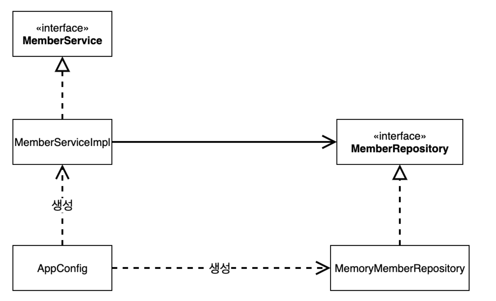

# 섹션 4. 스프링 핵심 원리 이해2 - 객체지향 원리 적용

# 1. 새로운 할인 정책 개발

👱‍♂️ 기획자 : 주문 금액당 할인하는 정률(%) 할인으로 정책 변경

- ∴ 이에 `RateDiscountPolicy`를 개발

✅ 테스트에선 실패 케이스에 대한 테스트도 중요함

### 📌 정리

✅ 무엇을 구현했는가?

- 정률 할인 정책 클래스와 그에 대한 테스트 개발
- `RateDiscountPolicy`, `RateDiscountPolicyTest`

# 2. 새로운 할인 정책 적용과 문제점

### 📌 문제 배경

✅ 현재 문제점

- 현재 주문 서비스(`OrderServiceImpl`)는 할인 정책(`DiscountPolicy`)을 사용함
- 정액 할인(`FixDiscountPolicy`)에서 정률 할인(`RateDiscountPolicy`)으로 변경 시도하면, 주문 서비스의 코드를 고쳐야함
- 1줄 변경이라도 고치긴 고쳐야함

🤖 `OrderServiceImpl`

```java
public class OrderServiceImpl implements OrderService {
    // private final DiscountPolicy discountPolicy = new FixDiscountPolicy();
    private final DiscountPolicy discountPolicy = new RateDiscountPolicy();
}
```

✅ 코드 평가

| 역할과 구현의 분리 | ⭕️ |
| --- | --- |
| 다형성 활용 | ⭕️ |
| OCP, DIP | ❌ |

### ❌ 문제점 1: DIP 위반 (의존성 역전 원칙)

✅ DIP

> 고수준 모듈은 저수준 모듈에 의존하면 안 되고, 둘 다 추상화에 의존해야 한다.
>

✅ DIP 위반 근거

- 현재 `OrderServiceImpl`은 `DiscountPolicy`라는 인터페이스(추상화) 에 의존하고 있음
- 그러나 내부 코드를 보면 구체 클래스도 함께 의존하고 있음
- 따라서 DIP 위반

💡 객체 A가 객체 B를 의존하고 있다

- 객체 A 코드 안에 객체 B에 대한 정보가 있다
- 여기선 `new FixDiscountPolicy`라는 1줄이 있음 → `OrderServiceImpl`이 의존하고 있는 것

### ❌ 문제점 2: OCP 위반 (개방-폐쇄 원칙)

✅ OCP

> 확장에는 열려 있어야 하고, 변경에는 닫혀 있어야 한다.
>

✅ OCP 위반 근거

- FixDiscountPolicy를 RateDiscountPolicy로 교체하려고 하면 코드를 수정해야함
- `OrderServiceImpl` 클래스 자체를 변경
- 정책을 확장한 것 뿐인데, 클라이언트 코드를 수정했으므로 OCP 위반

### 🛠 해결 방안: 클라이언트가 구현을 몰라도 되도록 설계 변경

1️⃣ 인터페이스에만 의존하도록 코드 변경 (DIP 만족)

```java
public class OrderServiceImpl implements OrderService {
    private DiscountPolicy discountPolicy; // 이제 구현체를 직접 생성하지 않음
}
```

- `OrderServiceImpl`은 더 이상 `FixDiscountPolicy`나 `RateDiscountPolicy`에 의존하지 않음
- 인터페이스에만 의존하므로 DIP 만족

2️⃣ 하지만 실행 시 오류 발생 (NPE)

```java
OrderServiceImpl service = new OrderServiceImpl();
service.createOrder(...); // NullPointerException 발생!
```

- 구현체가 없으니 `discountPolicy`는 `null` → 실행 시 NPE 발생

### ⚒️ 궁극적 해결: **누군가가 구현 객체를 생성하고 주입해야 함**

✅ 이 역할을 수행하는 게 바로 AppConfig 또는 스프링 컨테이너

# 3. 관심사의 분리

### 📌 현재 코드의 문제

✅ 현재 주문 서비스(OrderServiceImpl) 클라이언트는 책임이 여러 개임

- 주문 서비스에 대한 로직 & 구현체 클래스 결정 ⇒ 책임 중복

```java
public class OrderServiceImpl implements OrderService {
    private final DiscountPolicy discountPolicy = new FixDiscountPolicy();
}
```

✅ 현재 주문 서비스 클라이언트는 OCP, DIP 위반

- 변경이 발생할 때 클라이언트 클래스도 같이 수정해야함

### ⚒️ 해결 방안: AppConfig 도입 ⇒ 관심사 분리

✅ `AppConfig`를 사용하는 것이 왜 관심사 분리인가?

- 설정 클래스(AppConfig) 를 새로 만들어 객체 생성과 연결을 담당하게 분리
- 그러면 객체 생성, 연결(설정 책임)과 객체 사용(실행 책임)을 분리하는 것

✅ `AppCofig`는 생성한 객체의 참조값을 생성자로 주입해줌

### 📌 관심사 분리 ⇒ ∴ 클라이언트 코드 변경 X

 

✅ 관심사 분리의 장점

- 클라이언트는 더 이상 구현체를 직접 생성하지 않고 주입된 인터페이스만 사용
- 클라이언트는 인터페이스에만 의존 → DIP 충족
- 클라이언트는 주입만 받기 때문에 OCP 충족

✅ `MemberServiceImpl`, `OrderServiceImpl`은 더이상 구현 객체에 의존하지 않음

- 의존 관계에 대한 고민은 외부(AppConfig)에 맡기고, 해당 실행에만 집중



### ✅ DI(Dependency Injection)의 적용

- `AppConfig`가 객체를 생성하고 의존관계를 생성자를 통해 주입함으로써 DI 실현
- DIP 완성 : `MemberServiceImpl`은 추상 클래스(`MemberRepository`)에만 의존하면 됨
- 관심사 분리 : 객체를 생성하고 연결하는 역할과 실행하는 역할의 분리

✅ `MemberApp`, `OrderApp` 클래스도 구현 클래스에 의존하지 않고 `AppConfig`를 통해 DIP 충족

### 📌 테스트 코드에서도 AppConfig 활용

✅ `@BeforeEach` 키워드로 각 테스트를 호출하기 전에 구현체를 주입받음

### 📌 정리

✅ AppConfig로 관심사 분리 : 객체 생성,연결 책임 ↔ 실행 책임을 분리

✅ AppConfig로 DIP 충족 : 추상 클래스에만 의존하므로

✅ AppConfig로 OCP 충족 : 새로운 구현 클래스를 추가해도 클라이언트 코드에 변경 없음

# 4. AppConfig 리팩터링

AppConfig에는 중복이 있고, 역할에 따른 구현이 잘 안보임?

→ 코드로 설명

리팩토링한 코드의 장점

new MemoryMemberRepository 중복 제거

AppConfig의 역할과 구현 클래스가 한눈에 들어옴

따라서 앱의 전체 구성이 어떻게 되어 있는지 파악 가능

### 📌 문제 인식: 중복과 불명확한 역할-구현 구분

✅ 기존 `AppConfig` 구현에서는 다음 두 가지 문제가 존재함

**1.** 중복된 객체 생성

- `new MemoryMemberRepository()`가 여러 곳에서 반복됨
- 동일한 구현체가 여러 번 생성되고, 해당 구현 클래스를 다른 것으로 교체하려면 여러 곳을 수정해야함

2. 역할과 구현이 코드 상 분리되지 않음

- 역할(`MemberRepository`, `DiscountPolicy`)과 구현(`MemoryMemberRepository`, `FixDiscountPolicy`)이 명확히 구분되지 않음
- `AppConfig`를 읽는 사람이 "어떤 역할이 어떤 구현체로 연결되는가"를 직관적으로 파악하기 어려움
- 애플리케이션 설정이 "설정 역할"보다는 "즉석 객체 생성 코드"에 가까움

### ⚒️ 리팩터링 목적

✅ 리팩토링 효과

- 중복된 코드 제거 → 유지보수성 향상
- 역할(인터페이스)과 구현(클래스)의 매핑 구조를 한눈에 보이게 → 설정 클래스의 명확한 역할

### 📌 리팩터링 전후 비교

| 항목 | 리팩터링 전 | 리팩터링 후 |
| --- | --- | --- |
| 중복 | `new MemoryMemberRepository()` 중복 발생 | `memberRepository()`로 일원화 |
| 구현 교체 | 여러 위치 수정 필요 | 단일 메서드 수정으로 전체 반영 |
| 역할-구현 구분 | 불명확 | 명확: `DiscountPolicy → FixDiscountPolicy` |
| 구조 이해 | 클래스 간 연결 파악 어려움 | 설정 클래스만 봐도 전체 구조 파악 가능 |

✅ 만약 정책이 변경되어 구현 클래스를 변경해야한다면 1줄만 수정해서 정책 변경 가능

- OCP(Open-Closed Principle) 실현

# 5. 새로운 구조와 할인 정책 적용

### 📌 변경 시나리오

✅ 정액 할인 → 정률 할인으로 변경

- 기존 할인 정책: `FixDiscountPolicy` (정액 할인)
- 새로운 정책: `RateDiscountPolicy` (정률 할인)

### 📌 AppConfig로 앱의 관심사가 분리됨

| 구분 | 역할 | 예시 |
| --- | --- | --- |
| **사용 영역** | 실제 비즈니스 로직을 수행 | `OrderServiceImpl`, `MemberServiceImpl` |
| **구성 영역** | 객체를 생성하고 연결 | `AppConfig` |

✅ 할인 정책을 변경해도 AppConfig의 코드 1줄만 수정하면 됨

- 클라이언트 코드(`OrderServiceImpl`)은 전혀 수정하지 않음

### 📌 설계 원칙 적용 분석

✅ DIP ⇒ ⭕️

- 구현이 아닌 인터페이스에 의존
- `OrderServiceImpl`은 `DiscountPolicy` 인터페이스에만 의존하므로

✅ OCP ⇒ ⭕️

- 확장엔 열려있고 변경엔 닫혀야함
- 구현 객체를 `FixDiscountPolicy`에서 `RateDiscountPolicy`로 변경해도 클라이언트 코드(`OrderServiceImpl`)는 변경 없음

✅ 관심사 분리 ⇒ ⭕️

- AppConfig에서 객체의 생성, 연결 담당
- 서비스(OrderServiceImpl)는 객체의 실행에 집중

# 6. 전체 흐름 정리

### 1️⃣ 새로운 할인 정책 개발

- 다형성 ⇒ ∴ 새로운 할인 정책 클래스(`RateDiscountPolicy`)를 쉽게 추가 가능
- 인터페이스 기반 설계로 코드 확장 가능

---

### 2️⃣ 새로운 할인 정책 적용과 문제점

- 정책을 실제로 적용하려 하니 문제 발생 : 클라이언트(`OrderServiceImpl`) 코드를 수정해야하는 문제
- 문제의 원인 : `OrderServiceImpl`이 구체 클래스(`FixDiscountPolicy`)에 의존 ⇒ DIP 위반
- 정책을 바꾸려면 클라이언트 코드를 수정해야함 ⇒ OCP 위반

---

### 3️⃣ 관심사의 분리

- `OrderServiceImpl`에는 객체의 생성과 실행 책임이 섞여 있었음
- 이를 분리하기 위해 AppConfig 사용
- AppConfig : 객체 생성/연결
- 클라이언트 : 객체 실행

---

### 4️⃣ AppConfig 리팩터링

- 중복 제거: `new MemoryMemberRepository()` 등 반복 제거
- 역할과 구현이 분명하게 드러게 수정
- ∴ 변경 지점이 명확해짐, 유지보수 용이

---

### 5️⃣ 새로운 구조와 할인 정책 적용

- 할인 정책을 변경해도 AppConfig만 수정하면 됨
- 클라이언트 코드는 그대로 유지
- DIP, OCP, 관심사 분리 모두 만족

---

### ✅ 결론

| 구분 | 핵심 내용 |
| --- | --- |
| 문제 | 클라이언트가 구체 구현에 의존 → DIP/OCP 위반 |
| 해결 | AppConfig 도입으로 생성 책임 분리 |
| 효과 | 사용 영역은 변경 없이 유지, 확장 가능성 확보 |
- 이는 스프링의 DI(의존관계 주입) 철학을 코드로 구현한 기반 구조

# 7. 좋은 객체 지향 설계의 5가지 원칙 적용

### 📌 객체지향 설계 3대 원칙 정리

| 원칙 | 핵심 요약 | 적용 확인                                                                    |
| --- | --- |--------------------------------------------------------------------------|
| **SRP**(단일 책임 원칙) | 한 클래스는 하나의 책임만 가져야 함 | ✅ `OrderServiceImpl` 등 클라이언트 객체는 실행만 담당 <br>✅ `AppConfig`가 객체 생성과 연결을 담당 |
| **DIP**(의존관계 역전 원칙) | 추상화에 의존하고 구체화에 의존하지 말 것 | ✅ 클라이언트는 `DiscountPolicy` 인터페이스에만 의존 <br>                                     ✅ `AppConfig`가 구체 객체(`FixDiscountPolicy`)를 생성해 주입 |
| **OCP**(개방-폐쇄 원칙) | 확장에는 열려 있고 변경에는 닫혀 있어야 함 | `Fix → RateDiscountPolicy` 로 기능 확장 할 때 클라이언트 코드 수정 없이 `AppConfig`만 변경    |

✅ 객체지향 원칙에 맞는 유연하고 확장 가능한 구조

- 객체 생성과 실행 책임을 분리(SRP)
- 클라이언트는 인터페이스만 의존(DIP)
- 정책을 바꿔도 클라이언트는 변경 없음(OCP)

# 8. IoC, DI, 그리고 컨테이너

### 📌 제어의 역전 (IoC: Inversion of Control)

✅ 전통적인 흐름

- 예전에는 클라이언트 객체가 직접 필요한 서버 객체를 생성하고 연결하고 실행했음
- 즉, 클라이언트가 전체 제어 흐름을 갖고 있음

✅ AppConfig 등장 이후

- 객체 생성과 연결은 AppConfig가 담당
- `OrderServiceImpl`은 필요한 인터페이스만 호출하고, 어떤 구현체가 들어올지는 모름
- 프로그램의 제어 흐름이 외부(AppConfig)에 의해 역전됨

> 👉 이러한 흐름의 전환을 제어의 역전(IoC)이라고 함
>

✅ IoC 예시

| 구분 | 설명 |
| --- | --- |
| 기존 구조 | `OrderServiceImpl`이 `FixDiscountPolicy`를 직접 생성 |
| IoC 구조 | `AppConfig`가 `OrderServiceImpl`과 `FixDiscountPolicy`를 생성 및 연결 |

---

### 📌 프레임워크 vs 라이브러리

| 구분 | 설명 |
| --- | --- |
| 프레임워크 | 내가 짠 코드를 프레임워크가 제어하고 실행 (예: JUnit) |
| 라이브러리 | 내가 직접 호출하여 제어 흐름을 내가 관리 |

> 스프링은 개발자가 작성한 객체를 컨테이너가 제어하므로 프레임워크
>

---

### 📌 의존관계 주입 (DI: Dependency Injection)

✅ 핵심 개념

- `OrderServiceImpl`은 `DiscountPolicy` 인터페이스에만 의존
- 어떤 구현 객체(`Fix` or `Rate`)가 들어올지는 외부(AppConfig)가 주입

✅ 클래스 의존 vs 객체 의존

| 구분 | 설명 |
| --- | --- |
| 정적인 클래스 의존 관계 | `import` 구문을 통해 분석 가능.애플리케이션 실행 전 파악 가능 |
| 동적인 객체 의존 관계 | 실행 시점(runtime) 에 객체가 주입되어 참조 관계가 결정됨 |

✅ 예시 : **`OrderServiceImpl.java`**

```java
public class OrderServiceImpl implements OrderService {
    private final DiscountPolicy discountPolicy; // 인터페이스만 의존
    // 생성자에서 주입
}
```

- 위 코드는 정적으로는 `DiscountPolicy`에 의존하지만 실제 주입되는 객체는 FixDiscountPolicy or RateDiscountPolicy

✅ DI를 사용하면 장점

- 클라이언트 코드 변경 없이 구현체를 교체 가능
- 정적 의존 관계는 유지하면서, 동적 객체 의존 관계를 쉽게 변경 가능

---

### 📌 IoC 컨테이너 vs DI 컨테이너

| 용어 | 설명 |
| --- | --- |
| **IoC 컨테이너** | 객체의 생성, 관리, 의존관계 주입을 담당 |
| **DI 컨테이너** | 의존관계 주입에 중점을 둔 IoC 컨테이너 |
| 기타 명칭 | 어셈블러(Assembler), 오브젝트 팩토리 등으로도 불림 |

> 스프링에서 말하는 스프링 컨테이너 = DI 컨테이너
>
>
> DI를 중심으로 구성된 객체 관리 시스템
>

---

### 📌 정리

✅ IoC, DI

- 스프링은 객체 생성, 연결, 실행 흐름을 클라이언트에서 컨테이너(AppConfig 등)로 넘김 ⇒ 이것이 `제어의 역전(IoC)`
- 이렇게 객체를 외부에서 대신 만들고 연결해주니까 필요한 객체를 코드 내부에서 직접 생성하지 않고 주입 받음 ⇒ 이것이 `의존관계 주입(DI)`

✅ IoC와 DI의 관계

- DI는 IoC의 구현 방식 중 일부

# 9. 스프링으로 전환하기