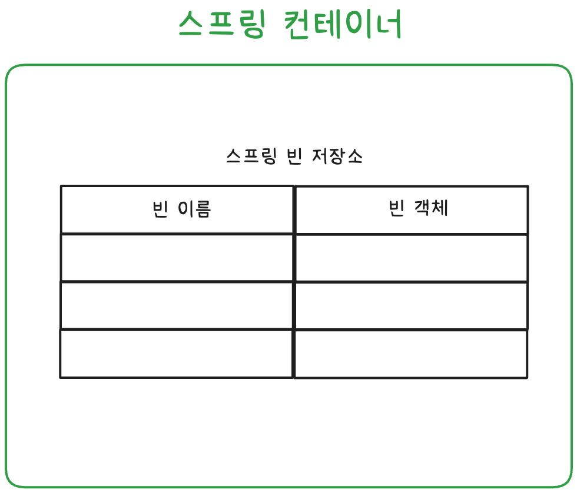

# 섹션 5. 스프링 컨테이너와 스프링 빈

# 1. 스프링 컨테이너 생성

### 📌 스프링 컨테이너 생성

🤖 코드

- `AppConfig.class` 설정 정보로 Annotation 기반 스프링 컨테이너 생성

```java
ApplicationContext applicationContext =
    new AnnotationConfigApplicationContext(AppConfig.class);
```

### 📌 `ApplicationContext`

✅ 스프링 컨테이너의 대표 인터페이스

- 스프링 컨테이너는 보통 `ApplicationContext`를 말함
- 빈 관리, 의존관계 주입, 생명주기 관리 등을 담당
- 애노테이션 기반 설정을 사용하는 경우, 구현체로 `AnnotationConfigApplicationContext`를 사용

### 📌 스프링 컨테이너 생성 흐름

✅ 스프링 컨테이너가 설정 정보를 기반으로 빈을 등록하고 의존관계를 연결하는 과정

1️⃣ 1단계: 스프링 컨테이너 생성

- 설정 정보를 기반으로 스프링 컨테이너 생성
- `new AnnotationConfigApplicationContext(AppConfig.class)`

- 스프링 컨테이너 안에는 스프링 빈 저장소가 있음



2️⃣ 2단계: 스프링 빈 등록

- `@Bean`이 붙은 메서드를 기반으로 빈 등록
- 빈 이름 ⇒ 메서드명
- 빈 객체 ⇒ 메서드의 반환 객체
- cf. 어노테이션을 통해 직접 빈 이름을 지정할 수 있음
- 주의 : 빈 이름 중복 금지

- AppConfig.class 정보를 이용해 스프링 빈 저장소를 구성한 모습


3️⃣ 3단계: 의존관계 설정 (준비)

- 각 빈이 필요로 하는 다른 빈 정보를 분석
- 생성자 파라미터 등을 기반으로 어떤 의존 객체가 필요한지 파악
- 설정 메서드 내에서 다른 `@Bean` 메서드를 호출함으로써 연결될 의존 객체들을 준비

4️⃣ 4단계: 의존관계 설정 (주입 완료)

- 스프링이 실제 객체들을 생성하고, 의존관계를 연결
- 설정 클래스 내의 메서드 호출을 통해 객체를 생성하고 의존성을 주입
- 이때 실제로는 스프링이 내부적으로 싱글톤으로 관리하며 중복 생성 방지
- 생성자 호출과 DI가 동시에 일어나는 것처럼 보이지만, 실제로는 스프링이 단계를 분리해 관리

### 📌 참고: 자바 코드와 스프링 DI의 차이점

| 항목 | 자바 코드 | 스프링 컨테이너 |
| --- | --- | --- |
| 객체 생성 | `new`로 직접 호출 | 스프링이 생성 및 관리 |
| DI 방식 | 개발자가 직접 의존 객체 연결 | 컨테이너가 설정 정보 기반으로 자동 주입 |
| 싱글톤 보장 | 직접 구현 필요 | 스프링이 자동으로 관리 |
| 설정 구조 | 단일 클래스 | 설정 클래스를 분리하거나 조합 가능 |

### 📌 최종 요약

✅ 스프링 컨테이너 생성 과정

1. 컨테이너 생성 : `AnnotationConfigApplicationContext(AppConfig.class)`
2. 빈 등록 : `@Bean` 메서드들을 분석
3. 빈 간의 의존관계 분석
4. 객체 생성 + 의존관계 주입(DI) 완료

# 2. 컨테이너에 등록된 모든 빈 조회

### 🤖 무엇을 구현했는가?

- `AnnotationConfigApplicationContext`를 사용해 테스트 컨테이너 생성
- 두 가지 테스트 작성:
    1. 모든 빈 출력하기
    2. 애플리케이션 빈만 출력하기

### 📌 모든 빈 출력하기

🤖 `findAllBean()`

✅ 목적

- 현재 컨테이너에 등록된 모든 빈 이름과 객체를 출력하여 정상 등록 여부 확인

👉 `ac.getBeanDefinitionNames()`

- 컨테이너에 등록된 모든 빈 이름을 배열로 반환

👉 `ac.getBean(beanName)`

- 해당 이름으로 빈 객체(인스턴스)를 조회

### 📌 애플리케이션 빈만 출력하기

🤖 `findApplicationBean()`

✅ 목적

- 등록된 빈 중, 개발자가 AppConfig에서 직접 등록한 빈만 필터링하여 출력

✅ 빈의 역할(role) 분류

| 역할 상수 | 의미 |
| --- | --- |
| `ROLE_APPLICATION` | 사용자가 직접 등록한 애플리케이션 빈 |
| `ROLE_INFRASTRUCTURE` | 스프링 내부에서 사용하는 인프라 빈 (예: AOP, Proxy 등) |

# 3. 스프링 빈 조회 - 기본

### 🤖 무엇을 구현했는가?

- `AnnotationConfigApplicationContext`를 사용하여 스프링 컨테이너 생성
- 다음 4가지 방식으로 스프링 빈을 조회하는 테스트 코드 작성
    1. 빈 이름 + 타입으로 조회
    2. 타입만으로 조회
    3. 구체 타입으로 조회
    4. 등록되지 않은 이름으로 조회 → 예외 발생 확인

✅ 구현 목적

- 스프링 컨테이너에서 등록된 빈을 어떻게 꺼낼 수 있는지 확인
- 조회 실패 시 에러 처리도 확인

### 📌 테스트 코드 설명

✅ 1. 빈 이름 + 타입으로 조회 : `findBeanByName()`

- 이름 `"memberService"`로 찾고, 타입 `MemberService.class`로 검증

✅ 2. 타입만으로 조회 : `findBeanByType()`

- 이름 없이 타입만으로도 조회 가능
- 같은 타입의 빈이 2개 이상이면 오류 발생하므로, 이 방법은 빈이 유일할 때만 사용 가능

✅ 3. 구체 타입으로 조회 : `findBeanByName2()`

- 구체 클래스로도 조회 가능
- 그러나 이는 구현에 의존하므로 DIP 위반

✅ 4. 조회 실패 테스트 : `canNotFindBeanByName()`

- 존재하지 않는 이름 `"abcd"`로 조회 시
- `NoSuchBeanDefinitionException` 예외 발생

# 4. 스프링 빈 조회 - 동일한 타입이 둘 이상

### 🤖 무엇을 구현했는가?

- 같은 타입(`MemberRepository`)의 빈을 두 개 등록
- `getBean()`으로 타입만 조회할 때 발생하는 중복 예외 테스트
- 해결 방법으로 빈 이름 지정 조회, 모든 빈 조회 방식 테스트

### 📌 테스트 코드 설명

🤖 `SameBeanConfig`

- `MemoryMemberRepository` 타입의 빈을 두 개 등록
- 빈 이름만 다르고 타입은 동일함

✅ 1. 타입으로 조회 시 중복 오류 발생 : `findBeanByTypeDuplicate()`

- `getBean(MemberRepository.class)` → 예외 발생
- ∵ 같은 타입의 빈이 2개 이상이므로, 어떤 빈을 반환해야할지 몰라서
- 발생 예외: `NoUniqueBeanDefinitionException`

✅ 2. 이름 + 타입으로 조회하여 해결 : `findBeanByName()`

- `getBean("memberRepository2", MemberRepository.class)`
- 명확하게 어떤 빈을 가져올지 지정했기 때문에 정상 동작

✅ 3. 해당 타입의 모든 빈 조회 : `findAllBeanByType()`

- `ac.getBeansOfType(MemberRepository.class)`
- 같은 타입의 모든 빈을 `Map<String, Object>`로 반환
- key : 빈 이름
- value : 빈 객체

# 5. 스프링 빈 조회 - 상속 관계

### 🤖 무엇을 구현했는가?

- 상위 타입 `DiscountPolicy`를 구현한 두 개의 자식 클래스를 빈으로 등록
- 다양한 방식으로 상속 관계의 빈을 조회하는 테스트 코드 작성

✅ 목적

- 스프링 컨테이너에서 부모 타입으로 빈을 조회할 경우, 자식 빈이 함께 조회되는 동작 확인
- 중복 발생 시 대처 방법 및 전체 빈 조회 방법 확인

### 📌 테스트 코드 설명

✅ `TestConfig`

- DiscountPolicy 인터페이스를 구현한 두 클래스를 각각 빈에 등록

✅ 1. 부모 타입으로 조회 시 중복 예외 발생 : `findBeanByParentTypeDuplicate()`

- 부모 타입으로 조회 → 자식 빈이 2개 있으므로 예외 발생
- 예외 : `NoUniqueBeanDefinitionException`

✅ 2. 부모 타입 + 이름으로 조회 (중복 해결) : `findBeanByParentTypeBeanName()`

- 부모 타입으로 조회 시 → 빈 이름 지정해서 원하는 빈 특정

✅ 3. 구체 하위 타입으로 조회 : `findBeanBySubType()`

- 자식 타입으로 빈 직접 조회 가능
- 그러나 유연성이 떨어지고 구현체에 강하게 의존함

✅ 4. 부모 타입으로 모든 빈 조회 (Map으로) : `findAllBeanByParentType()`

- `getBeansOfType(부모타입)` : 해당 타입 또는 하위 타입을 모두 Map으로 반환
- key = 빈 이름 / value = 빈 객체

✅ 5. 최상위 타입(Object)으로 조회 : `findAllBeanByObject()`

- 모든 자바 객체의 부모인 `Objcet` 클래스로 조회 → 스프링 컨테이너에 있는 모든 빈 출력

### 📌 결론 요약

- 스프링에서 부모 타입으로 조회하면 자식 빈도 포함되어 조회됨
- 실제 개발에선 직접 빈을 조회할 일이 잘 없음
- `@Autowired`, `@Qualifier`, `@Primary`를 통해 자동 주입에서 활용되는 기초 개념

# 6. BeanFactory와 ApplicationContext

### 📌 BeanFactory란?

✅ 스프링 컨테이너의 최상위 인터페이스

- 역할 : 스프링 빈 생성, 관리, 조회 기능을 제공하는 인터페이스
- 지금까지 사용한 기능은 BeanFactory가 제공하는 기능

### 📌 ApplicationContext란?

✅ BeanFactory를 확장한 인터페이스

- BeanFactory의 모든 기능 + 다양한 애플리케이션 개발에 필요한 부가기능 제공
- 실무에선 대부분 ApplicationContext 사용

```tsx
public interface ApplicationContext extends BeanFactory {
    ...
}
```

### 📌 ApplicationContext의 주요 부가기능

| **기능** | **설명** |
| --- | --- |
| 국제화
(MessageSource) | 메시지 소스를 활용한 다국어 지원 (예: 한국어/영어 전환) |
| 환경(Environment) | `dev`, `test`, `prod` 등 환경 프로파일에 따라 설정 분기 가능 |
|  애플리케이션 이벤트 | 이벤트를 발행/구독하는 모델 지원 |
| 리소스 조회 | 파일, URL, classpath 등 다양한 위치의 자원을 편리하게 조회 |
| 자동 빈 등록 처리 | 컴포넌트 스캔, 애노테이션 처리 등도 지원됨 |

# 7. 다양한 설정 형식 지원 - 자바, XML

💡 참고사항

- XML 설정은 지금 거의 사용되지 않지만, 레거시 프로젝트에 존재함
- 자바 설정(@Configuration)과 XML 설정은 기능적으로 거의 동일함
- 스프링은 설정 방식이 달라도 동일한 컨테이너 동작을 제공함을 보여주기 위한 강의

 

### 📌 자바 기반 설정

```java
ApplicationContext ac = new AnnotationConfigApplicationContext(AppConfig.class);
```

- `@Configuration` 클래스 (`AppConfig.java`)를 기반으로 스프링 컨테이너 구성
- 스프링 부트와 함께 대부분 이 방식을 사용

### 📌 XML 기반 설정

```java
ApplicationContext ac = new GenericXmlApplicationContext("appConfig.xml");
```

- `appConfig.xml` 설정 파일을 통해 빈 등록 및 의존관계 주입
- 클래스 이름과 의존성 주입 구조가 자바 설정과 거의 동일

🤖 예시: `appConfig.xml`

```xml
<bean id="memberService" class="hello.core.member.MemberServiceImpl">
  <constructor-arg name="memberRepository" ref="memberRepository"/>
</bean>
```

- 자바 설정의 `@Bean` 메서드와 동일한 구조
- 빈의 이름(`id`)과 클래스(`class`)를 명시하고, 생성자 주입도 설정 가능

# 8. 스프링 빈 설정 메타 정보 - BeanDefinition

> 스프링은 자바 설정, XML 설정 등 여러 형식을 지원하면서 일관된 방식으로 동작함
이러한 유연함의 중심에는 BeanDefinition이 있음
>

### 📌 BeanDefinition이란?

✅ 빈을 생성하기 위한 메타 정보를 담고 있는 객체

- `@Bean` 또는 `<bean>` 1개당 하나의 `BeanDefinition` 생성
- 따라서 스프링은 `BeanDefinition`만 바라보고, 내부적으로 자바인지 XML인지 몰라도 됨

✅ 즉, 어떤 형식이든 BeanDefinition으로 통합하여 처리하는 게 스프링의 유연성의 핵심

### 📌 BeanDefinition 주요 속성

✅ 주요 속성

- 이런 정보를 통해 스프링은 어떻게 빈을 만들고, 의존성을 주입하고 관리할지 결정

| 속성명 | 설명 |
| --- | --- |
| `beanClassName` | 생성할 빈의 클래스 이름 |
| `factoryBeanName` | 팩토리 메서드를 사용하는 경우 팩토리 클래스 이름 |
| `factoryMethodName` | 팩토리 메서드명 |
| `scope` | 싱글톤/프로토타입 여부 (기본값: singleton) |
| `lazyInit` | true일 경우, 실제 사용할 때까지 빈 생성을 지연 |
| `initMethodName` | 빈 생성 후 초기화 메서드 이름 |
| `destroyMethodName` | 빈 종료 시 호출할 메서드 이름 |
| `constructorArgs`, `propertyValues` | 의존관계 주입 정보 |