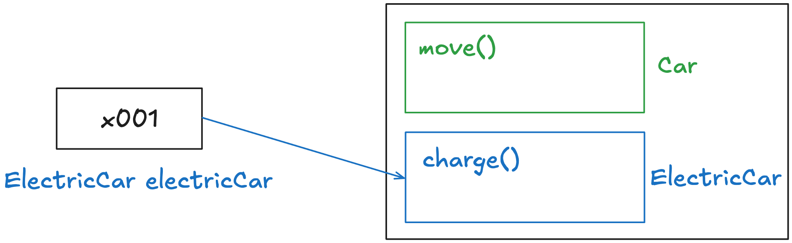

# 섹션 10. 상속

# 1. 상속 - 시작

🤖 `ex1/ElectricCar, GasCar`

- 두 클래스의 공통 메서드 : `move()`
- 이렇게 공통된 메서드는 상속 관계를 이용하면 유지보수성 ↑

# 2. 상속 관계

✅ 상속

- 기존 클래스의 필드, 메서드를 새로운 클래스에서 재사용하게 해줌
- extends 키워드 사용
- extends 대상은 1개만 선택 가능

✅ 용어 정리

- 부모 클래스(슈퍼 클래스) : 상속을 통해 자신의 필드, 메서드를 제공하는 클래스
- 자식 클래스(서브 클래스) : 부모로부터 필드, 메서드를 상속받는 클래스

🤖 `ex2/CarMain`

- Car 클래스를 상속받은 자식 클래스는 `move()` 메서드 사용 가능
- 부모 클래스는 자식 클래스에 접근 불가(부모는 자식 클래스에 대한 정보가 없음)
- 자식 클래스는 extends 뒤에 부모 클래스가 있으므로 부모 클래스를 알고 있음

✅ 단일상속

- 자바는 다중 상속을 지원하지 않음 → ∴ extends의 대상은 1개
- 즉, 하나의 자식 클래스의 부모는 반드시 1개

# 3. 상속과 메모리 구조

✅ 상속 관계의 객체를 생성하면 그 내부에는 부모와 자식이 구분되어 생성됨

- 자식 클래스의 인스턴스에는 부모 클래스 정보까지 포함해서 생성됨
- 참조값은 1개지만 해당 인스턴스에는 부모 클래스 정보까지 있는 것

```java
// ElectricCar extends Car 
ElectricCar electricCar = new ElectricCar();
```



✅ 상속 관계의 객체를 호출할 때, 호출자의 타입을 통해 대상 타입을 찾음

- 메서드는 호출하는 변수의 타입(클래스)을 기준으로 선택
- `electricCar.charge()` 호출 : 변수 electricCar는 ElectricCar 클래스이므로 → ElectricCar 클래스 정보에서 우선 `charge()`를 찾음
- `electricCar.move()` 호출 : ElectricCar 클래스 정보에서 우선 `move()`를 찾고, 없다면 부모의 클래스 정보에서 move()를 찾음

✅ 현재 타입에서 기능을 찾지 못하면 상위 부모 타입에서 찾음(찾지 못하면 컴파일 에러)

# 4. 상속과 기능 추가

✅ 상속으로 인한 코드 중복 ↓

- 상속 관계에서, 여러 자식 클래스들은 부모 클래스의 기능을 사용해서 코드 중복 ↓
- 새로운 자식 클래스를 생성해도 기존 기능을 받은 상태에서 확장(extends) 가능

# 5. 상속과 메서드 오버라이딩

✅ 메서드 오버라이딩 : 부모에게 상속받은 기능을 자식이 재정의하는 것

- 부모 타입의 기능을 자식에서 다르게 정의하고 싶을 수 있음
- ex. `overriding/ElectricCar`
- 메서드 이름은 같지만 새로운 기능을 구현하고 싶을 때

✅ @(애노테이션)

- 프로그램이 읽을 수 있는 특별한 주석

✅ @Override

- 메서드가 정확히 오버라이드 되었는지 확인
- 오버라이딩 조건을 만족하지 못한다면 컴파일 에러 발생
- ex. 부모 메서드에 오버라이딩한 메서드가 없는 경우
- 코드의 명확성을 위해 필요

✅ 메서드 오버라이딩과 메모리 구조

1. electricCar.move() 호출

2. electricCar는 ElectricCar 타입이므로, 인스턴스의 ElectricCar에서 move()를 먼저 찾음

3. move()가 존재하므로 해당 메서드를 사용함

✅ 오버로딩(Overloading)과 오버라이딩(Overriding)

- 메서드 오버로딩 : 메서드명이 같고 파라미터가 다른 메서드를 여러 개 정의하는 것
- 메서드 오버라이딩 : 하위 클래스에서 상위 클래스의 메서드를 재정의하는 것

✅ 메서드 오버라이딩 조건

- 부모 메서드와 같은 메서드를 오버라이딩 할 수 있음
- 생성자는 오버라이딩 할 수 없음

# 6. 상속과 접근 제어

✅ 접근제어자 protected

- 같은 패키지 안에서 호출 허용 + 패키지가 달라도 상속 관계 호출 허용

🤖`ExtendsAccessMain`

- Parent와 Child는 서로 다른 클래스 && 상속 관계
- 따라서 Child에서 public, protected 필드/메서드에 접근 가능

# 7. super - 부모 참조

✅ 다음과 같은 경우에선 자식에서 부모의 필드/메서드 호출 불가

- 부모와 자식의 필드명이 같은 경우
- 메서드가 오버라이딩된 경우
- 이때 `super` 키워드를 사용하면 부모를 참조해서 필드/메서드 호출 가능

🤖 `extends1/super1/Child`

- this : Child 인스턴스
- super : Parent 인스턴스
- Child 클래스에서 필드 이름과 메서드 이름이 같지만, super 키워드로 접근 가능
- 이름이 다르면 super 키워드가 필요 없지만, 이름이 같아서 super 키워드가 필요함

# 8. super - 생성자

✅ 자식 클래스의 생성자에서 부모 클래스의 생성자를 반드시 호출해야함

- 자식 클래스의 인스턴스를 생성하면 메모리에 부모 클래스 정보까지 포함돼서 생성됨
- 따라서 부모 클래스의 생성자도 같이 호출되어야함
- 부모 생성자는 자식 클래스 생성자의 첫 줄에 super(…)로 호출
- 기본 생성자인 경우 생략 가능

✅ 생성자의 첫 줄에 this() 가 있는 경우, 그 안에서 super()가 호출됨

✅ 상속 관계의 생성자 호출은 부모부터 호출됨

- ex. `super2Main`
- 생성자를 통한 초기화는 제일 부모 인스턴스부터 초기화됨