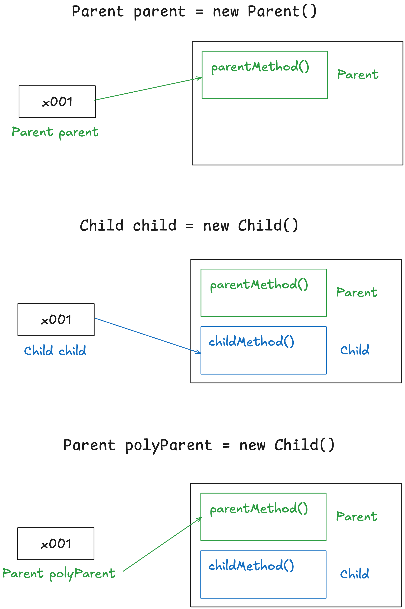
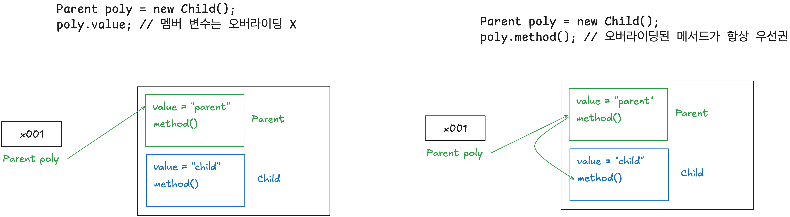

# 섹션 11. 다형성 1

# 1. 다형성 - 시작

✅ 다형성(Polymorphism)

- 한 객체가 여러 타입의 객체로 취급될 수 있는 능력
- 다형성을 사용하면 하나의 객체가 다른 타입으로 사용 가능

✅ 다형성을 이해하기 위한 2가지 핵심

1. 다형적 참조

2. 메서드 오버라이딩

✅ 다형적 참조

- 부모 타입의 변수는 자식 인스턴스 참조 가능(하위 인스턴스는 다 참조 가능)
- 다양한 형태를 참조할 수 있어서 → 다형적 참조
- 자식 타입의 변수가 부모 인스턴스를 참조할 수는 없음

🤖 `PolyMain`

```java
// 부모 타입의 변수가 부모 인스턴스 참조
Parent parent = new Parent();
parent.parentMethod();

// 자식 타입의 변수가 자식 인스턴스 참조
Child child = new Child();
child.childMethod();

// 부모 타입의 변수가 자식 인스턴스 참조(다형적 참조)
Parent polyParent = new Child();
polyParent.parentMethod();
// polyParent.childMethod(); // Parent 타입이므로 자식 클래스의 메서드 호출 불가
```



✅ 다형적 참조의 한계

- ex. `polyParent.childMethod();` 는 에러 발생
- 클래스에 메서드가 없을 때 상위 클래스의 메서드는 접근 가능하지만 하위 클래스는 접근 불가
- 이런 경우, `childMethod()`를 호출하고 싶다면 캐스팅이 필요함

# 2. 다형성과 캐스팅

🤖 `CastingMain1`

- 부모 타입의 변수에서, 자식 클래스의 메서드에 접근 불가
- 이를 가능하게 하는 것이 다운캐스팅

✅ 다운캐스팅

- 참조 대상을 자식 타입으로 변경(상위 클래스에서 하위 클래스로)
- ex. `Child polyChild = (Child) polyParent`
- 이때 캐스팅된 변수(`polyParent`)의 타입이 변경되는 것은 아님
- cf. 업캐스팅 : 부모 타입으로 변경

# 3. 캐스팅의 종류

✅ 일시적 다운캐스팅

- 아래 예제와 같이 다운캐스팅을 위한 변수 선언 없이 바로 하위 인스턴스의 기능을 호출하는 것

```java
// 다운캐스팅
Child child = (Child) polyParent;
child.childMethod();
```

```java
// 일시적 다운캐스팅
((Child) polyParent).childMethod();
```

- `polyParent`가 Child 타입으로 변경되는 것이 아니라, 읽은 참조값을 Child 타입으로 다운캐스팅하는 것

✅ 업캐스팅

- 현재 타입을 부모 타입으로 변경하는 것
- 업캐스팅은 생략해서 쓰는 것
- 생략 가능해서 `Parent parent = child` 같은 코드가 가능한 것

# 4. 다운캐스팅과 주의점

✅ 업캐스팅은 생략 가능하고 다운 캐스팅은 명시적으로 표시해야하는 이유

- 다운캐스팅을 잘못하면 런타임 오류 발생 가능
- ∵ 객체를 생성하면 상위 부모 타입은 모두 생기지만, 하위 타입은 안생기므로
- ∴ 업캐스팅은 안전하지만, 다운캐스팅은 존재하지 않는 하위 타입을 가리킬 수 있으므로 에러 발생 가능

🤖 `CastingMain4`

- 부모 인스턴스를 자식 타입으로 다운 캐스팅하면 런타임 에러
- `parent2`는 Parent 인스턴스로 생성됨 → Child 클래스 정보가 없음
- 따라서 다운캐스팅하면 런타임 에러

# 5. instanceof

✅ instanceof

- 다형적 참조로, 변수는 다양한 자식을 참조할 수 있음
- 참조하는 인스턴스의 타입을 확인하고 싶을 때 `instanceof` 키워드 사용

🤖 `CastingMain5`

✅ 다운캐스팅을 하기 전에 `instanceof` 키워드로 다운캐스팅이 가능한지 검증하기

🤖 `CastingMain6`

- `parent2 instanceof Parent`도 `true`
- ∵ Child 클래스의 인스턴스에는 Parent 정보도 있으니까

# 6. 다형성과 메서드 오버라이딩

✅ 메서드 오버라이딩

- 오버라이딩 된 메서드가 항상 우선권을 갖는다

✅ cf. 멤버 변수는 오버라이딩되지 않음

🤖 `OverridingMain`

- 멤버 변수는 오버라이딩 되지 않음
- 메서드는 오버라이딩됨 → ∵ 오버라이딩된 메서드는 항상 우선권을 가지므로

