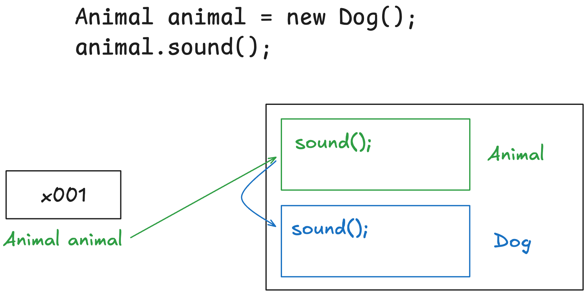
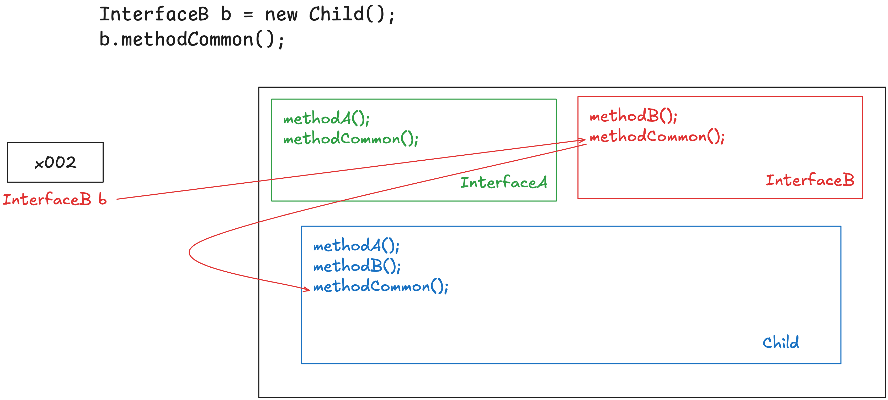

# 섹션 12. 다형성 2

# 1. 다형성 활용 1

🤖 `AnimalSoundMain`

- 동물 소리를 출력하는 코드가 중복됨
- 따라서 이를 메서드로 추출해도 코드 중복 문제가 해결 안됨
- ∵ Dog, Cat, Cow의 클래스가 달라서
- 배열을 통해 문제를 해결하려고 해도, 하나의 배열에 여러 타입이 담길 수 없어서 문제
- Dog, Cat, Cow가 같은 타입이라면 코드가 중복되는 문제를 해결 가능

# 2. 다형성 활용 2

🤖 `AnimalPolyMain1`

- 다형성을 사용하기 위해 상속을 사용
- 부모 클래스를 만들고, 오버라이딩 될 메서드를 생성
- 각 자식 클래스에서는 해당 메서드를 오버라이딩

🤖 `*soundAnimal*(dog)`

- 다형적 참조 → ∴ Animal의 자식 타입인 Dog 인스턴스를 파라미터로 넣을 수 있음
- 메서드 오버라이딩 → ∴ animal.sound()를 호출해도 자식 인스턴스의 메서드가 호출됨
- 메서드 오버라이딩이 없었다면 Animal 클래스의 sound()가 호출됨

✅ 다형성 덕분에 새로운 동물 클래스가 추가돼도 코드 재사용 가능

- 다형적 참조로 여러 타입을 하나의 타입으로 맞추고
- 메서드 오버라이딩으로 각 타입의 메서드를 호출

# 3. 다형성 활용 3

🤖 `AnimalPolyMain2`

- 배열과 for문으로 중복 제거
- 다형적 참조 덕분에 Animal 타입의 배열에 서로 다른 타입인 dog, cat, cow 가 들어갈 수 있음

✅ 새로운 기능이 추가되었을 때 변하는 부분이 최소화되는 코드가 잘 작성된 코드

- 이를 위해 코드에서 변하는 부분과 변하지 않는 부분을 구분하는 것이 좋음
- main() : 변하는 부분, soundAnimal() : 변하지 않는 부분

⚠️ `AnimalPolyMain2`의 현재 문제 2가지

- Animal 클래스를 생성할 수 있음
- Animal 클래스의 자식 클래스에서 메서드 오버라이딩을 하지 않을 수 있음
- 이러한 문제는 추상 클래스, 추상 메서드를 통해 제약을 만들어서 해결 가능

⚠️ Animal 클래스 생성 가능

- Animal 클래스는 다형성을 위한 클래스지만 인스턴스를 생성하기 위한 클래스가 아님
- 이 인스턴스가 생성되면 제대로된 기능을 수행하지 않음

⚠️ 메서드 오버라이딩되지 않을 가능

- 메서드 오버라이딩을 의도한 메서드였지만 개발자가 자식 클래스에서 실수할 수 있음
- 에러는 발생하지 않지만 프로그램이 의도한대로 동작하지 않음

# 4. 추상 클래스 1

✅ 추상 클래스

- 상속을 위한 부모 클래스지만 인스턴스가 생성되면 안되는 클래스
- 클래스 선언 시 앞에 abstrcat 키워드 추가
- 일반적인 클래스와 똑같지만, 인스턴스를 생성하지 못함

✅ 추상 메서드

- 자식 클래스에서 반드시 오버라이딩 돼야하는 메서드
- 추상적인 개념만 부모 클래스에서 제공하므로, 메서드 바디가 없음
- 메서드 선언부 앞에 abstrcat 키워드 추가

✅ 추상 메서드

- 추상 메서드가 하나라도 있는 클래스는 추상 클래스로 선언

  → 메서드 바디가 없는 불완전한 상태이므로, 인스턴스를 생성하지 못하도록 제약

- 추상 메서드는 자식 클래스에서 오버라이딩 되어야함
- 오버라이딩 하지 않으면 자식도 추상 클래스가 되어야함

🤖 `AbstractAnimal`

- 추상 클래스이므로 인스턴스 생성 불가
- `sound()` : 추상 메서드 → 자식 클래스에서 오버라이딩될 목적
- `move(){ … }` : 일반 메서드 → 자식 클래스에서 상속해서 사용할 목적

✅ 정리

- 추상 클래스 → Animal 인스턴스 생성 가능성 차단
- 추상 메서드 → 오버라이딩 해야하는 메서드를 반드시 오버라이딩

# 5. 추상 클래스 2

✅ 순수 추상 클래스 : 모든 메서드가 추상 메서드인 클래스

- 다형성을 위한 껍데기를 제공하는 역할

✅ 자바는 `순수 추상 클래스`라는 용어는 없고 `인터페이스`가 있음

# 6. 인터페이스

✅ 인터페이스

- 자바에서 순수 추상 클래스를 더 편하게 사용할 수 있도록 인터페이스 기능을 제공
- class가 아닌 interface 키워드 사용

✅ 인터페이스 특징

- 인스턴스 생성 불가
- 상속 시 모든 메서드 오버라이딩
- 다형성을 위해 사용됨
- 메서드는 모두 public, abstract → 이를 상속 받는 클래스는 메서드를 다 구현해야함
- 메서드에 public abstract 생략 권장
- 다중 구현(다중 상속)을 지원
- 보통 여러 곳에서 구현되므로 접근 제어자는 public 사용

✅ 인터페이스와 멤버 변수

- 인터페이스는 껍데기이므로 그 내부에 데이터가 있는 것이 어색함
- 멤버 변수는 `public static final`이 모두 포함되어 있다고 간주함

✅ 인터페이스와 상속

- 인터페이스의 자식 클래스를 표현할 때
- `상속 받았다` 가 아니라 `구현한다` 라고 표현함
- ∵ 인터페이스의 메서드는 물려받을게 없고 다 구현해야하므로

✅ 인터페이스도 클래스다

- 인터페이스, 추상 클래스, 클래스는 프로그램 코드, 메모리 구조상 같음
- 모두 자바에서는 .class로 다뤄짐
- 클래스에 비해 조금 더 제약이 있는 것

✅ 인터페이스와 순수 추상 클래스

- 순수 추상 클래스가 아닌 인터페이스를 사용하는 이유
1. 순수 추상 클래스에는 실행 가능한 메서드를 넣을 수 있음
2. 다중 구현

1️⃣ 순수 추상 클래스에는 실행 가능한 메서드를 넣을 수 있음

- 그러면 자식 클래스에서 구현을 안할 수 있음
- 인터페이스는 이러한 문제를 차단

2️⃣ 다중 구현

- 다중 상속은 불가하지만, 다중 구현은 가능

# 7. 인터페이스 - 다중 구현

✅ 자바에서 다중 상속을 지원하지 않는 이유

- 다이아몬드 문제
- 여러 부모에게 상속 받은 메서드 중, 메서드명이 같다면 자식 클래스는 어떤 메서드를 사용 특정할 수 없음

✅ 인터페이스는 다중 구현이 가능한 이유

- 모든 메서드가 추상 메서드이므로 어차피 자식 클래스에서 구현해야함
- 어떤 부모의 메서드인지 특정할 필요가 없음

`🤖 DiamondMain`

- 다중 구현
- Child 인스턴스를 생성하면 다중 구현한 인터페이스까지 같이 메모리에 생성
- 인터페이스의 메서드 호출 시, 오버라이딩된 메서드가 호출됨

# 8. 클래스와 인터페이스 활용

✅ 자식 클래스에서 상속과 구현을 같이하는 경우

- extends 키워드로 상속 받을 클래스 먼저 적고 implements 적기

🤖 `SoundFlyMain`