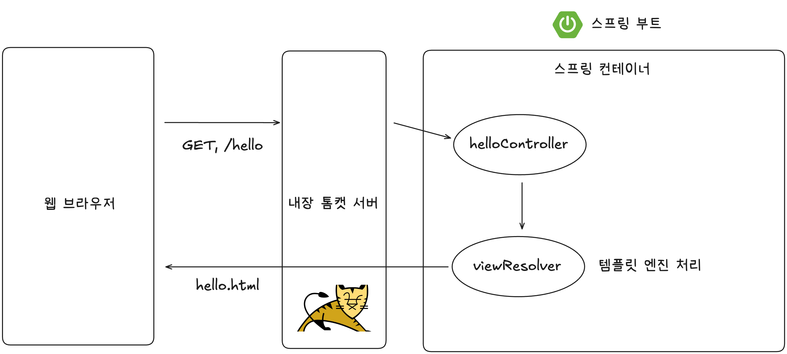

# 섹션 2. 프로젝트 환경설정

# 1. 프로젝트 생성

⚙️ 개발 환경

- Java 17
- Spring Boot 3.5.0
- Gradle
- IDE : InteliJ

✅ 스프링 프로젝트 생성

- 스프링 부트 스타터 사이트로 스프링 프로젝트 생성
- [https://start.spring.io/](https://start.spring.io/)

🆚 스프링 빌드 도구 : Gradle vs Maven

- 스프링 빌드 도구는 다음과 같은 작업을 실행함
- ex. 라이브러리 추가, 코드 컴파일, 테스트 실행, 실행 파일 생성, 의존성 관리 등
- 빌드 도구 중 대표적으로 Gradle과 Maven이 있음

| 도구 | 설정 방식 | 특징 |
| --- | --- | --- |
| Maven | XML (`pom.xml`) | 구조화 잘됨, 문법 간단 |
| Gradle | Groovy/Kotlin 스크립트 (`build.gradle`) | 속도 빠름, 유연함, 트렌디 |

🆚 Spring vs Spring Boot

| 항목 | 🌱 Spring | 🚀 Spring Boot |
| --- | --- | --- |
| 정의 | 자바 기반 웹 애플리케이션 프레임워크 | Spring을 쉽고 빠르게 사용하게 해주는 도구 |
| 설정 | 복잡함, 개발자가 다 설정해야 함 | 자동 설정, 바로 실행 가능 |
| 실행 방식 | 수동 설정 + 외부 서버 필요 (Tomcat 등) | 자체 실행 서버 내장 (`main()`으로 실행 가능) |
| 시작 속도 | 느리고 어렵다 | 빠르고 간편하다 |
| 목적 | 유연하지만 초기 진입장벽 있음 | 생산성 향상, 빠른 개발 |
| 비유 | 요리 재료 세트 | 편의점 도시락 |

📌 Dependencies로 설치한 항목 : Spring Web, Thymeleaf

✅ Spring Web

- 웹 애플리케이션을 만들기 위한 기본 도구
- HTTP 요청/응답 처리 (`@Controller`, `@RestController`, `@GetMapping` 등)
- 내장 Tomcat 서버 포함 → `main()` 실행만으로 웹 서버 구동

✅ Thymeleaf

- HTML 템플릿 엔진 (백엔드에서 데이터를 HTML에 넣어주는 역할)
- JSP 대신 많이 사용됨
- Spring과 잘 통합됨 → `Model`에 담은 데이터를 바로 사용할 수 있음

✅ 프로젝트 생성 후 디렉터리를 여는 것이 아니라 build.gradle을 여는 이유

- ∵ InteliJ가 build.gradle 파일로 의존성 자동 다운로드, 빌드 설정 등을 적용해줌
- build.gradle은 Node.js의 package.json과 유사함

✅ main 메서드를 실행해서 서버를 로컬에 띄우기

1. SpringApplication.run(...) 실행 : 스프링 부트 앱 “시작”

2. 내장 톰캣(Tomcat) 웹 서버 자동 실행 : 별도 설정 없이 `8080` 포트에서 서버가 켜짐

3. 앱이 실행 상태로 유지 : 이제 웹 요청을 받을 준비 완료됨(API, 화면 등)

- → 이제 웹 요청 받을 준비 완료! (API, 화면 등)

# 2. 라이브러리 살펴보기

✅ 빌드 도구가 의존 관계를 관리해줌

- ∴ External Libraries에 내가 설정하지 않은 라이브러리들이 들어 있는 것
- ex. Spring Web만 dependency에 추가하면, Gradle이 Spring Web에 필요한 의존 관계를 가져옴

# 3. View 환경설정

✅ Welcome page 추가하기

- 정적 페이지 방식
- src/main/resources/static/index.html
- index.html 파일을 추가하고 → localhost:8080에 들어가면 해당 html 파일이 보이게 됨
- 정적 페이지가 아닌 템플릿 엔진을 사용하면 동적 데이터 처리 가능

✅ 템플릿 엔진으로 동적 페이지를 띄우기 위해 `HelloController`와 `hello.html`을 생성

- 사용자가 `/hello`로 접속하면
- `HelloController`가 `data = "spring"`을 넘기고,
- Thymeleaf가 이를 받아 HTML을 완성해 브라우저에 랜더링

```
사용자: http://localhost:8080/hello 접속
 ↓
내장 톰캣 서버: 요청 수신
 ↓
스프링 컨테이너: @Controller 붙은 HelloController 찾음
 ↓
@GetMapping("hello"): 매핑된 메서드 실행
 ↓
model.addAttribute("data", "spring")
 ↓
"hello" 리턴 → ViewResolver가 hello.html 템플릿을 찾음
 ↓
Thymeleaf가 템플릿 렌더링: ${data} = "spring"
 ↓
최종 HTML: <p>안녕하세요. spring</p>
 ↓
브라우저에 출력
```



✅ 파일 경로 규칙 (Spring Boot 기본값)

- Controller에서 return "파일명"을 하면
- ViewResolver는 다음 위치의 파일을 찾아서 렌더링
- `resources/templates/ + 파일명 + .html`
- ex. `return "hello"` → `resources/templates/hello.html`

# 4. 빌드하고 실행하기

✅ 현재까지는 InteliJ로 스프링을 실행했음

- main() 메서드를 실행하면 Gradle로 컴파일하고 java 명령으로 JVM에서 main() 메서드 실행

✅ 터미널에서 Gradle로 빌드하고 java -jar로 실행

- jar 파일을 JVM에서 직접 실행하는 것
- 이는 배포 가능한 형태로 빌드됨(클라우드, 도커 환경에서 실행 가능)
- 이 파일에는 내장 톰켓이 있어서 java -jar만으로도 웹서버 구동 가능

⚙️ 터미널에서 스프링 코드가 있는 디렉터리로 이동 → 아래 명령어 입력

```jsx
./gradlew build

cd build/libs

java -jar demo-0.0.1-SNAPSHOT.jar // 스프링 웹서버 구동
```