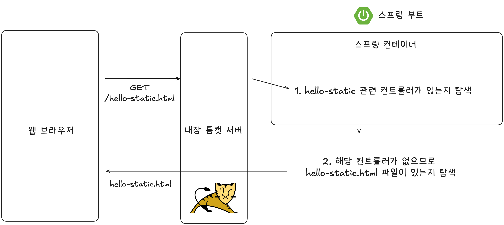

# 섹션 3. 스프링 웹 개발 기초

# 1. 정적 컨텐츠

✅ 스프링 부트는 정적 컨테츠를 제공하는 기능이 있음

- `resources/static` 디렉터리에 파일을 넣기만 하면 스프링이 랜더링해줌

✅ 동작 과정

# 2. MVC와 템플릿 엔진

📌 MVC 패턴이란

- 웹 애플리케이션을 3가지 역할(Model, View, Controller)로 분리하는 아키텍처 패턴

✅ MVC 구성 요소

---

| 구성 요소 | 역할 |
| --- | --- |
| Model | 애플리케이션의 데이터와 비즈니스 로직을 담당  ex. DB 조회, 계산, 상태 저장 등 |
| View | 사용자에게 보여지는 화면을 담당 ex. HTML, Thymeleaf 템플릿 |
| Controller | 사용자의 요청을 받아 처리하고, 적절한 Model과 View를 연결 |

✅ MVC 패턴의 흐름

1. 사용자가 브라우저에서 URL 요청
2. Controller가 요청을 받고 처리
3. 필요한 데이터를 Model에서 가져옴
4. 데이터를 View로 넘겨서 화면 렌더링
5. 렌더링된 HTML이 사용자에게 응답됨

✅ 스프링에서의 MVC

- `@Controller` → 요청 처리
- `Model` 객체 → View에 데이터 전달
- `templates/*.html` (Thymeleaf) → View 템플릿 역할

# 3. API

✅ `@ResponseBody`

- HTTP 응답 본문에 데이터를 넣어주는 애노테이션
- 뷰 템플릿 없이 데이터 자체를 반환

✅ `@ResponseBody` 동작 방식

- @Controller나 @RestController 클래스에서 메서드 위에 @ResponseBody가 있다면
- ViewResolver를 거치지 않고
- HttpMessageConverter가 작동해서 JSON 등으로 변환해서 HTTP 응답 바디에 데이터를 넣어줌

🆚 `@ResponseBody` vs MVC

| 항목 | Spring MVC | `@ResponseBody` 사용 방식 |
| --- | --- | --- |
| 반환 | View 이름 (`String`) | 실제 데이터 (`String`, `Object`) |
| View 처리 | ViewResolver → HTML 렌더링 | HttpMessageConverter → JSON or 문자열 응답 |
| 용도 | HTML 페이지 응답 | REST API 응답, JSON 데이터 응답 등 |
| 템플릿 필요 | 있음 (Thymeleaf 등) | 없음 (데이터만 전송) |

✅ HttpMessageConverter

- @ResponseBody가 붙은 메서드는 View를 사용하지 않고 HTTP 응답 바디에 데이터를 직접 넣음
- 이때 ViewResolver 대신 HttpMessageConverter가 동작
- 어떤 컨버터가 사용되는지는 클라이언트의 Accept 헤더와 서버의 반환 타입을 조합해 결정됨