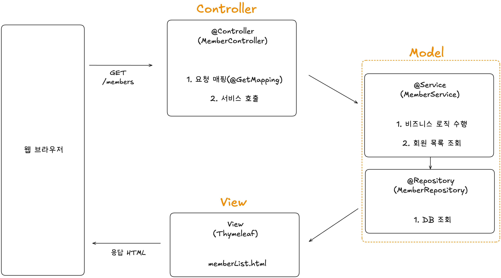

# 섹션 6. 회원 관리 예제 - 웹 MVC 개발

# 0. 웹 MVC

✅ MVC란

- Model-View-Controller
- 웹 요청을 3단계로 나눠서 처리하는 구조

✅ 강의에서 MVC 구성

| 구성 요소 | 역할 | 실제 코드/파일 |
| --- | --- | --- |
| Model | 비즈니스 로직 / 데이터 처리 | `Member`, `MemberService`, `MemberRepository` |
| View | 사용자에게 보여지는 화면 (HTML) | `home.html`, `createMemberForm.html`, `memberList.html` |
| Controller | 요청 처리 및 흐름 제어 | `HomeController`, `MemberController` |

👉 Model

- 실제 데이터를 처리하고 비즈니스 로직을 담는 영역
- ex. `Member` 클래스 → 회원 정보를 표현하는 도메인 객체
- ex. `MemberService` → 회원 가입/조회 등의 비즈니스 로직
- ex. `MemberRepository` → DB와의 연결을 담당하는 데이터 접근 계층

👉 Controller

- 사용자 요청을 받아서 처리하고 결과를 View에 전달하는 영역
- ex. `HomeController` → 홈 화면 요청 처리
- ex. `MemberController` → 회원 등록/조회 등 요청 처리

👉 View

- 사용자에게 보여지는 화면 영역, 데이터를 HTML로 렌더링



# 1. **홈 화면 추가**

### 📌 Controller

```java
@GetMapping("/")
public String home() {
    return "home";  // → resources/templates/home.html 반환
}

```

### 📌 View (home.html)

```html
<a href="/members/new">회원 가입</a>
<a href="/members">회원 목록</a>

```

✅ 컨트롤러가 정적파일보다 우선 순위를 갖음

- ∴ `index.html`이 존재해도 `@Controller, @GetMapping(”/”)`이 있다면, 해당 메서드가 먼저 호출됨

# 2. **회원 등록**

### 📌 Controller

```java
@GetMapping("/members/new")
public String createForm() {
    return "members/createMemberForm";
}

```

### 📌 View (createMemberForm.html)

```html
<form action="/members/new" method="post">
  <input type="text" id="name" name="name">
</form>

```

> → 이 폼이 /members/new로 POST 요청을 보내게 됨
>

### 📌 **회원 등록 처리**

```java
public class MemberForm {
    private String name;
}

```

### 📌 Controller

```java
@PostMapping("/members/new")
public String create(MemberForm form) {
    Member member = new Member();
    member.setName(form.getName());
    memberService.join(member);  // 회원 저장
    return "redirect:/";  // 홈으로 리다이렉트
}
```

# 3. **회원 목록 조회**

### 📌 Controller

```java
@GetMapping("/members")
public String list(Model model) {
    List<Member> members = memberService.findMembers(); // 전체 회원 조회
    model.addAttribute("members", members);             // View에 넘김
    return "members/memberList"; // → memberList.html
}
```

### 📌 View (memberList.html)

```html
<tr th:each="member : ${members}">
  <td th:text="${member.id}"></td>
  <td th:text="${member.name}"></td>
</tr>
```