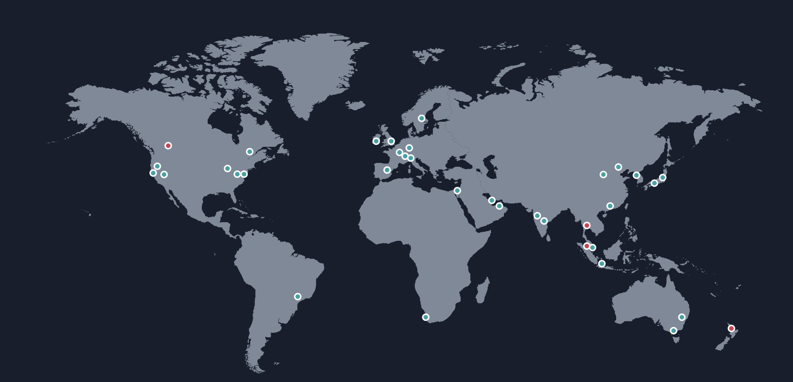
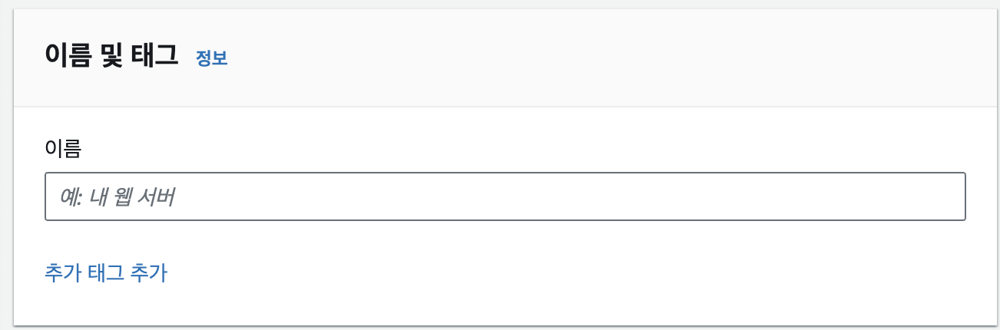
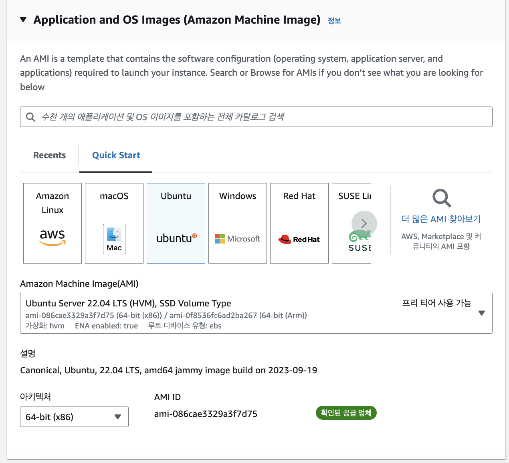
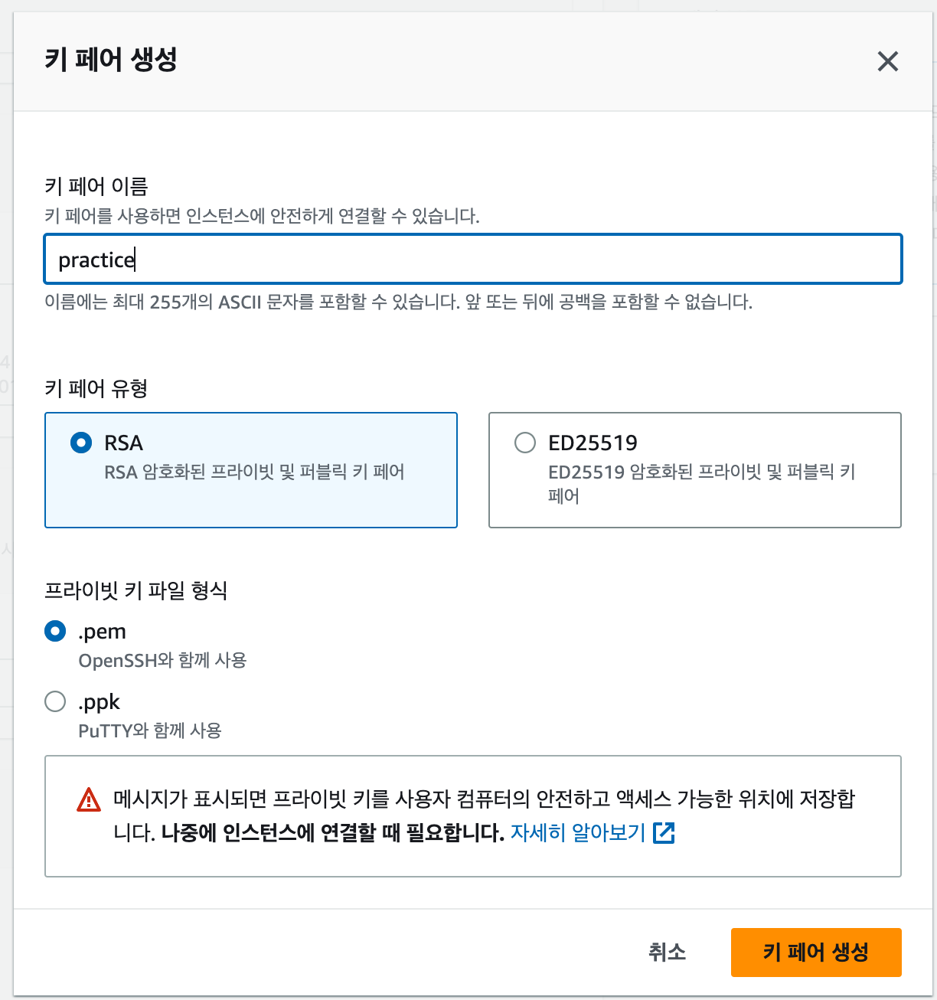
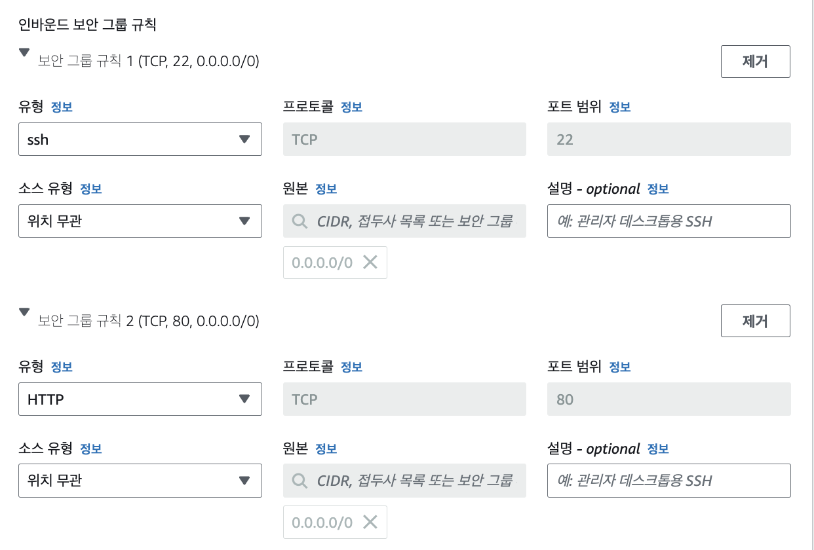

# ..

# 1_EC2

## 1. 배포(Deployment)란

- 배포 : 다른 사용자들이 인터넷을 통해서 서비스를 사용할 수 있게 만드는 것
- 개인 컴퓨터에서 개발을 할 때는 localhost라는 주소로 테스트 및 개발하지만, 이 주소는 다른 컴퓨터에서는 접근할 수 없는 주소
- 배포를 하면 IP나 도메인과 같은 고유 주소를 부여 받아서 다른 컴퓨터에서 해당 주소로 접속 가능

## 2. EC2란

### 🔹 EC2(Elastic Compute Cloud)

- 컴퓨터를 빌려서 원격으로 접속해 사용하는 서비스

### 🔹 EC2를 배우는 이유

- 서버를 배포하기 위해 컴퓨터가 필요함
- 이때 내 컴퓨터로 서버를 배포하면 24시간 컴퓨터가 켜져 있어야하고, 인터넷을 통해 내 컴퓨터에 접속할 수 있으므로 보안적으로 위험할 수 있음
- 따라서 이런 문제를 해결하는게 AWS의 EC2 서비스
- AWS EC2에는 서버 운영에 필요한 부가 기능(로깅, 오토스케일링, 로드밸런싱 등)이 있음

## 3. 실습 : 리전(Region) 선택하기

### 🔹 리전(Region)이란

- 인프라를 지리적으로 나누어 배포한 각 데이터 센터
- AWS는 전 세계적으로 다양한 리전을 보유하고 있음
  
- 각 리전은 고유의 이름을 갖고 있음
  - ex. `us-east-1`, `eu-west-3`

### 🔹 리전 선택 기준

- 애플리케이션의 주된 사용자들의 위치와 지리적으로 가까운 리전을 선택
  - 사용자 위치와 서버의 위치가 멀면 통신 속도가 느려지므로

## 4. 실습 : EC2 세팅(기본 설정)

### 🔹 이름 및 태그



- EC2의 이름을 설정
- ex. `my-server-ec2`

### 🔹 Application and OS Images (Amazon Machine Image)



- OS 선택
- 서버 배포용 컴퓨터의 OS는 보통 MacOS보다 가벼운 리눅스, 우분투를 많이 사용함

### 🔹 인스턴스 유형

- 인스턴스 : AWS EC2에서 빌리는 컴퓨터 1대
- 인스턴스 유형 : 컴퓨터 사양

### 🔹 키 페어(로그인)

- 키 페어 : EC2 컴퓨터에 접근할 때 사용하는 비밀번호
- 키 페어 이름 설정 : 어떤 EC2에 접근하기 위한 키 페어였는지 네이밍
- ex. `my-server-key`



## 5. 실습 : EC2 세팅(보안그룹)

### 🔹 네트워크 설정

- VPC : AWS 안의 사설 네트워크 공간
- Subnet : VPC를 더 작게 나눈 구역
- Public Subnet : 인터넷에서 접근 가능한 서브넷
- Private Subnet : 인터넷에서 직접 접근 불가능한 서브넷

### 🔹 보안 그룹(Security Group)

- 보안 그룹 : AWS 클라우드에서의 네트워크 보안 규칙의 묶음
- 보안 규칙에는 인⋅아웃바운드 트래픽에서 어떤 트래픽만 허용할 지 설정 가능
- 보안 그룹을 설정할 때는 허용할 IP 범위와 포트를 설정 가능

### 🔹 보안그룹 설정

- 인바운드 보안그룹 규칙
  - 22번 포트 : SSH로 접속할 포트 번호
  - 80번 포트 : HTTP로 접속할 포트 번호



## 6. 실습 : 탄력적 IP 연결하기

### 🔹 탄력적 IP가 필요한 이유

- EC2 인스턴스를 생성하면 IP를 할당받지만, 이는 임시적인 IP
- EC2 인스턴스를 중지시켰다가 다시 실행하면 IP가 변경됨
- EC2 인스턴스를 중지했다가 다시 실행할 때마다 IP가 변경하면 서비스 운영이 불편함 → 이 IP를 고정적으로 해주는 고정 IP가 필요
- 이 고정 IP가 탄력적 IP

## 7. 실습 : Express 서버 배포하기

### 🔹 Ubuntu 환경에서 Node.js 설치

- Express 서버를 실행하려면 Node.js를 설치해야 함
  ```tsx
  sudo su
  apt-get update && /
  apt-get install -y ca-certificates curl gnupg && /
  mkdir -p /etc/apt/keyrings && /
  curl -fsSL https://deb.nodesource.com/gpgkey/nodesource-repo.gpg.key | sudo gpg --dearmor -o /etc/apt/keyrings/nodesource.gpg && /
  NODE_MAJOR=20 && /
  echo "deb [signed-by=/etc/apt/keyrings/nodesource.gpg] https://deb.nodesource.com/node_$NODE_MAJOR.x nodistro main" | sudo tee /etc/apt/sources.list.d/nodesource.list && /
  apt-get update && /
  apt-get install nodejs -y
  ```
- node.js 설치 확인
  ```bash
  node -v
  ```

### 🔹 Github에서 Express 프로젝트 clone

```bash
git clone https://github.com/JSCODE-EDU/ec2-express-sample
cd ec2-express-sample
apt install npm
npm i
```

### 🔹 `.env` 파일 직접 만들기

- .env 같은 파일은 깃으로 버전 관리를 하지 않으므로, .env 파일은 별도로 EC2에 생성하거나 올려줘야 함
  ```sql
  touch .env
  nano .env
  # DATABASE_NAME=my_database 입력
  ```

### 🔹 pm2 설치해서 서버 실행하기

- 서비스 운영에 유용한 기능을 `pm2`가 많이 갖고 있음
  ```bash
  sudo npm i -g pm2
  sudo pm2 start app.js
  ```
