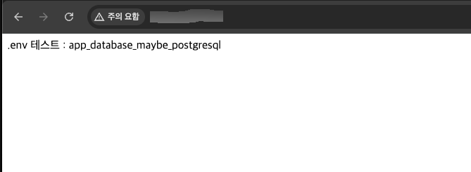
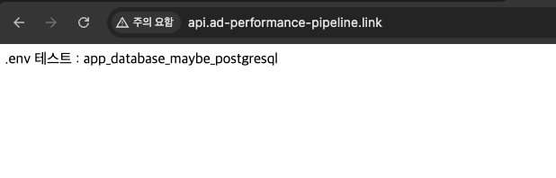

# Route53

## 1. Route53이란

### 🔹 Route53이란

- 도메인을 발급하고 관리해주는 서비스
- 즉, DNS 서비스

### 🔹 Domain Name System이란

- 특정 컴퓨터와 통신하기 위해선 해당 컴퓨터의 주소가 필요함
- 이때 IP 주소를 활용(ex. `12.134.122.11`)
  - IP 주소 : 특정 컴퓨터를 가리키는 주소
- IP 주소의 문제점 : 많은 숫자로 구성되어 있어서 외우기가 불편함
- 따라서 이를 해결하기 위해 IP 주소를 문자로 변환해주는 시스템을 생성 → DNS
  - DNS 덕분에 통신하려고 하는 컴퓨터의 IP 주소를 외우지 않아도 됨

### 🔹 도메인과 HTTPS

- 그리고 HTTPS 인증서는 보통 도메인 기준으로 발급됨
  - HTTPS : 내가 접속한 대상이 진짜 해당 대상인지 인증서로 검증
  - 즉, 사용자가 접속한 주소와 인증서의 주소가 일치해야 함
- 따라서 IP 주소보다 도메인을 사용해서 서비스하는게 일반적

### 🔹 현업에서 Route53

- DNS 서비스는 AWS의 Route53 외에 가비아 등 다양하게 존재함
- 서비스마다 구매할 수 있는 도메인의 종류가 다르므로, 원하는 도메인이 있는 곳의 DNS 서비스를 활용함

## 2. 실습 : Route53에서 도메인 구매

### 🔹 도메인을 연결할 서버 준비

- EC2 인스턴스 생성
- 인스턴스 생성 이후 탄력적 IP 주소 할당
- Express 서버 배포
  

### 🔹 Route53에서 도메인 등록

- Route53 > 등록된 도메인 > 도메인 등록
- 도메인 검색 후 도메인 결제
- .link 로 끝나는 도메인이 저렴함($5)
- 도메인이 잘 구매됐는지 확인하기
  - 호스팅 영역 확인
  - 등록된 도메인 확인

## 3. 실습 : Route53의 도메인을 EC2에 연결하기

### 🔹 Route53의 도메인을 EC2에 연결하기

- 호스팅 영역 > 레코드 생성
- 레코드는 주로 A, CNAME 을 사용
- 레코드 유형 : A 선택
- 값 : EC2의 퍼블릭IP주소(탄력적IP)
- 접속 확인
  

### 🔹 레코드

- DNS는 사람이 읽는 문자열 주소를 서버 주소로 변경해줌
  ```
  사용자 입력: api.ad-performance-pipeline.link
          ↓
  DNS 조회
          ↓
  서버 IP: 54.xxx.xxx.xxx
  ```
- 이때 도메인을 IPv4 주소로 보낼지, 아니면 다른 도메인 이름과 연결할지 등 연결정보를 설정할 수 있음
  - 이 연결정보가 레코드
  - 대표적인 레코드 유형 : A, CNAME
- A 레코드
  - Address Record
  - 도메인을 IPv4 주소로 연결
  - ex. `api.ad-performance-pipeline.link → 54.0.1.1`
- CNAME 레코드
  - Canonical Name Record
  - 도메인을 다른 도메인 이름으로 연결
  - ex. `www → ad-performance-pipeline.link`
