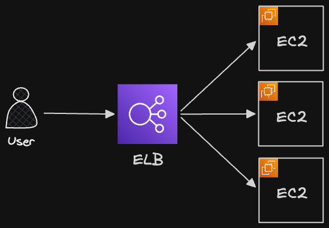
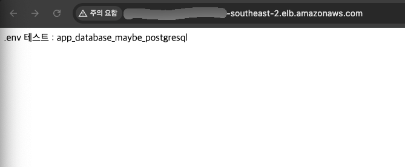
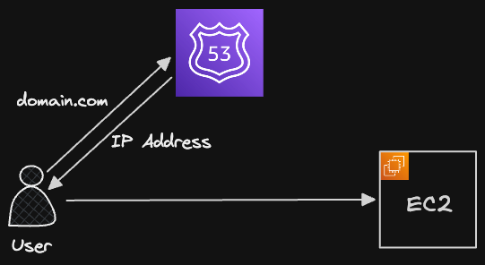
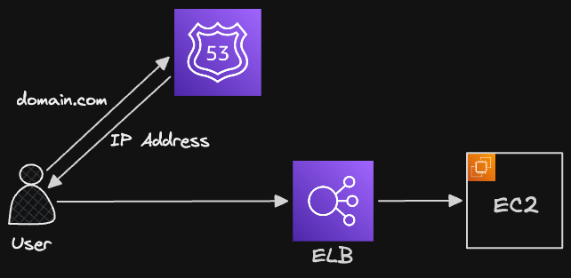
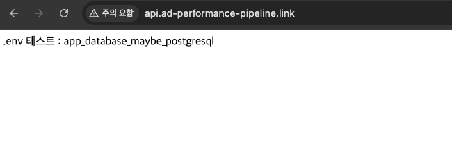
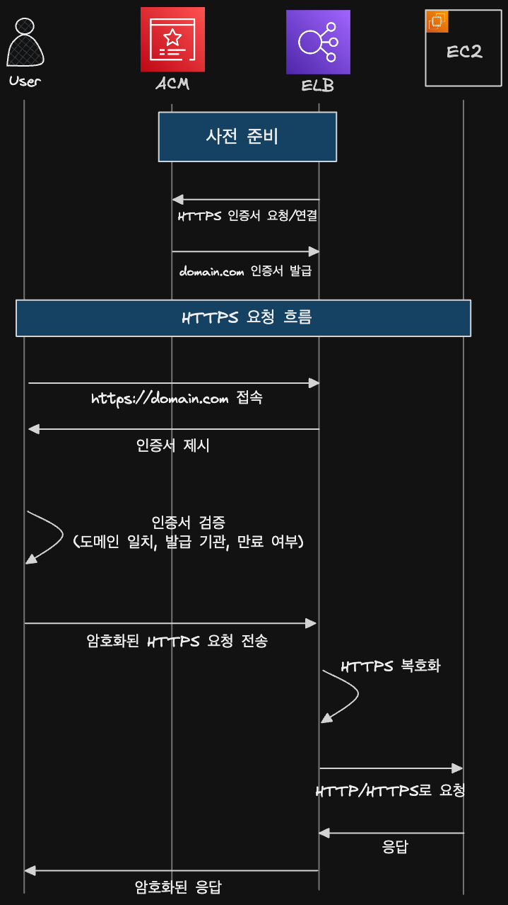
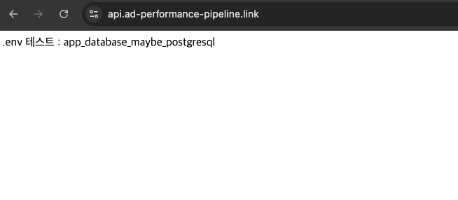
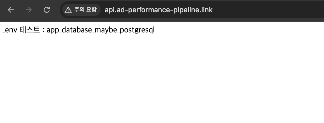
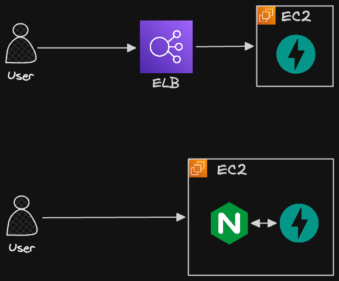

# 3_ELB(HTTPS 연결)

> 지금은 ELB의 로드밸랜서 기능을 사용하지 않고, ELB의 부가 기능인 HTTPS 적용을 사용할 것

## 1. ELB란

### 🔹 ELB(Elastic Load Balancer)란

- 트래픽을 적절하게 분배해주는 서버(로드밸런서)
- 서버를 2대 이상 운영할 때 ELB를 필수적으로 도입

### 🔹 SSL/TLS란

- SSL/TLS란 HTTP를 HTTPS로 바꿔주는 인증서
- ELB는 SSL/TLS 인증서를 활용해 HTTP가 아닌 HTTPS로 통신할 수 있게 해줌

### 🔹 HTTPS란

- HTTPS를 적용시켜야 하는 이유
  1. 보안 : 데이터를 서버끼리 주고 받을 때 HTTPS로 암호화를 시켜서 통신
  2. 사용자 이탈 방지 : 브라우저에서 HTTPS를 사용하지 않는다고 경고창이 뜨면 사용자가 서비스를 신뢰하지 못함

### 🔹 대부분의 서비스는 HTTPS를 적용

- HTTPS 인증을 받은 웹 사이트가 백엔드 서버와 통신하려면, 백엔드 서버의 주소도 HTTPS 인증을 받아야 함
- 따라서 백엔드 서버와 통신할 때도 IP 주소로 통신하는게 아니라 HTTPS 인증을 받은 도메인 주소로 통신
- 주로 도메인을 구성할 때 아래와 같이 많이 구성
  - 웹 사이트 주소 : **`https**://example.com`
  - 백엔드 API 서버 주소 : **`https**://api.example.com`

## 2. ELB를 활용한 아키텍처

### 🔹 ELB를 활용한 아키텍처 구성



- ELB를 사용하기 전의 아키텍처는 사용자들이 EC2의 IP주소, 도메인 주소에 직접 요청을 보내는 구조
- ELB를 도입하면 사용자들이 EC2에 직접 요청을 보내지 않고 ELB로 요청을 전송
  - ELB가 이 요청을 EC2에 전송
- 따라서 EC2에 있던 도메인 및 HTTPS를 ELB에 적용

## 3. 실습 : ELB 세팅하기

### 🔹 리전 선택

- ELB도 EC2와 같은 리전으로 선택

### 🔹 로드 밸런서 유형 선택하기

1. 로드 밸런서 생성하기
2. 로드 밸런서 유형 선택 : ALB

### 🔹 기본 구성

- 체계
  - 인터넷 경계 : 퍼블릭 IP, 인터넷 트래픽 처리
  - 내부 : 사설 IP 처리
- 로드밸런서 IP 주소 유형 : IPv4

### 🔹 네트워크 매핑

- 로드 밸런서가 어떤 가용 영역으로만 트래픽을 보낼 것인지 제한하는 기능
- 가용 영역(AZ): 하나의 AWS 리전 안에 있는 물리적으로 분리된 데이터센터 단위로, 장애가 나도 다른 영역에서 서비스를 계속 운영하기 위해 나눠둔 구역

### 🔹 보안 그룹

- 인바운드 규칙 생성
  - HTTP, anywhere
  - HTTPS, anywhere
- ELB는 인바운드 규칙에 80, 443 포트로 모든 IP에 대해 요청을 받을 수 있어야 함
  - 인터넷 사용자의 HTTP/HTTPS 요청을 가장 먼저 받는 진입점이므로, 외부 어디서든 접속할 수 있게 열어야 함
- ELB 생성 화면으로 돌아와서 보안 그룹 선택하기

### 🔹 대상 그룹 설정하기

- 리스너 및 라우팅은 ELB로 들어온 요청을 어떤 EC2 인스턴스에 전달할 것인지 설정하는 부분
- 대상 그룹 : ELB로 들어온 요청을 전달하는 곳
  - ELB를 EC2 인스턴스에게 전달할 것이므로, 대상 그룹은 EC2 인스턴스
- 대상 유형 선택 : 인스턴스
- 어떻게 대상 그룹에게 트래픽을 전달할 지 설정
  - 프로토콜 : HTTP
  - IP 주소 유형 : IPv4
  - 프로토콜 버전 설정 : HTTP1
- 상태 검사 설정 : HTTP, /health
  - ELB가 트래픽을 보내야 하는데 서버가 죽어 있으면 비효율적
  - 따라서 주기적으로 대상 그룹이 살아 있는지 확인하는게 상태 검사
- 대상 등록하기
- 대상 그룹 생성하기
- ELB 생성 화면으로 돌아와서 대상 그룹 등록
- 로드 밸런서 생성하기

### 🔹 EC2의 서버에 Health Check API 추가

```jsx
require("dotenv").config();
const express = require("express");
const app = express();
const port = 80;

app.get("/", (req, res) => {
  res.send(`.env 테스트 : ${process.env.DATABASE_NAME}`);
});

// Health check API 추가
app.get("/health", (req, res) => {
  res.status(200).send("Success Heatlth Check");
});

app.listen(port, () => {
  console.log(`Example app listening on port ${port}`);
});
```

### 🔹 로드 밸런서 주소로 서버 접속해보기

- 로드 밸런서 주소로 접속하면 서버의 응답을 확인 가능



## 4. 실습 : ELB에 도메인 연결

### 🔹 Route53에서 EC2에 연결되어 있던 레코드 삭제



- Route53에는 도메인과 퍼블릭 IP 주소를 연결한 A 레코드가 있었음
- 이제 이 도메인을 EC2가 아니라 ELB와 연결할 것이므로, 기존 레코드를 삭제

### 🔹 Route53에서 ELB에 도메인 연결하기



- Route53에서 해당 도메인과 ELB에 대한 A 레코드 생성
- 도메인으로 요청을 보내면 ELB가 이를 받아서 EC2에게 전달하고, EC2가 응답을 보내줌
  

## 5. 실습 : HTTPS 적용을 위해 인증서 발급 받기

### 🔹 ACM(AWS Certificate Manager) 서비스에서 인증서 요청

- HTTPS를 적용하기 위해선 인증서를 발급 받아야 함
  - HTTPS = HTTP + 암호화 + 서버 신원 확인
  - 이때 인증서는 이 서버가 진짜 [domain.com](http://domain.com) 서버가 맞다는 증명서
  - ACM은 AWS에서 그 인증서를 발급, 관리해주는 서비스

### 🔹 HTTPS 동작 과정



- HTTPS는 상대가 진짜 서버인지 확인하고, 그 다음 암호화된 통신을 시작
- 이때 인증서는 서버의 신분증
- 인증서가 없다면 브라우저는 서버를 신뢰할 수 없어서 경고를 띄움
  ```
  이 사이트는 안전하지 않음
  인증서를 신뢰할 수 없음
  ```
- ACM은 AWS에서 HTTPS 인증서를 발급하고 관리하는 서비스
  - 인증서 발급, 도메인 소유 검증(도메인 소유자인지 Route53 DNS로 확인), 인증서 자동 갱신

### 🔹 인증서 요청하기

- 인증서 유형 : 퍼블릭 인증서 요청
- 도메인 이름 입력
- 검증 방법 : DNS 검증
- 키 알고리즘 : RSA 2048

### 🔹 인증서 검증하기

- 이 도메인을 내가 진짜 소유한 도메인인지 검증하는 과정
- Route53에서 CNAME 레코드 생성
- ACM은 DNS를 조회해서 해당 CNAME이 있는지 확인
- 존재하면 도메인 소유자가 맞다고 판단
- 인증서 발급 완료

## 6. 실습 : ELB에 HTTPS 인증서 적용

### 🔹 ELB 리스너 및 규칙 수정하기

- ELB에서 HTTPS에 대한 리스너 추가하기
  - 프로토콜 : HTTPS
  - 포트 : 443
  - 라우팅 액션 : 대상 그룹으로 전달(이를 통해 EC2로 트래픽을 전달)
  - 대상 그룹 설정
- 보안 리스너 설정
  - Certificate source : ACM에서
  - 발급한 인증서 적용
- 이러면 HTTPS가 잘 적용됨
  

### 🔹 HTTP로 접속할 경우, HTTPS로 전환되도록 설정하기

- 현재 HTTP로 해당 도메인에 접속하면 HTTP로 통신함
  
- 따라서 이를 HTTPS로 자동으로 변환해주는 기능 추가
  - ELB에서 기존 HTTP 리스너 삭제
- 리스너 추가
  - 프로토콜 : HTTP
  - 포트 : 80
  - 라우팅 액션 : URL로 리디랙션, 프로토콜 HTTPS, 포트 443
    - 이러면 HTTP 80으로 요청이 오면 HTTPS로 변경해서 전달해주는 기능
- 이러면 [http://로](http://로) 요청을 보내도 [https://로](https://로) 리디랙션돼서 전달됨

## 5. HTTPS 연결 시 ELB vs Nginx+Certbot

### 🔹 HTTPS 연결 시 ELB vs Nginx+Certbot

- AWS 아키텍처를 구축한 서비스에서는 ELB를 활용해서 HTTPS를 주로 적용함
- Nginx, Certbot를 사용하는 이유는 비용
  - ELB도 비용이 발생하므로
- EC2에 Nginx+Certbot과 백엔드 서버를 같이 띄우면 비용을 절약할 수 있음


