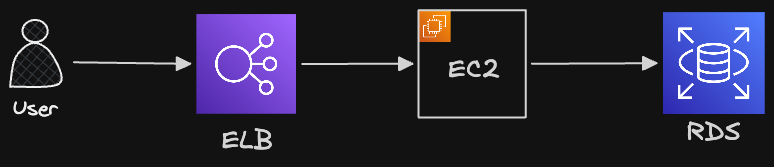

# 4_RDS

## 1. RDS란

### 🔹 RDS(Relational Database Service)란

- 관계형 데이터베이스 서비스
  - MySQL, PostgreSQL 등 여러 RDBMS 서비스를 AWS에서 빌려서 사용
- AWS RDS는 자동 백업, 모니터링, 다중 AZ등 여러 편리한 부가 기능을 지원

### 🔹 EC2에 MySQL을 직접 설치해서 운영

- 개발, 학습용이면 EC2 인스턴스 안에 서버와 MySQL을 같이 실행해도 됨
  - 구조가 단순하고 RDS 비용이 들지 않으므로
- 그러나 운영 환경에서는 서버와 DB를 분리하는 것이 일반적
  1. EC2에 에러가 발생하면 백엔드 서버와 DB가 동시에 영향을 받음, 또 둘이 같은 자원을 공유하므로 서버의 영향이 DB로 전파 가능
  2. 성능 튜닝과 확장이 어려움 : 서버는 보통 CPU, 네트워크가 중요하고 DB는 메모리, 디스크 IO 등이 중요하므로, 병목 원인을 분리해서 확장하기 어려움
  3. DB 운영 작업(백업, 복구, 패치, 모니터링, 복제 구성, 보안 등)을 직접 해야함

## 2. RDS를 활용한 아키텍처



## 3. 실습 : RDS 생성하기

### 🔹 RDS 생성하기

- 리전 선택 : EC2와 같은 리전 선택
- DB 종류 선택 : MySQL
- 템플릿 선택 : 프리티어
- 가용성 및 내구성 : 단일 AZ DB 인스턴스 배포(인스턴스 1개)
- 설정
  - 자격 증명 관리 : 자체 관리 → 마스터 사용자 이름 및 암호 기억
- 연결
  - 지금은 퍼블릭 엑세스 가능하도록 설정
  - 추후 보안을 신경쓰면 퍼블릭 접근이 안되게 설정하고 RDS를 만들 수 있음

### 🔹 보안그룹 설정하기

- AWS EC2 : 보안 그룹에서 보안그룹 생성
  - 인바운드 규칙 : RDS의 MySQL은 3306포트가 기본값
  - 아웃바운드 규칙은 모든 포트/IP로 나가도록 설정
- RDS에서 수정
  - 연결 항목에서 보안그룹 선택
  - 생성한 보안그룹 설정

### 🔹 파라미터 그룹 설정하기

- RDS에서 파라미터 그룹 선택
- 파라미터 그룹 생성
  - 이때 파라미터 그룹 패밀리를 RDS의 DB 엔진과 동일하게 선택
- 아래 속성을 utf8mb4로 설정(한글 지원 가능하도록)
  - `character_set_client`
  - `character_set_connection`
  - `character_set_database`
  - `characater_set_filesystem`
  - `characater_set_results`
  - `character_set_server`
- utf8bm4_unicode_ci로 설정
  - `collation_connection`
  - `collation_server`
- time_zone을 Asia/Seoul로 설정

### 🔹 RDS의 파라미터 그룹 변경하기

- RDS 수정
- DB 파라미터 그룹을 생성한 파라미터 그룹으로 변경
- RDS의 DB 재부팅하면 파라미터가 정상적으로 적용됨

## 4. 실습 : RDS와 연결하기

### 🔹 DB Client로 RDS에 연결

- Username : 마스터 사용자 이름
- Password : 마스터 암호
- Server Host : RDS의 엔드포인트
- 포트 : 3306

### 🔹 Express 서버와 RDS 연결

- 아래와 같은 config 정보로 RDS와 연결 가능
  - 일반 DB 연결하듯 연결
  ```jsx
  const sequelize = new Sequelize(
    process.env.DATABASE_NAME,
    process.env.DATABASE_USERNAME,
    process.env.DATABASE_PASSWORD,
    {
      host: process.env.DATABASE_HOST,
      dialect: "mysql",
    },
  );
  ```
