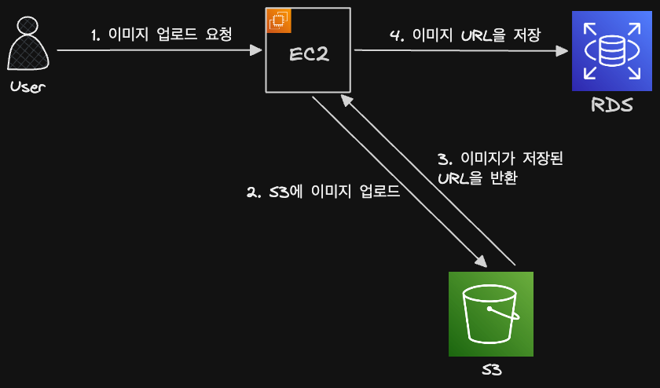

## 1. S3란

### 🔹 S3란

- 파일 저장 서비스
- S3는 파일 저장 및 조회에도 최적화되어 있음

## 2. 전체 아키텍처 이해하기

### 🔹 이미지 파일 업로드 과정

- DB에는 이미지가 아니라 이미지 URL을 저장
  
- 이미지 조회할 때는 URL을 내려주고, 브라우저에서 해당 이미지 URL에 요청해서 조회

## 3. 실습 : 버킷 생성하기

### 🔹 S3 용어 정리

- 버킷 : S3의 저장소
  - 마치 깃허브의 레포지토리
- 객체 : S3 버킷에 업로드된 파일

### 🔹 버킷 생성하기

- S3 > 버킷 > 버킷 만들기
- 모든 퍼블릭 엑세스 차단 해제

### 🔹 버킷에 대한 퍼블릭 엑세스 차단

- 일반적으로 S3 버킷은 모든 퍼블릭 엑세스 차단을 켜둠
- 특히 데이터 레이크로 S3를 사용하는 경우 퍼블릭 접근을 차단해야 함
- 그리고 IAM 설정을 통해 접근
  - Airflow가 돌아가는 EC2에 IAM Role을 붙이고, 그 Role에 S3 권한을 부여
  - EC2 애플리케이션이 Access Key를 직접 보관하지 않고 IAM Role을 사용

### 🔹 버킷에 정책 추가하기

- S3 정책 : 권한을 정의하는 JSON 문서
  - 특정 리소스에 접근하려면 권한을 허용해야 함
  - 권한을 허용할 때 작성해야 하는게 정책
- 버킷 > 권한 > 버킷 정책 → 편집 → 새 문 추가
  - S3 > GetObject
  - 리소스 추가
- 리소스 ARN : `arn:aws:s3:::{내가 만든 버킷명}/*`의 형식으로 입력
  - ARN : Amazon Resource Name
  - AWS에 존재하는 리소스를 표현하는 방식
- `Principal : “*”`

  ```json
  {
    "Version": "2012-10-17",
    "Statement": [
      {
        "Sid": "Statement1",
        "Principal": "*",
        "Effect": "Allow",
        "Action": ["s3:GetObject"],
        "Resource": ["arn:aws:s3:::test-s3-bucket-ad-pipeline/*"]
      }
    ]
  }
  ```

  - 인터넷의 누구든지(`Principal:”*”`) 해당 버킷 안의 모든 객체(`/*`)를 읽을 수 있게(`s3:GetObject`) 허용

### 🔹 정책 전체 구조

- AWS IAM JSON policy는 여러 요소로 구성됨
  - Version, Statement, Effect, Principal, Action, Resource, Condition
  - 요소 순서는 의미에 영향을 주지 않음

```json
{
  "Version": "2012-10-17",
  "Statement": [
    {
      "Sid": "Statement1",
      "Principal": "*",
      "Effect": "Allow",
      "Action": ["s3:GetObject"],
      "Resource": ["arn:aws:s3:::test-s3-bucket-ad-pipeline/*"]
    }
  ]
}
```

- Version : IAM 정책 문법 버전
- Statement : 권한 규칙 목록
- Sid : Statement ID
- Principal : 누가 접근할 수 있는가
  - 값으로 특정 IAM Role이 들어갈 수 있음
  - ex. `"Principal": {"AWS": "arn:aws:iam::123456789012:role/airflow-ec2-role"}`
- Effect : 허용할지, 거부할지
  - ex. `Allow` : 허용, `Deny` : 거부
- Action : 어떤 API 동작을 허용할지
  - ex. `s3:GetObject` : 객체 읽기/다운로드, `s3:PutObject`: 객체 업로드, `s3:ListBucket`: 버킷 안 객체 목록 조회
- Resource : 어떤 리소스에 적용할지
  - ex. `arn:aws:s3:::my-bucket/*`: 버킷 안의 모든 객체
- 정책을 읽는 방법
  - 누가(Principal)
  - 무엇을(Action)
  - 할 수 있는가(Effect)
  - 어떤 리소스에 대해(Resource)
  - 어떤 조건에서(Condition)

## 4. 실습 : S3에 파일 업로드가 가능하도록 IAM에서 엑세스 키 발급받기

### 🔹 IAM 사용자 생성

- S3와 같은 AWS 리소스에 접근할 수 있는 권한을 받기 위해 IAM에서 권한을 부여 받아야 함
- IAM > IAM 사용자 > 사용자 생성
- 권한 설정(직접 정책 연결) : `AmazonS3FullAccess`
- 사용자 생성

### 🔹 IAM 액세스 키 만들기

- 특정 사용자 클릭 > 보안 자격 증명 > 액세스 키 만들기 > AWS 외부에서 실행되는 애플리케이션 > 액세스 키 생성
- IAM은 AWS 리소스에 대한 인증/권한을 관리하는 시스템
  - Access Key는 장기 출입증
  - IAM Role은 AWS 리소스가 임시 출입증을 자동으로 받아 쓰는 방식(실무적)
