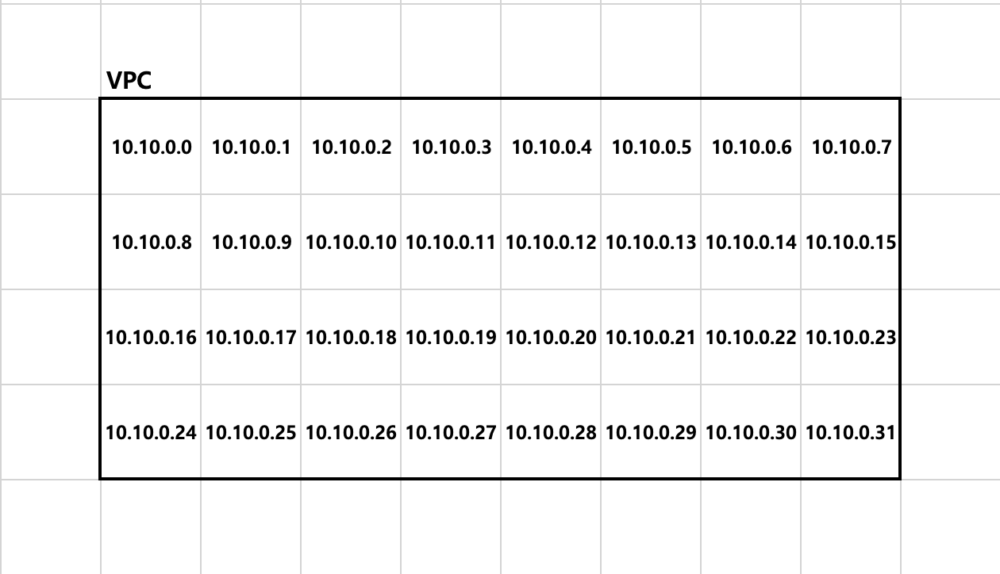
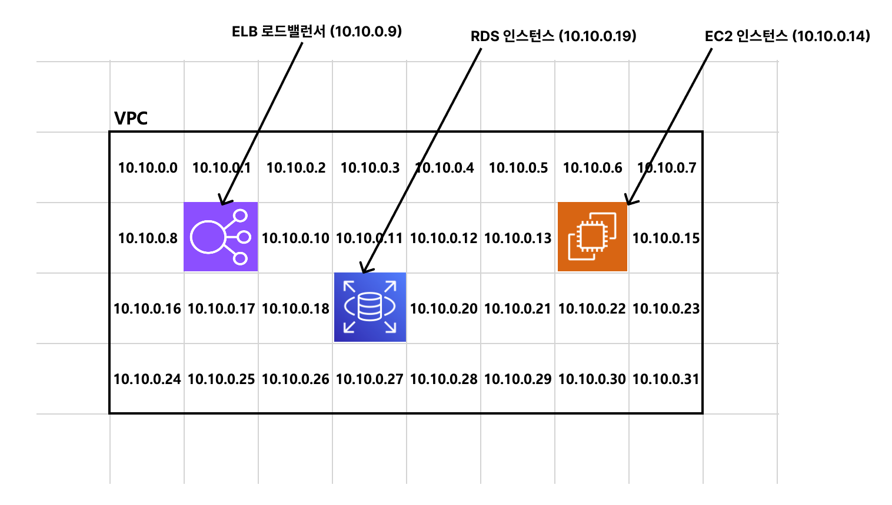
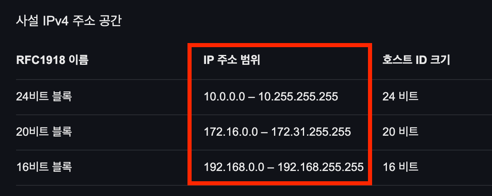

# 1_VPC

## 1. VPC란

### 🔹 VPC를 사용하는 이유

- 가장 핵심적인 이유 : 보안
  - VPC를 사용하면 외부에서 직접 접근할 수 없는 네트워크 환경이라 보안적으로 안전
- 예를 들어 EC2 인스턴스 2대가 있다면, 1대는 인터넷과 연결하고 1대는 내부망에서만 사용 가능

### 🔹 VPC(Virtual Private Cloud)란

- 가상의 네트워크 공간
- EC2, RDS, ELB 같은 서비스도 다른 컴퓨터와 통신을 해야 하므로, 반드시 VPC 위에 세팅을 해야함

### 🔹 VPC 비유




- VPC는 땅이라고 생각하면, 각 구역이 있음
- 각 칸은 IP 주소를 갖고 있음 → 즉, VPC는 할당할 수 있는 여러 개의 IP를 갖고 있음
- AWS에서 리소스를 생성하는 순간 해당 VPC 안에 배치함 → 각 자원에 IP를 할당하는 것



- VPC의 크기를 정할 때는 IP 주소 범위로 정함
  - ex. `10.10.0.0 ~ 10.10.0.31`

### 🔹 VPC의 범위 표기 방식 : CIDR 표기 방식

- CIDR : Classless Inter-Domain Routing
- IP 주소 범위를 짧게 표현하는 방식
- ex. `10.0.0.0/16`
  - `10.0.0.0` : 시작 기준이 되는 네트워크 주소
  - `/16` : 앞 16비트는 네트워크 영역으로 고정
  - 나머지 16비트 : AWS 리소스에 할당 가능한 IP 범위
  - ∴ `10.0.0.0/16`= `10.0.0.0 ~ 10.0.255.255`
- VPC에서 사용할 사설 IP 주소의 전체 범위를 CIDR로 표현

  ```
  VPC CIDR: 10.0.0.0/16

  VPC
  ├── Public Subnet:  10.0.1.0/24
  ├── Private Subnet: 10.0.2.0/24
  └── DB Subnet:      10.0.3.0/24
  ```

- `/숫자`가 작을수록 IP 범위가 크가, 클수록 IP 범위가 작음

## 2. CIDR

### 🔹 CIDR이란

- IP 주소의 범위를 나타내기 위한 표기 방법

### 🔹 IP 주소의 구성

- IP 주소는 4개의 숫자로 구성됨
- 각 숫자는 0-255의 숫자 중 하나로 표현할 수 있음
  - ex. `127.23.150.11`, `15.0.255.1`

### 🔹 10진수 → 2진수 변환

- 큰 자리값부터 빼면서 뺄 수 있으면 1, 못 빼면 0
- 예시 : 10진수 150을 2진수로 변환하기

| 자리값 |                     | 2진수 |
| ------ | ------------------- | ----- |
| 128    | 150(뺄 수 있으면 1) | 1     |
| 64     | 22(뺄 수 없으면 0)  | 0     |
| 32     | 22                  | 0     |
| 16     | 22                  | 1     |
| 8      | 6                   | 0     |
| 4      | 6                   | 1     |
| 2      | 2                   | 1     |
| 1      | 0                   | 0     |

- 따라서 `150` = `10010110`

### 🔹 2진수 → 10진수 변환

- 1이 있는 자리의 값만 더하기
- 예시 : `10010110`

| 자리값 | 2진수 |     |
| ------ | ----- | --- |
| 128    | 1     | 128 |
| 64     | 0     | 0   |
| 32     | 0     | 0   |
| 16     | 1     | 16  |
| 8      | 0     | 0   |
| 4      | 1     | 4   |
| 2      | 1     | 2   |
| 1      | 0     | 0   |
|        |       | 150 |

### 🔹 IP 주소에 적용

- `127.23.150.11`
- 각 숫자를 8비트 2진수로 변경
- `01111111.00010111.10010110.00001011`
- 각 칸이 8비트이므로, `23`은 `10111`이 아니라 `00010111`

### 🔹 CIDR과 IP 주소

- IP 주소는 총 32비트
  ```
  127.23.150.11
  = 8비트 . 8비트 . 8비트 . 8비트
  = 총 32비트
  ```
- CIDR의 `/24`, `/16`은 이 32비트 중에서 앞에서 몇 비트까지 네트워크 주소로 고정할지를 의미
- `10.0.1.0/24`
  - 의미 : 앞 24비트는 네트워크 영역, 나머지는 호스트 영역
  - 따라서 `10.0.1.0 ~ 10.0.1.255`

### 🔹 예시 : `13.25.82.0/24`

- 24니까 앞에서 24비트는 네트워크 영역
- 그럼 앞 3자리는 고정, 맨 뒷자리는 0-255까지 사용 가능
- `13.25.82.0/24`= `13.25.82.0`~`13.25.82.255`

## 3. CIDR 예제

### 🔹 예제 1) `10.88.135.0/24`가 의미하는 IP 주소 범위는 ?

- `10.88.135.0` ~ `10.88.135.255`
- /24이므로 앞 24비트는 네트워크 영역
- 나머지 8비트는 호스트 영역

### 🔹 예제 2) `25.212.157.0/25`가 의미하는 IP 주소 범위는 ?

- `25.212.157.0` ~ `25.212.157.127`
- /25이므로 앞 25비트는 네트워크 영역
- 나머지 7비트가 호스트 영역
- `X.X.X.00000000` ~ `X.X.X.01111111`
- 따라서 `01111111`은 `127`

### 🔹 예제 3) `25.212.157.128/25`가 의미하는 IP 주소 범위는 ?

- `25.212.157.128`~`25.212.157.255`
- `X.X.X.10000000` ~ `X.X.X.11111111`

## 4. 사설 IP, 공인 IP

### 🔹 공인 IP(퍼블릭 IP)란

- 퍼블릭 IP : 외부 인터넷을 통해 접근할 수 있는 IP 주소
- 공인 IP는 전 세계에서 딱 1개 뿐인 주소
- AWS EC2 인스턴스를 생성할 때도 퍼블릭 IPv4주소를 받음
  - 이 주소를 통해 외부 인터넷에서 EC2 인스턴스에 접근 가능

### 🔹 사설 IP(프라이빗 IP)란

- 외부 인터넷과 직접 연결되지 않고, 내부 네트워크에서만 사용되는 주소
- 사설 IP는 동일한 네트워크 환경에서만 통신 가능
  - 동일한 네트워크 환경 = 같은 공유기를 사용하거나 같은 VPC인 경우
- 사설 IP는 네트워크 환경마다 중복될 수 있음
  - 공인 IP는 2개의 컴퓨터가 중복해서 가질 수 없음
  - 그러나 사설 IP는 네트워크 환경마다 독립적으로 사용할 수 있음
    - A 와이파이에서 사설 IP로 `a.b.c.d`를 사용할 때, B 와이파이에서 사설 IP로 `a.b.c.d`가 존재할 수 있음

### 🔹 사설 IP의 범위

- IETF에서 사설 IP 범위를 정함
  - 
- 사설 IP 범위에 있는 IP 주소로 통신하면 사설 IP로 인식
  - 즉 사설 IP 범위에 있는 IP 주소는 공인 IP로 사용할 수 없음
