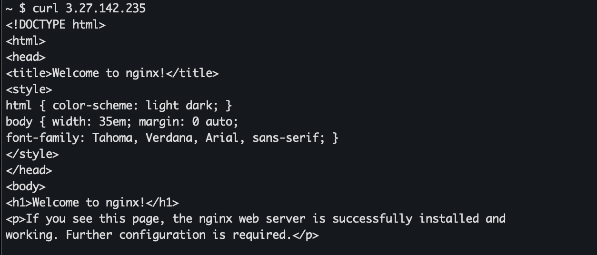
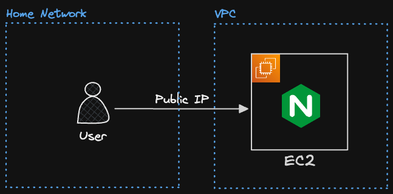
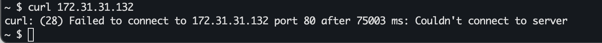
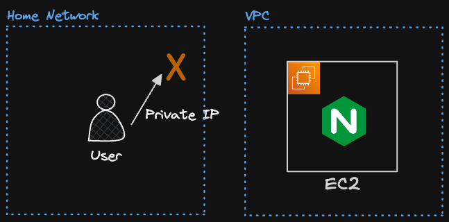
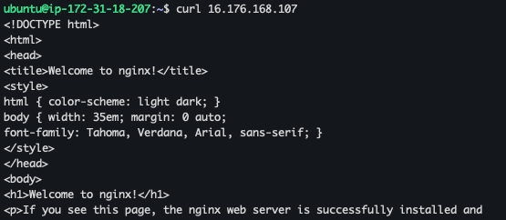
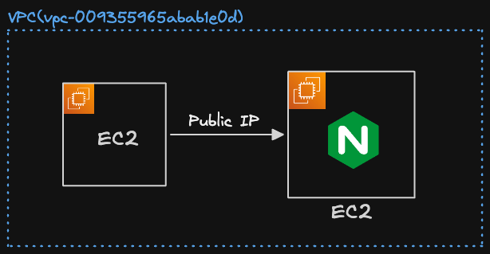
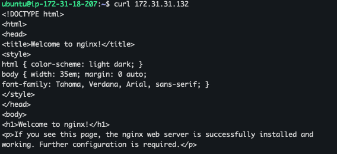
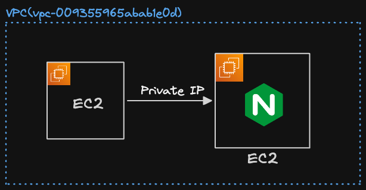
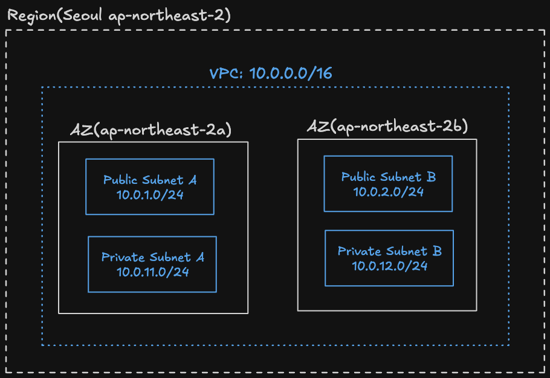

# 1_VPC

## 1. VPC란

### 🔹 VPC를 사용하는 이유

- 가장 핵심적인 이유 : 보안
  - VPC를 사용하면 외부에서 직접 접근할 수 없는 네트워크 환경이라 보안적으로 안전
- 예를 들어 EC2 인스턴스 2대가 있다면, 1대는 인터넷과 연결하고 1대는 내부망에서만 사용 가능

### 🔹 VPC(Virtual Private Cloud)란

- 가상의 네트워크 공간
- EC2, RDS, ELB 같은 서비스도 다른 컴퓨터와 통신을 해야 하므로, 반드시 VPC 위에 세팅을 해야함

### 🔹 VPC 비유


- VPC는 땅이라고 생각하면, 각 구역이 있음
- 각 칸은 IP 주소를 갖고 있음 → 즉, VPC는 할당할 수 있는 여러 개의 IP를 갖고 있음
- AWS에서 리소스를 생성하는 순간 해당 VPC 안에 배치함 → 각 자원에 IP를 할당하는 것


- VPC의 크기를 정할 때는 IP 주소 범위로 정함
  - ex. `10.10.0.0 ~ 10.10.0.31`

### 🔹 VPC의 범위 표기 방식 : CIDR 표기 방식

- CIDR : Classless Inter-Domain Routing
- IP 주소 범위를 짧게 표현하는 방식
- ex. `10.0.0.0/16`
  - `10.0.0.0` : 시작 기준이 되는 네트워크 주소
  - `/16` : 앞 16비트는 네트워크 영역으로 고정
  - 나머지 16비트 : AWS 리소스에 할당 가능한 IP 범위
  - ∴ `10.0.0.0/16`= `10.0.0.0 ~ 10.0.255.255`
- VPC에서 사용할 사설 IP 주소의 전체 범위를 CIDR로 표현

  ```
  VPC CIDR: 10.0.0.0/16

  VPC
  ├── Public Subnet:  10.0.1.0/24
  ├── Private Subnet: 10.0.2.0/24
  └── DB Subnet:      10.0.3.0/24
  ```

- `/숫자`가 작을수록 IP 범위가 크가, 클수록 IP 범위가 작음

## 2. CIDR

### 🔹 CIDR이란

- IP 주소의 범위를 나타내기 위한 표기 방법

### 🔹 IP 주소의 구성

- IP 주소는 4개의 숫자로 구성됨
- 각 숫자는 0-255의 숫자 중 하나로 표현할 수 있음
  - ex. `127.23.150.11`, `15.0.255.1`

### 🔹 10진수 → 2진수 변환

- 큰 자리값부터 빼면서 뺄 수 있으면 1, 못 빼면 0
- 예시 : 10진수 150을 2진수로 변환하기

| 자리값 |                     | 2진수 |
| ------ | ------------------- | ----- |
| 128    | 150(뺄 수 있으면 1) | 1     |
| 64     | 22(뺄 수 없으면 0)  | 0     |
| 32     | 22                  | 0     |
| 16     | 22                  | 1     |
| 8      | 6                   | 0     |
| 4      | 6                   | 1     |
| 2      | 2                   | 1     |
| 1      | 0                   | 0     |

- 따라서 `150` = `10010110`

### 🔹 2진수 → 10진수 변환

- 1이 있는 자리의 값만 더하기
- 예시 : `10010110`

| 자리값 | 2진수 |     |
| ------ | ----- | --- |
| 128    | 1     | 128 |
| 64     | 0     | 0   |
| 32     | 0     | 0   |
| 16     | 1     | 16  |
| 8      | 0     | 0   |
| 4      | 1     | 4   |
| 2      | 1     | 2   |
| 1      | 0     | 0   |
|        |       | 150 |

### 🔹 IP 주소에 적용

- `127.23.150.11`
- 각 숫자를 8비트 2진수로 변경
- `01111111.00010111.10010110.00001011`
- 각 칸이 8비트이므로, `23`은 `10111`이 아니라 `00010111`

### 🔹 CIDR과 IP 주소

- IP 주소는 총 32비트
  ```
  127.23.150.11
  = 8비트 . 8비트 . 8비트 . 8비트
  = 총 32비트
  ```
- CIDR의 `/24`, `/16`은 이 32비트 중에서 앞에서 몇 비트까지 네트워크 주소로 고정할지를 의미
- `10.0.1.0/24`
  - 의미 : 앞 24비트는 네트워크 영역, 나머지는 호스트 영역
  - 따라서 `10.0.1.0 ~ 10.0.1.255`

### 🔹 예시 : `13.25.82.0/24`

- 24니까 앞에서 24비트는 네트워크 영역
- 그럼 앞 3자리는 고정, 맨 뒷자리는 0-255까지 사용 가능
- `13.25.82.0/24`= `13.25.82.0`~`13.25.82.255`

## 3. CIDR 예제

### 🔹 예제 1) `10.88.135.0/24`가 의미하는 IP 주소 범위는 ?

- `10.88.135.0` ~ `10.88.135.255`
- /24이므로 앞 24비트는 네트워크 영역
- 나머지 8비트는 호스트 영역

### 🔹 예제 2) `25.212.157.0/25`가 의미하는 IP 주소 범위는 ?

- `25.212.157.0` ~ `25.212.157.127`
- /25이므로 앞 25비트는 네트워크 영역
- 나머지 7비트가 호스트 영역
- `X.X.X.00000000` ~ `X.X.X.01111111`
- 따라서 `01111111`은 `127`

### 🔹 예제 3) `25.212.157.128/25`가 의미하는 IP 주소 범위는 ?

- `25.212.157.128`~`25.212.157.255`
- `X.X.X.10000000` ~ `X.X.X.11111111`

## 4. 사설 IP, 공인 IP

### 🔹 공인 IP(퍼블릭 IP)란

- 퍼블릭 IP : 외부 인터넷을 통해 접근할 수 있는 IP 주소
- 공인 IP는 전 세계에서 딱 1개 뿐인 주소
- AWS EC2 인스턴스를 생성할 때도 퍼블릭 IPv4주소를 받음
  - 이 주소를 통해 외부 인터넷에서 EC2 인스턴스에 접근 가능

### 🔹 사설 IP(프라이빗 IP)란

- 외부 인터넷과 직접 연결되지 않고, 내부 네트워크에서만 사용되는 주소
- 사설 IP는 동일한 네트워크 환경에서만 통신 가능
  - 동일한 네트워크 환경 = 같은 공유기를 사용하거나 같은 VPC인 경우
- 사설 IP는 네트워크 환경마다 중복될 수 있음
  - 공인 IP는 2개의 컴퓨터가 중복해서 가질 수 없음
  - 그러나 사설 IP는 네트워크 환경마다 독립적으로 사용할 수 있음
    - A 와이파이에서 사설 IP로 `a.b.c.d`를 사용할 때, B 와이파이에서 사설 IP로 `a.b.c.d`가 존재할 수 있음

### 🔹 사설 IP의 범위

- IETF에서 사설 IP 범위를 정함
  - 
- 사설 IP 범위에 있는 IP 주소로 통신하면 사설 IP로 인식
  - 즉 사설 IP 범위에 있는 IP 주소는 공인 IP로 사용할 수 없음

## 5. 실습 : 사설 IP로 통신해보기

### 🔹 사설 IP로 통신해보기

- EC2 인스턴스 생성
  - 인터넷에서 HTTP 트래픽 허용 체크
- EC2 인스턴스에 접속
- Nginx 설치
  ```bash
  sudo apt update # apt 패키지 리스트 최신화
  sudo apt install nginx -y # nginx 설치
  sudo systemctl start nginx # nginx 시작
  sudo systemctl status nginx # nginx 상태 확인
  ```
- 웹 서버가 잘 실행되고 있는지 확인
  - 터미널에서 curl 명령어로 퍼블릭 IP로 요청 전송
    
    
- 터미널에서 curl 명령어로 프라이빗 IP로 요청 전송
  - 응답이 오지 않음
    
- 프라이빗 IP는 동일한 네트워크 환경에서만 통신할 수 있는 주소
  - 현재 노트북의 네트워크 환경과 EC2 인스턴스의 네트워크 환경이 다르므로 접속이 안되는 것
    

### 🔹 같은 네트워크 환경에 EC2 인스턴스 추가하기

- 기존 EC2 인스턴스의 VPC 확인
  - `vpc-009355965abab1e0d`
- 새로운 EC2 인스턴스 생성
  - 네트워크 설정에서 동일한 VPC를 선택
- 새로운 EC2 인스턴스에서 기존 EC2 인스턴스의 퍼블릭 IP로 요청 전송
  
  
- 새로운 EC2 인스턴스에서 기존 EC2 인스턴스의 프라이빗 IP로 요청 전송
  - EC2 인스턴스가 둘 다 같은 네트워크 환경(동일한 VPC)에 있어서 사설 IP로 통신 가능
    
    

### 🔹 사설 IP란

- 사설 IP : 외부 인터넷과 직접 연결되지 않고, 내부 네트워크에서만 사용되는 주소
- 사설 IP는 동일한 네트워크 환경에서만 통신 가능
- 동일한 네트워크 환경이란
  1. 같은 공유기(와이파이)를 사용하는 경우
  2. 같은 VPC인 경우

## 6. 실습 : VPC 생성하기

### 🔹 VPC 생성하기

- VPC 생성
  - 생성할 리소스 : VPC만
  - IPv4 CIDR : 10.0.0.0/16

### 🔹VPC를 10.0.0.0/16으로 설정한 이유

- 10.0.0.0 ~ 10.0.255.255(IP 주소 개수 약 65,000개)
- 이유 1 : 사설 IP 범위에 포함되어야 함
  - 사설 IPv4 주소 공간
    - 10.0.0.0 ~ 10.255.255.255
    - 172.16.0.0 ~ 172.31.255.255
    - 192.168.0.0 ~ 192.168.255.255
- 이유 2 : 충분한 IP 개수가 있어야 함
  - 하나의 VPC에서 다양한 AWS 리소스를 사용하게 되므로, 충분한 IP 주소 개수가 필요
- 그러나 VPC만 생성해서는 EC2 인스턴스를 생성할 수 없음
  - VPC만 생성하는게 아니라 서브넷도 같이 생성해야 EC2 인스턴스 생성 가능

### 🔹 사설 IPv4 주소 범위

- RFC 1918은 사설 네트워크용으로 아래 3개 블록을 예약했음
  | 범위 | CIDR | 주소 수 | 과거 표현 |
  | ------------------------------- | ---------------- | ------------- | ------------- |
  | `10.0.0.0 ~ 10.255.255.255` | `10.0.0.0/8` | 약 1,677만 개 | Class A 1개 |
  | `172.16.0.0 ~ 172.31.255.255` | `172.16.0.0/12` | 약 104만 개 | Class B 16개 |
  | `192.168.0.0 ~ 192.168.255.255` | `192.168.0.0/16` | 약 6.5만 개 | Class C 256개 |
  - 큰 회사용, 중간 조직용, 작은 네트워크용으로 사용할 수 있게 크기가 다른 블록을 준 것
- 그리고 이미 할당된 공인 IPv4 주소를 피해서 사설 IPv4 주소를 할당함

### 🔹 AWS에서 VPC 가격 정책

- AWS에서 VPC 자체를 생성하고 사용하는 데는 추가 요금이 없음
- 따라서 VPC 범위를 설정할 때, IP 주소 범위를 넓게 설정한다고 해서 추가 요금이 더 발생하지 않음
- 대표적으로 비용이 발생하는 항목
  - EC2 : 인스턴스 실행 시간
  - EBS : 디스크 용량
  - Public IPv4 : 시간당 과금
  - NAT Gateway : 시간당 요금 + 처리 GB당 요금
  - Data Transfer : 인터넷/리전/AZ 간 전송량
- 비용은 주소 공간의 크기가 아니라 그 안에 배치된 유로 리소스와 트래픽에서 발생함

### 🔹 VPC만 생성하면 EC2를 생성할 수 없는 이유

- VPC는 주소 공간과 네트워크 경계를 정의
- EC2는 VPC 안에 직접 놓이는 게 아니라 반드시 서브넷 안에 놓이고, 각 서브넷은 하나의 AZ 안에만 존재
- VPC는 리전 단위의 논리적 네트워크이고, 서브넷은 그 VPC 주소 점위를 특정 AZ에 배치한 실제 리소스 배치 단위이므로 서브넷까지 생성해야 EC2 생성 가능

```
Region = 서울이라는 도시
AZ = 서울 안의 서로 떨어진 AWS 데이터센터 구역
VPC = 네가 서울 전체에 만든 사설 네트워크 주소 체계
Subnet = 그 주소 체계를 AZ별로 잘라놓은 구역
EC2 = 특정 Subnet 안에 입주하는 서버
```


