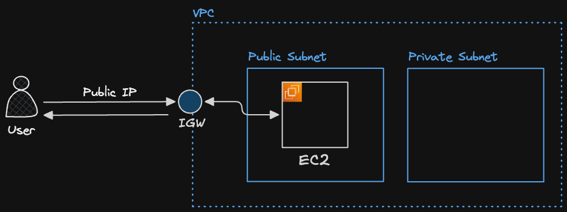
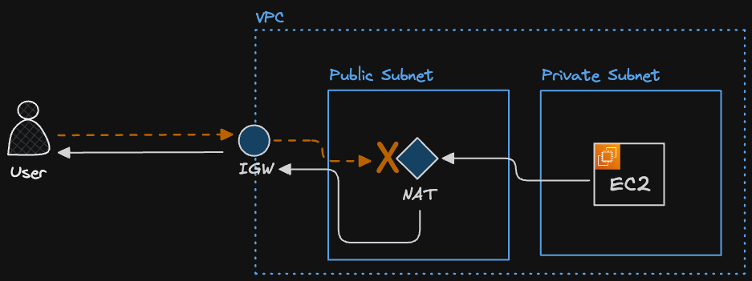
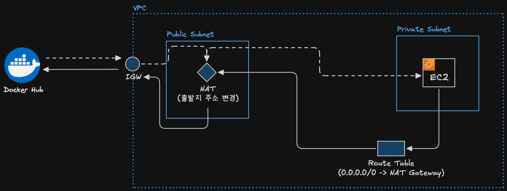
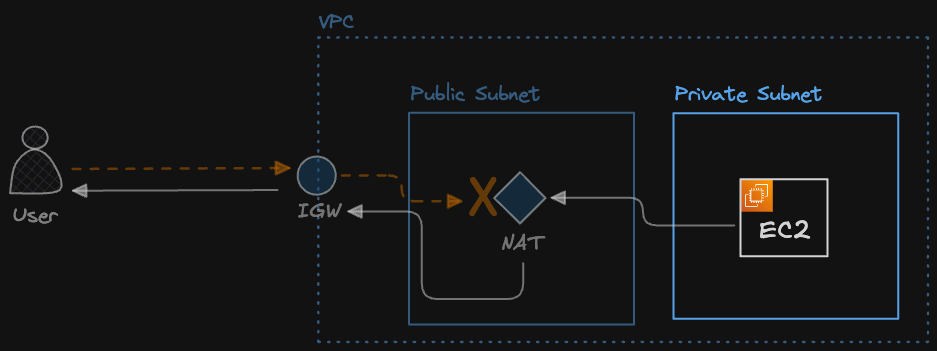
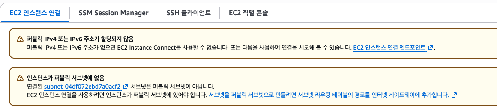
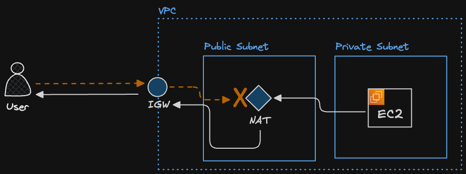
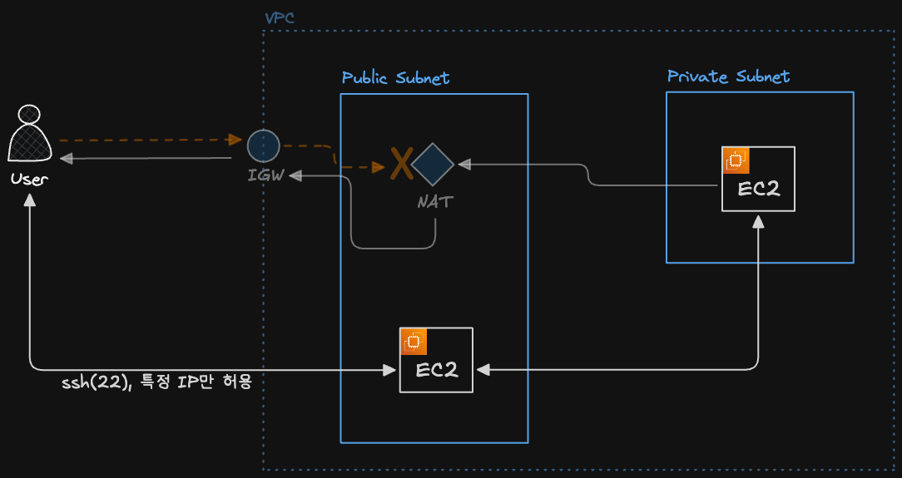

## 1. NAT 게이트웨이란

### 🔹 프라이빗 서브넷을 위해 필요한 NAT 게이트웨이

- 퍼블릭 서브넷은 외부 인터넷과 직접 통신해야 하므로 IGW와 라우팅 테이블에 `0.0.0.0/0 → IGW` 규칙을 추가함
  
- 반면 프라이빗 서브넷은 외부에서 직접 접근되면 안 되므로 IGW로 직접 라우팅하지 않음
- 하지만 프라이빗 서브넷의 EC2도 경우에 따라 외부 인터넷으로 나가야 함
  - OS 패키지 설치, 보안 업데이트, Docker 이미지 다운로드, 외부 API 호출, 데이터 수집 작업 수행 등
- 이때 필요한 것이 NAT 게이트웨이
  - NAT 게이트웨이는 프라이빗 서브넷의 인스턴스가 외부 인터넷으로 나가는 트래픽은 허용하지만, 외부 인터넷에서 프라이빗 인스턴스로 직접 들어오는 요청은 허용하지 않음
  - 따라서 프라이빗 서브넷의 라우팅 테이블에는 `0.0.0.0/0 → NAT Gateway` 규칙을 추가함
- NAT 게이트웨이 자체는 인터넷과 통신할 수 있어야 하므로 퍼블릭 서브넷에 배치하고, 퍼블릭 IP인 Elastic IP를 연결함
  

### 🔹 NAT 게이트웨이란

- 외부 인터넷에서 서브넷으로 접근할 수는 없지만, 서브넷에서 외부 인터넷으로 접근할 수 있게 해주는 장치
- Network Address Translation
- 외부에서 내부로 요청을 보낼 수는 없지만, 내부에서 외부로 요청을 보낼 수 있음
  - 외부의 침입으로부터 보호할 수 있어서 보안적으로 훨씬 안전함
- NAT 게이트웨이는 프라이빗 서브넷이 아니라 퍼블릭 서브넷에 위치해야햠
  - 프라이빗 서브넷의 요청을 인터넷으로 대신 보내야하므로

### 🔹 예시 : 프라이빗 서브넷의 EC2가 도커 허브에서 이미지 다운로드



```
Private EC2
- Private IP: 10.0.2.15
- Source Port: 52000

NAT Gateway
- Private IP: 10.0.1.10
- Elastic IP: 3.35.10.20

Docker Hub
- Public IP: 44.200.100.10
- Port: 443
```

1. EC2가 Docker Hub로 HTTPS 요청 전송

   ```
   출발지: 10.0.2.15:52000
   목적지: 44.200.100.10:443
   ```

   - 프라이빗 서브넷의 라우팅 테이블에는 보통 아래 규칙이 있음

   ```
   0.0.0.0/0 → NAT Gateway
   ```

2. NAT Gateway가 출발지 주소를 변경
   - 프라이빗 IP는 인터넷에서 라우팅되지 않으므로

   ```
   변환 전
   출발지: 10.0.2.15:52000(프라이빗 서브넷의 EC2의 프라이빗 IP)
   목적지: 44.200.100.10:443

   변환 후
   출발지: 3.35.10.20:xxxxx(NAT Gateway의 퍼블릭 IP)
   목적지: 44.200.100.10:443
   ```

   - Docker Hub 입장에서는 요청자가 EC2가 아니라 NAT Gateway의 퍼블릭 IP로 보임

3. NAT Gateway는 매핑 정보를 저장
   - 응답이 들어왔을 때 해당 응답을 어느 EC2에게 돌려줘야 하는지 알아야 하므로

   ```
   10.0.2.15:52000  ↔  3.35.10.20:xxxxx
   ```

4. Docker Hub가 NAT Gateway로 응답

   ```
   출발지: 44.200.100.10:443
   목적지: 3.35.10.20:xxxxx
   ```

5. NAT Gateway가 응답을 EC2로 전송
   - 응답 패킷의 목적지 변경

   ```
   변환 전
   출발지: 44.200.100.10:443
   목적지: 3.35.10.20:xxxxx

   변환 후
   출발지: 44.200.100.10:443
   목적지: 10.0.2.15:52000
   ```

## 2. 실습 : NAT 게이트웨이 생성하기

### 🔹 NAT 게이트웨이 생성

- VPC > NAT 게이트웨이
- NAT 게이트웨이 생성
  - VPC 선택
  - 연결유형 : 퍼블릭
    - 외부 인터넷과 통신할 수 있어야하므로 퍼블릭
  - 탄력적 IP 할당

### 🔹 라우팅 테이블 생성

- 라우팅 테이블을 만들어서 프라이빗 서브넷의 트래픽이 NAT 게이트웨이로 이동할 수 있게 설정
- VPC > 라우팅 테이블 > 라우팅 테이블 생성
  - VPC 선택

### 🔹 라우팅 테이블에 서브넷 연결

- 서브넷 연결 > 서브넷 연결 편집
- 프라이빗 서브넷 선택
  - 이 라우팅 테이블은 프라이빗 서브넷과 NAT 게이트웨이를 연결하는 것이므로

### 🔹 라우팅 편집하기

- 라우팅 > 라우팅 편집
- 라우팅 규칙 추가 : 모든 IPv4 트래픽을 NAT 게이트웨이로 전송


- VPC 내부에서 10.0.0.0/16으로 보내는 트래픽은 local 통신(프라이빗 IP로 내부 통신)
- 0.0.0.0/0, 즉 모든 IPv4 주소로 보내는 트래픽은 NAT 게이트웨이로 전송
  - IP 주소가 둘 다 겹치면, IP 주소 범위가 더 구체적인 조건을 우선 적용함

## 3. 실습 : 프라이빗 서브넷에 EC2 배치해서 외부 접근 차단

### 🔹 EC2 생성

- 아래 그림에서 프라이빗 서브넷의 EC2를 생성하는 것
  
- EC2 생성
  - VPC 선택
  - 프라이빗 서브넷 선택
  - 퍼블릭 IP 자동 할당 : 비활성화
    - 외부로부터 접근할 수 없게 막는게 목적이므로
  - 보안그룹 추가
    - HTTP, 위치무관
- EC2 인스턴스에 연결
  
  - 퍼블릭 IP가 없고, 인스턴스가 퍼블릭 서브넷에 없음 → 의도한 동작
- 따라서 다음과 같이 EC2를 프라이빗 서브넷에 위치시킴
  
- 그러나 프라이빗 서브넷에 접근해서 해당 서버에서 작업을 처리해야 하는 경우가 있음
  - ex. 도커 이미지 다운로드, 서버 실행, 패키지 다운로드
  - 이를 해결하는게 Bastion Host

## 4. 실습 : 프라이빗 서브넷의 EC2에 접속하는 방법

### 🔹 프라이빗 서브넷에 접근하는 방법

- 프라이빗 서브넷은 외부에서 접근 불가
- 그러나 같은 VPC 내부에서는 퍼블릭 서브넷의 리소스와 프라이빗 서브넷의 리소스가 자유롭게 통신 가능



### 🔹 퍼블릭 서브넷에 EC2 생성

- EC2 생성
  - VPC 선택
  - 퍼블릭 서브넷
  - 보안그룹 : 22번, 내 IP만 허용

### 🔹 Bastion Host로 프라이빗 서브넷의 EC2에 접근하기

- 퍼블릭 서브넷의 EC2 인스턴스에 접속 확인
  ```json
  ubuntu@ip-10-0-1-139:~$
  ```
- 로컬 컴퓨터에서 퍼블릭 서브넷의 EC2 인스턴스로 프라이빗 서브넷의 EC2 키 페어 파일 전송

  ```bash
  $ cd [키 페어 파일이 존재하는 경로]

  # scp -i [EC2 접근을 위한 키 페어 파일] [전송할 파일명] [서버 username]@[EC2 인스턴스의 Public IP]:[전송 받을 파일 위치]
  ```

  - `scp` : Secure Copy Protocol
  - 전송 후 퍼블릭 서브넷의 EC2에 들어가보면, 키페어가 있음을 확인 가능

  ```json
  ubuntu@ip-10-0-1-139:~$ ls
  test-ad-server-key.pem
  ```

- 퍼블릭 서브넷의 EC2를 통해 프라이빗 서브넷의 EC2 접근
  ```json
  ubuntu@ip-10-0-2-170:~$
  ```

## 5. Bastion Host란

### 🔹 Bastion Host란


- Bastion : 요새에서 돌출 지점마다 건설된 포루
  - Bastion Host도 이와 비슷한 역할
- Bastion Host : 외부 인터넷에서 내부 네트워크에 있는 리소스에 접근할 때, 먼저 거치는 컴퓨터를 의미

### 🔹 Bastion Host가 필요한 이유

- 프라이빗 서브넷에 있는 서버를 인터넷에 직접 노출하지 않고, 관리자가 들어오는 하나의 출입구만 만들어서 접근을 통제하기 위해서
- Bastion 없음 : 각 방마다 외부로 통하는 문이 있음
- Bastion 있음 : 건물 입구는 하나이고, 내부 방은 건물 안에서만 접근 가능
- Bastion Host가 해킹당하면 위험한 것은 같지만, 공격 받는 지점을 하나로 모으는 의미가 있음
- Bastion Host가 없다면 인터넷에서 접근 가능한 Public IP, 열린 포트가 많을 수록 공격 대상이 넓어져서 위험
