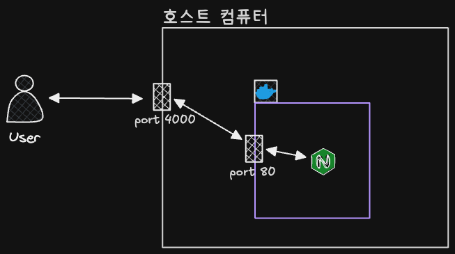

# 2_Docker CLI

## 1. 이미지 다운로드

### 🔹 이미지 다운로드

- 최신 버전(latest) 이미지 다운로드
  ```bash
  # docker pull <이미지명>
  docker pull nginx # == docker pull nginx:latest
  ```

### 🔹 Dockerhub

- 도커 이미지 저장소
- 사람들이 올려놓은 이미지를 pull을 통해 다운받아서 사용 가능
- Github과 비슷한 역할

### 🔹 태그명

- 태그명 = 이미지의 특정 버전을 나타내는 이름
- 특정 버전 이미지 다운로드
  ```bash
  # docker pull <이미지명:태그명>
  docker pull nginx:stable-perl
  ```

## 2. 이미지 조회/삭제

### 🔹 이미지 조회

- 다운받은 모든 이미지 조회

  ```bash
  docker image ls
  ```

  - `ls` : list의 약자
  - `REPOSITORY` : 이미지명
  - `TAG` : 이미지 태그명
  - `IMAGE ID` : 이미지 ID
  - `CREATED` : 이미지가 생성된 날짜(다운받은 날짜가 아님)
  - `SIZE` : 이미지 크기

### 🔹 이미지 삭제

- 특정 이미지 삭제

  ```bash
  # docker image rm <image id 또는 이미지명>
  ```

  - `rm` : remove의 약자
  - 이미지 ID를 입력할 때 전체 ID를 다 입력하지 않고 일부 ID만 입력해도 삭제됨
  - 삭제 조건 : 컨테이너에서 사용하고 있지 않은 이미지만 삭제 가능

- 중지된 컨테이너에서 사용하고 있는 이미지를 강제로 삭제하기

  ```bash
  # docker image rm -f <image id 또는 이미지명>
  ```

  - 참고 : 실행 중인 컨테이너에서 사용하고 있는 이미지는 강제로 삭제 불가
    - 삭제하고 싶다면 컨테이너를 중단시켜야 가능

- 전체 이미지 삭제

  ```bash
  # 컨테이너에서 사용하고 있지 않은 이미지만 전체 삭제
  docker image rm $(docker images -q)

  # 컨테이너에서 사용하고 있는 이미지를 포함해서 전체 이미지 삭제
  docker image rm -f $(docker images -q)
  ```

  - 도커로 작업을 하다보면 안쓰던 이미지가 쌓임 → 이를 하나하나 지우기 귀찮을 때 사용
  - `docker images -q` : 시스템에 있는 모든 이미지 ID를 반환
    - `-q` 옵션 : quite, 상제 정보 대신 이미지의 고유한 ID만 표시

## 3. 컨테이너 생성/실행

### 🔹 컨테이너 생성

- 이미지를 바탕으로 컨테이너를 생성
- create 명령어는 생성만 하고 실행하지는 않음(잘 사용하지 않는 명령어)
- 컨테이너 생성

  ```bash
  # docker create 이미지명[:태그명]
  docker create nginx

  docker ps -a # 모든 컨테이너 조회
  ```

  - 만약 이때 로컬 환경에 이미지(ex. `nginx`)가 없다면, Dockerhub에서 이미지를 다운(`pull`)받아서 컨테이너를 생성함

### 🔹 컨테이너 실행

- 정지되어 있는 컨테이너를 실행

  ```bash
  # docker start <컨테이너명 or 컨테이너ID>

  docker ps # 실행 중인 컨테이너 조회
  ```

- 실행 중인 컨테이너는 docker ps의 결과의 STATUS에 UP이라고 표시됨

### 🔹 컨테이너 생성 + 실행

- 이미지를 바탕으로 컨테이너 생성 후, 실행까지 진행
  - 처음에 이미지로 컨테이너를 실행하고 싶을 때, 이 명령어를 자주 사용

  ```bash
  # docker run <이미지명[:태그명]>
  docker run nginx # 포그라운드에서 실행(추가적인 명령어 조작 불가)

  # Çtrl + C로 포그라운드에서 실행 중인 컨테이너 종료
  ```

  - `run = create + start`라서, 마찬가지로 로컬에 이미지가 없다면 다운받아서 실행됨
  - 만약 새롭게 업데이트된 이미지를 다운받고 싶다면 `docker pull` 명령어를 활용

### 🔹 포그라운드, 백그라운드

- 포그라운드(foreground)
  - 실행시킨 프로그램의 내용이 화면에서 실행되고 출력되는 상태
  - 따라서 포그라운드 상태에서 다른 프로그램을 조작 불가
- 백그라운드(background)
  - 실행시킨 프로그램이 컴퓨터 내부적으로 실행되는 상태
  - 따라서 다른 명령어를 실행할 수 있음

```bash
# 백그라운드에서 컨테이너 실행
# docker run -d <이미지명[:태그명]>
docker run -d nginx

# 포그라운드에서 컨테이너 실행
# docker run <이미지명[:태그명]>
docker run nginx
```

- `-d` 옵션 : detached mode
  - 컨테이너를 현재 터미널과 분리해서 실행하는 방식

### 🔹 컨테이너에 이름 붙여서 생성 및 실행하기

- 컨테이너에 이름 붙여서 생성 및 실행
  ```bash
  # docker run -d --name <[컨테이너명]> <이미지명[:태그명]>
  docker run -d --name my-server nginx
  ```
- 컨테이너명을 붙이면 운영⋅디버깅⋅자동화가 쉬워짐
  1. 명령어가 쉬워짐
     1. 컨테이너ID 대신 사용 가능
  2. 어떤 컨테이너인지 바로 알 수 있음
     1. 이름 없이 실행하면 도커가 랜덤 이름을 붙임
     2. 그러면 컨테이너가 어떤 역할인지 명확하게 알 수 없음
  3. 스크립트/자동화에 유리
     1. 컨테이너ID는 매번 변경되지만, 이름은 고정적으로 관리 가능
  4. 로그 확인이 쉬워짐
  5. 컨테이너 간 통신에서 컨테이너명 사용 가능
     1. 도커 네트워크 안에서는 컨테이너 이름이 일종의 DNS 이름처럼 동작 가능
     2. IP를 직접 쓰지 않아도돼서 편리함
  - 단 컨테이너 이름은 중복 생성 안됨

### 🔹 포트 매핑



- 호스트의 포트와 컨테이너의 포트를 연결하기
  ```bash
  # docker run -p [호스트 포트]:[컨테이너 포트] 이미지명[:태그명]
  docker run -p 4000:80 nginx
  ```
- 포트 매핑은 컨테이너 안에서 실행 중인 서버를 외부에서 접속 가능하게 만드는 연결 규칙

  ```bash
  docker run -p 4000:80 nginx
  ```

  - 내 컴퓨터의 4000번 포트로 들어온 요청을 nginx 컨테이너 안의 80번 포트로 전달

- 포트 매핑이 해결하는 문제
  - 컨테이너는 격리된 네트워크 공간을 가지므로, Nginx가 컨테이너 안에서 80번 포트로 실행 중이라도 내 브라우저에서 80번 포트로 접속하면 연결이 안됨
  - 따라서 이를 포트 매핑을 통해 외부에서 컨테이너 내부의 서비스로 요청을 보낼 수 있도록 연결해주는 것

## 4. 컨테이너 조회, 중지, 삭제

### 🔹 컨테이너 조회

- 실행 중인 컨테이너들만 조회
  ```bash
  docker ps
  ```

  - `ps` : process status
- 모든 컨테이너 조회(실행 중인 컨테이너 + 중지된 컨테이너)
  ```bash
  docker ps -a
  ```

  - `-a` 옵션 : all

### 🔹 컨테이너 중지

- 정상적으로 컨테이너 종료
  ```bash
  # docker stop <컨테이너명 or 컨테이너ID>
  ```
- 컨테이너 강제 종료
  ```bash
  # docker kill <컨테이너명 or 컨테이너ID>
  ```

### 🔹 컨테이너 삭제

- 중지된 특정 컨테이너 삭제
  ```bash
  # docker rm <컨테이너명 or 컨테이너ID>
  ```
- 실행 중인 특정 컨테이너 삭제
  ```bash
  # docker rm -f <컨테이너명 or 컨테이너ID>
  ```

  - `-f` 옵션 : force
- 중지된 모든 컨테이너 삭제
  ```bash
  docker rm $(docker ps -qa)
  ```

  - `-a` : all
  - `-q` : quite : 컨테이너 ID만 출력
- 실행 중인 모든 컨테이너 삭제
  ```bash
  docker rm -f $(docker ps -qa)
  ```

## 5. 컨테이너 로그 조회

### 🔹 컨테이너 로그 조회

- 컨테이너를 실행시키고 나서, 잘 동작하고 있는지 확인하기 위해 로그를 봐야함
- 기존 로그 조회 + 생성되는 로그를 실시간으로 확인
  ```bash
  docker logs -f <컨테이너명 or 컨테이너ID>
  ```

  - `-f` : follow
- 최근 로그 10줄만 조회
  ```bash
  # docker logs --tail [줄 수] <컨테이너명 or 컨테이너ID>
  docker logs --tail 10 nginx
  ```
- 기존 로그는 조회하지 않고 + 생성되는 로그를 실시간으로 확인
  ```bash
  docker logs --tail 0 -f <컨테이너명 or 컨테이너ID>
  ```
- 특정 컨테이너의 모든 로그 조회
  ```bash
  docker logs <컨테이너명 or 컨테이너ID>
  ```

## 6. 실행 중인 컨테이너 내부에 접속하기

### 🔹 실행 중인 컨테이너 내부에 접속하기

- 실행 중인 특정 컨테이너 내부에 접속하기
  ```bash
  # docker exec -it <컨테이너명 or 컨테이너ID> bash
  ```
- 컨테이너 내부에서 나오려면 `exit` 또는 `Ctrl + D`
- `-it` : -it 옵션을 사용해야 계속 명령어를 입력하고 결과 확인 가능
  - 이 옵션이 없으면 명령어를 1번만 실행시키고 종료됨
  - `-i` : interactive : 표준 입력을 열어둠
  - `-t` : tty : 터미널 환경을 할당
