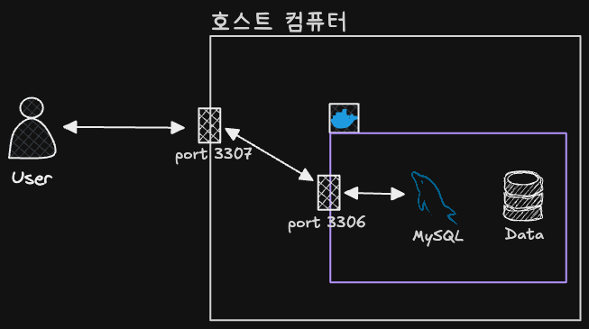
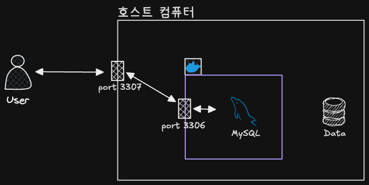

# 3_Docker Volume

## 1. 도커 볼륨

### 🔹 컨테이너가 가진 문제점

- 프로그램을 컨테이너로 실행 중인데, 프로그램에 업데이트가 생겼다면 도커는 기존 이미지를 지우고 새로운 이미지로 컨테이너를 실행시켜야 함
- 따라서 이 상황에선 기존 컨테이너 내부에 있던 데이터도 같이 삭제됨
- 만약 이 컨테이너가 DBMS를 실행하는 컨테이너였다면, DB의 데이터도 같이 삭제되는 것
- 이러한 문제를 해결하기 위해 도커는 볼륨이라는 개념을 사용

### 🔹 도커 볼륨이란

- 도커 볼륨 : 도커 컨테이너에서 데이터를 영속적으로 저장하기 위한 방법
- 볼륨은 컨테이너 자체의 저장 공간을 사용하지 않고, 호스트 자체의 저장 공간을 공유해서 사용하는 형태

### 🔹 named volume

- 볼륨을 사용하는 명령어

  ```bash
  # docker run -v [호스트의 디렉터리 절대경로]:[컨테이너의 디렉터리 절대경로] 이미지명[:태그명]
  ```

  - 이때 `[호스트의 디렉터리 절대경로]`에 디렉터리가 이미 존재하면, 호스트 디렉터리가 컨테이너의 디렉터리를 덮어씀
  - `[호스트의 디렉터리 절대경로]`에 디렉터리가 존재하지 않으면, `[호스트의 디렉터리 절대경로]`에 디렉터리를 새로 만들고, 컨테이너 디렉터리에 있는 파일을 호스트 디렉터리로 복사

## 2. 실습 : Docker로 MySQL 실행

### 🔹 Docker로 MySQL 실행

- MySQL 이미지로 컨테이너 실행하기

  ```bash
  docker run -e MYSQL_ROOT_PASSWORD=abcd1234 -p 3307:3306 -d mysql
  ```

  - `docker pull`은 생략 가능 → `docker run`을 했을 때 해당 이미지가 없다면, Dockerhub에서 해당 이미지를 다운 받아서 실행함
  - `-e` : environment : 환경변수 설정 명령어

- 각 이미지에 필요한 옵션 정보는 Dockerhub에 문서를 보면 ‘How to use image’에 설명되어 있음
- 실행 중인 MySQL 컨테이너 안으로 접속하기
  ```bash
  docker exec -it [컨테이너ID] bash
  # bash-5.1#
  ```
- 컨테이너에서 다음 명령어 실행 : 환경변수 값 출력
  ```bash
  # bash-5.1# echo $MYSQL_ROOT_PASSWORD
  # abcd1234
  ```
- 컨테이너가 잘 실행되고 있는지 체크
  ```bash
  docker ps
  ```
- 컨테이너 로그 체크
  ```bash
  	docker logs [컨테이너ID 또는 컨테이너명]
  ```
- DBeaver에 연결해보기
  - localhost:3307로 연결



### 🔹 컨테이너를 종료하면 해당 컨테이너의 데이터도 삭제

- MySQL 컨테이너에 접속
  ```bash
  docker exec -it [컨테이너ID] bash
  ```
- 컨테이너에서 MySQL에 접근하기
  ```bash
  $ mysql -u root -p
  mysql>
  ```
- MySQL 내부에서 DB 조회
  ```bash
  mysql> show databases;
  +--------------------+
  | Database           |
  +--------------------+
  | information_schema |
  | mysql              |
  | performance_schema |
  | sys                |
  +--------------------+
  4 rows in set (0.012 sec)
  ```
- DB 생성하기
  ```bash
  mysql> create database test_db;
  mysql> show databases;
  +--------------------+
  | Database           |
  +--------------------+
  | information_schema |
  | mysql              |
  | performance_schema |
  | sys                |
  | test_db            |
  +--------------------+
  5 rows in set (0.003 sec)
  ```
- MySQL 컨테이너 중단 후 다시 해당 컨테이너 실행하기

  ```bash
  docker stop [컨테이너ID]
  docker start [컨테이너ID]
  docker exec -it [컨테이너ID] bash
  # MySQL에 접속해서 show databases; 명령어 실행
  ```

  - 컨테이너 중단 후 다시 실행해도 데이터는 저장되어 있음

- MySQL 컨테이너 종료 후 다시 MySQL 컨테이너 실행하기

  ```bash
  docker stop [컨테이너ID]
  docker rm [컨테이너ID]

  # MySQL 이미지 다시 실행
  docker run -e MYSQL_ROOT_PASSWORD=password123 -p 3307:3306 -d mysql
  docker exec -it [컨테이너ID] bash
  # MySQL에 접속해서 show databases; 명령어 실행
  ```

  - 아까 생성한 DB가 없어진 것을 확인 가능

- 이 방식은 볼륨을 사용하지 않고 MySQL 컨테이너를 띄워서, 컨테이너를 삭제하면 MySQL 내부에 있는 데이터도 삭제됨
  - 이를 방지하기 위해 볼륨을 활용해 MySQL 컨테이너를 띄워야함
- 컨테이너를 삭제할 일은 생각보다 자주 있음
  - 실행 옵션⋅이미지 버전⋅포트⋅환경변수⋅이름 변경, 이미지 업데이트 등
  - 이럴때 해당 데이터는 유지하고 싶을 때 볼륨을 사용

### 🔹 볼륨(Volume)을 활용해 컨테이너 띄우기

- 컨테이너의 데이터를 저장하고 싶은 폴더를 호스트 컴퓨터에 생성
- 이 디렉터리는 비워져있어야, 컨테이너의 데이터를 이 디렉터리로 마운트 가능
  ```bash
  practice-docker $ pwd # 현재 경로
  /Users/sangunlee6/Desktop/dev/practice-docker
  practice-docker $ mkdir mysql-data # 데이터 저장 디렉터리 생성
  ```
- MySQL 컨테이너 띄우기
  ```bash
  # docker run -e MYSQL_ROOT_PASSWORD=abcd1234 -p 3307:3306 -v {호스트의 절대경로}/mysql-data:/var/lib/mysql -d mysql
  docker run -e MYSQL_ROOT_PASSWORD=abcd1234 -p 3307:3306 -v /Users/sangunlee6/Desktop/dev/practice-docker
  /mysql-data:/var/lib/mysql -d mysql
  ```
- MySQL 컨테이너에 접속해서 DB 만들기

  ```bash
  docker exec -it [컨테이너ID] bash

  mysql -u root -p
  mysql> show databases;
  mysql> create database test_db
  mysql> show databases;
  ```

- 컨테이너 종료 후 다시 생성해보기

  ```bash
  # 컨테이너 종료
  docker rm -f [컨테이너ID]

  # 컨테이너 생성
  docker run -e MYSQL_ROOT_PASSWORD=abcd1234 -p 3307:3306 -v /Users/sangunlee6/Desktop/dev/practice-docker/mysql-data:/var/lib/mysql -d mysql

  # 컨테이너 내부 접속
  docker exec -it [컨테이너ID] bash
  # mysql 접속해서 DB 조회
  mysql -u root -p
  mysql> show databases; # 아까 생성한 test_db가 그대로 있는 것을 확인
  ```



### 🔹 MySQL 컨테이너 삭제하고 다시 띄워보기

```bash
docker rm -f [컨테이너ID]

# mysql root 비밀번호 변경해서 실행
docker run -e MYSQL_ROOT_PASSWORD=aaaa1234 -p 3307:3306 -v /Users/sangunlee6/Desktop/dev/practice-docker/mysql-data:/var/lib/mysql -d mysql

docker exec -it [컨테이너ID]
mysql -u root -p # 변경된 비밀번호로 접속이 안됨, 이전 비밀번호로만 접속 가능
```

- 볼륨으로 설정해둔 폴더에 root 계정의 비밀번호도 저장되어 있으므로, 새로운 비밀번호를 설정해도 의미가 없고 예전 비밀번호로 접속해야 함
