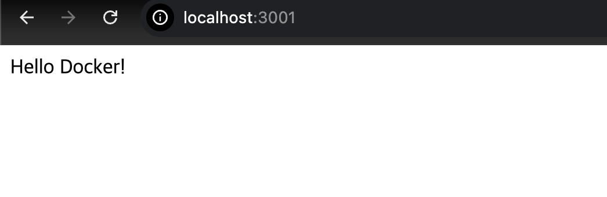
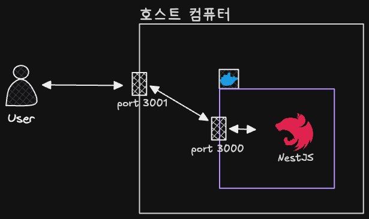

# 4_Dockerfile

## 1. Dockerfile이란

### 🔹 Dockerfile

- Dockerfile : 도커 이미지를 만드는 파일
- 도커 파일을 이용해서 나만의 도커 이미지를 만들 수 있음

## 2. FROM : 베이스 이미지

### 🔹 베이스 이미지

- 도커 컨테이너를 만들 때, 특정한 이미지를 바탕으로 추가적인 세팅을 할 수 있음
- 여기서 특정한 이미지를 베이스 이미지라고 함

### 🔹 사용법

```docker
FROM [이미지명]
FROM [이미지명]:[태그명]
```

- `태그명`을 적지 않으면 해당 이미지의 최신 버전(`latest`)을 사용

### 🔹 실습

1. Dockerfile 만들기

   ```docker
   # Node.js
   FROM node
   ```

2. Dockerfile을 기반으로 이미지 만들기

   ```bash
   # docker build -t [이미지명]:[태그명] [Dockerfile이 존재하는 디렉터리 경로]
   docker build -t my-node-server .
   ```

   - 태그명을 적지 않으면 `latest`로 설정됨
   - 이때 도커파일이 존재하는 경로는 상대 경로이므로, 해당 디렉터리에 들어가서 명령어 입력

3. 이미지를 기반으로 컨테이너 실행

   ```bash
   docker run -d my-node-server
   ```

4. 컨테이너 조회

   ```bash
   docker ps # 저 도커파일은 실행하고 바로 종료됨, 내부에 하는 일이 정의되어 있지 않으므로
   docker ps -a # 종료되어 있는 것 확인
   ```

5. 도커 파일 수정

   ```docker
   FROM node

   ENTRYPOINT ["/bin/bash", "-c", "sleep 5000"]
   ```

6. 컨테이너 내부에 접속해서 Node.js 설치 확인

   ```bash
   docker build -t my-node-server . # 이미지 다시 빌드
   docker run -d my-node-server # 컨테이너 실행
   docker ps # 실행 중인 컨테이너 조회
   docker exec -it <컨테이너 ID> bash # 컨테이너 접속

   $ node -version # 설치 확인
   # v26.3.0
   ```

### 🔹 도커 이미지 빌드 명령어

- 도커 파일을 바탕으로 도커 이미지 빌드

  ```bash
  docker build -t my-node-server .
  ```

  - -t : tag
  - 이 옵션이 빠지면 build 명령어로 인식이 안되므로, -t를 붙여야함
  - [이미지명] 뒤에 [:태그명]을 붙이지 않으면, latest로 생성

## 3. 종료된 컨테이너에 접속하는 방법

- 문제 상황 : `docker exec -it <컨테이너ID> bash`는 실행 중인 컨테이너에만 접속할 수 있음
- 따라서 이를 해결하기 위해 시스템을 일정 시간 동안 정지시켜서, 내부 접속할 수 있도록 설정 가능
- 도커 파일에 아래 코드를 추가
  ```docker
  ENTRYPOINT ["/bin/bash", "-c", "sleep 500"] # 500초 동안 시스템을 일시정지 시키는 명령어
  ```

## 4. COPY

### 🔹 COPY의 의미

- 호스트 컴퓨터에 있는 파일을 복사해서 컨테이너로 전달

### 🔹 사용법

```docker
COPY [호스트 컴퓨터에 있는 복사할 파일의 경로] [컨테이너에서 파일이 위치할 경로]

# 예시
COPY app.txt /app.txt
```

### 🔹 실습 : 파일 복사

1. app.txt 파일 생성
2. Dockerfile 생성 후 이미지 생성 및 컨테이너 실행

   ```docker
   FROM ubuntu

   COPY app.txt /app.txt

   # 디버깅용 코드
   ENTRYPOINT ["/bin/bash", "-c", "sleep 500"]
   ```

   ```bash
   docker build -t my-ubuntu .
   docker run -d my-ubuntu
   docker exec -it [컨테이너ID] bash
   root@41e9995e7310:/# ls
   app.txt  boot  etc   lib    mnt  proc  run   srv  tmp  var
   bin      dev   home  media  opt  root  sbin  sys  usr
   root@41e9995e7310:/# cat app.txt
   hello docker
   ```

   - 호스트 컴퓨터에 있는 app.txt가 ubuntu 컨테이너에 복사된 것을 확인 가능

### 🔹 실습 : 폴더 안에 있는 모든 파일들을 컨테이너로 복사

1. my-app 디렉터리 생성 후 디렉터리 안에 파일 생성
2. Dockerfile 생성 후 이미지 생성 및 컨테이너 실행

   ```docker
   FROM ubuntu

   COPY my-app /my-app/

   ENTRYPOINT ["/bin/bash", "-c", "sleep 500"]
   ```

   - 디렉터리를 복사할 때는 맨 끝에 `/`를 추가하기
     - ⭕️ `/my-app/`
     - ❌ `/my-app`

3. 컨테이너 안에 접속 후 `my-app` 디렉터리가 복사됐는지 확인

   ```bash
   root@31549b4a413b:/# ls
   bin   dev  home  media  my-app  proc  run   srv  tmp  var
   boot  etc  lib   mnt    opt     root  sbin  sys  usr
   root@31549b4a413b:/# cd my-app/
   root@31549b4a413b:/my-app# ls
   file1.txt  file2.txt  file3.txt
   ```

### 🔹 .dockerignore

- 특정 파일 또는 폴더만 COPY를 하고 싶지 않을 수 있음 → 이때 `.dockerignore` 사용

1. `.dockerignore` 파일 생성

   ```bash
   /my-app/file1.txt
   ```

2. Dockerfile로 이미지 생성 및 컨테이너 실행
3. 컨테이너 안에 들어가서 my-app 디렉터리 확인
   - `my-app` 디렉터리는 잘 복사됐지만, `.dockerignore`에 들어간 `file1.txt`는 COPY되지 않은 것을 확인할 수 있음

   ```bash
   root@27bccd64da92:/# ls
   bin   dev  home  media  my-app  proc  run   srv  tmp  var
   boot  etc  lib   mnt    opt     root  sbin  sys  usr
   root@27bccd64da92:/# cd my-app/
   root@27bccd64da92:/my-app# ls
   file2.txt  file3.txt
   ```

## 5. ENTRYPOINT

### 🔹 ENTRYPOINT의 의미

- 컨테이너가 생성되고 최초로 실행할 떄 수행되는 명령어

### 🔹 사용법

```docker
# 문법
ENTRYPOINT [명령문...]

# 예시
ENTRYPOINT ["node", "dist/main.js"]
```

### 🔹 실습 : 컨테이너 실행 후 hello 출력

- Dockerfile

  ```docker
  FROM ubuntu

  ENTRYPOINT ["/bin/bash", "-c", "echo hello"]
  ```

- 도커 컨테이너 실행 후 로그 확인 : `hello`가 잘 찍혀있는 것을 확인 가능

  ```bash
  docker build -t my-ubuntu .
  docker run -d my-ubuntu
  # 6fa4ddaaef1dc28325a760c00ae49760ef477eb381f7dcd4eabc57deda46e736

  docker logs 6fa
  # hello
  ```

### 🔹 실습 : 컨테이너 실행 후 여러 명령어 실행

- 컨테이너 실행 후 여러 명령어를 실행하고 싶을 때는, 스크립트를 활용
- 스크립트 파일 정의

  ```bash
  #!/bin/bash
  set -e

  echo "start init"
  echo "run migration"
  echo "start app"
  ```

- Dockerfile
  - ENTRYPOINT에 스크립트 실행

  ```docker
  FROM ubuntu

  COPY entrypoint.sh /entrypoint.sh
  RUN chmod +x /entrypoint.sh

  ENTRYPOINT ["/entrypoint.sh"]
  ```

- 컨테이너 실행 후 로그를 확인
  ```bash
  docker logs [컨테이너ID]
  start init
  run migration
  start app
  ```

## 6. RUN

### 🔹 의미

- `RUN` : 이미지 생성 과정에서 명령어를 실행시켜야 할 때 사용

### 🔹 사용법

```docker
RUN [명령문]

RUN npm install
```

### 🔹 `RUN` vs `ENTRYPOINT`

- 둘 다 명령어를 실행하는 명령어지만, 실행 타이밍이 다름
- `RUN` : 이미지 생성 과정에서 필요한 명령어를 실행할 때
- `ENTRYPOINT` : 생성된 이미지로 컨테이너를 생성한 직후에 명령어를 실행할 때

### 🔹 실습

- 우분투 컨테이너를 만들 때, git이 깔려있게 만들고 싶음
- Dockerfile

  ```docker
  FROM ubuntu

  RUN apt update && apt install -y git

  ENTRYPOINT ["/bin/bash", "-c", "sleep 500"]
  ```

- 이미지 빌드 및 컨테이너 실행

  ```bash
  docker build -t my-ubuntu .
  docker run -d my-ubuntu

  docker exec -it [컨테이너ID] bash

  root@c7137d530f8d:/ git -v # 컨테이너 안에 git이 잘 설치됐는지 확인
  # git version 2.53.0
  ```

## 7. WORKDIR

### 🔹 의미

- `WORKDIR`로 작업 디렉터리를 전환하면, 이후 등장하는 모든 `RUN`, `CMD`, `ENTRYPOINT`, `COPY`, `ADD` 명령문은 해당 디렉터리를 기준으로 실행됨
- 작업 디렉터리를 지정하는 이유는 컨테이너 내부 폴더를 깔끔하게 관리하기 위함
- Dockerfile을 통해 생성되는 파일을 특정 폴더에 정리해두는 것이 유지보수에 유리함

### 🔹 사용법

```docker
WORKDIR [작업 디렉터리로 사용할 절대경로]
```

### 🔹 실습

- 호스트 컴퓨터에 `app.txt`, `src/`, `entrypoint.sh` 만들기(컨테이너로 `COPY`할 대상)
- Dockerfile 생성
  - 현재 디렉터리의 파일들을 컨테이너로 복사
  - WORKDIR을 사용하지 않았을 때 파일 구성

  ```docker
  FROM ubuntu

  # 현재 디렉터리의 모든 내용을, 컨테이너의 루트 디렉터리에 복사
  COPY ./ ./

  ENTRYPOINT ["/bin/bash", "-c", "sleep 500"]
  ```

- 컨테이너 실행 후 접속해서 파일 목록 조회
  - src/, app.txt, entrypoint.sh 등이 다른 디렉터리와 섞여있음
  ```bash
  docker exec -it [컨테이너ID] bash
  root@ba24e0fca435:/# ls
  Dockerfile  bin   dev            etc   lib    mnt         opt   root  sbin  srv  tmp  var
  app.txt     boot  entrypoint.sh  home  media  mysql-data  proc  run   src   sys  usr
  ```
- Dockerfile 수정
  - WORKDIR 사용

  ```docker
  FROM ubuntu

  WORKDIR /my-dir

  # 현재 디렉터리의 모든 내용을, 컨테이너의 /my-dir 디렉터리에 복사
  COPY ./ ./

  ENTRYPOINT ["/bin/bash", "-c", "sleep 500"]
  ```

- 컨테이너에 접속해서 파일 목록 조회

  ```bash
  docker exec -it [컨테이너ID] bash

  # 접속할 때부터 /my-dir로 들어감
  # 해당 디렉터리 안에 COPY한 내용들이 들어감
  root@bdbde8b6c021:/my-dir# ls
  Dockerfile  app.txt  entrypoint.sh  mysql-data  src

  # 다른 ubuntu의 디렉터리와 도커파일에서 복사한 my-dir가 구분되어 있음
  root@bdbde8b6c021:/my-dir# cd ..
  root@bdbde8b6c021:/# ls
  bin   dev  home  media  my-dir  proc  run   srv  tmp  var
  boot  etc  lib   mnt    opt     root  sbin  sys  usr
  ```

## 8. NestJS 백엔드 서버를 도커로 실행하기

### 🔹 NestJS를 도커로 실행하기

1. NestJS 프로젝트 생성

   ```bash
   # NestJS CLI 설치
   npm i -g @nestjs/cli

   # 프로젝트명 : nestjs-server
   nest new nestjs-server
   ```

2. Dockerfile 작성
   - `/nestjs-server` 디렉터리 안에서 작성

   ```docker
   FROM node

   WORKDIR /app

   COPY ./ ./

   RUN npm install
   RUN npm run build

   EXPOSE 3000

   ENTRYPOINT ["node", "dist/main.js"]
   ```

3. .dockerignore 작성
   - `RUN`으로 `npm install`을 하므로, 무거운 node_modules 디렉터리는 컨테이너로 복사할 필요 없음

   ```docker
   node_modules
   ```

4. 컨테이너 실행 후 호스트 컴퓨터로 접속

   ```docker
    docke run -d -p 3001:3000 nestjs-server
   ```

   

5. 컨테이너 중지, 삭제하기, 이미지 삭제하기

   ```bash
   docker stop {컨테이너 ID}
   docker rm {컨테이너 ID}
   docker image rm {이미지 ID}
   ```

### 🔹 그림으로 이해하기


