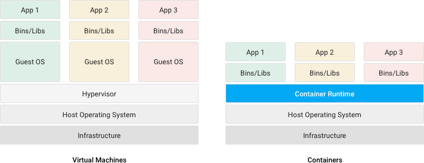
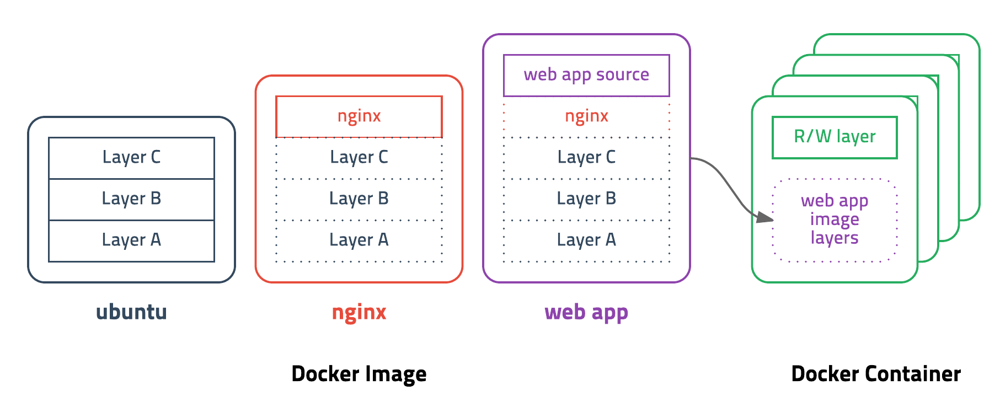
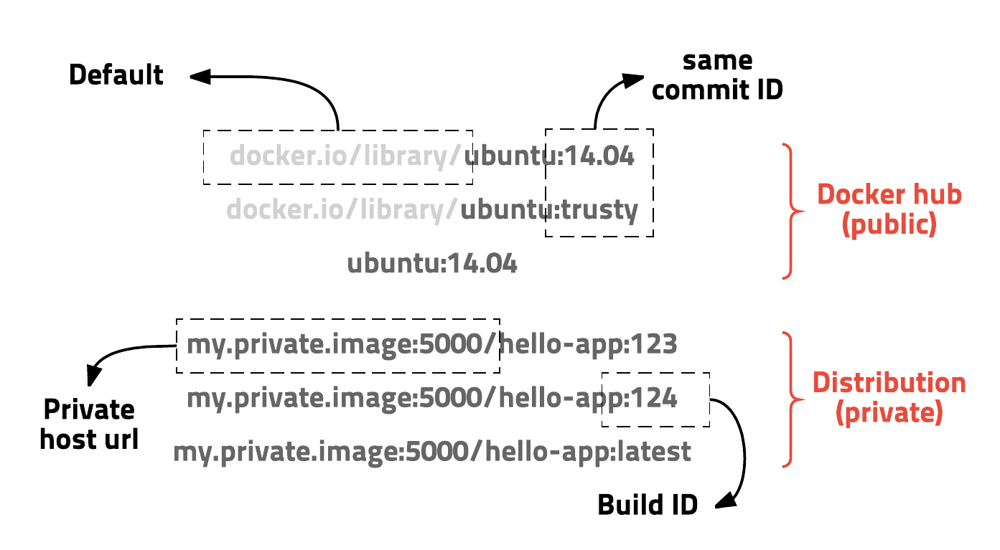
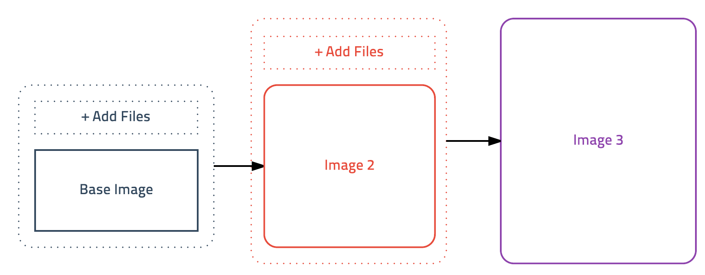
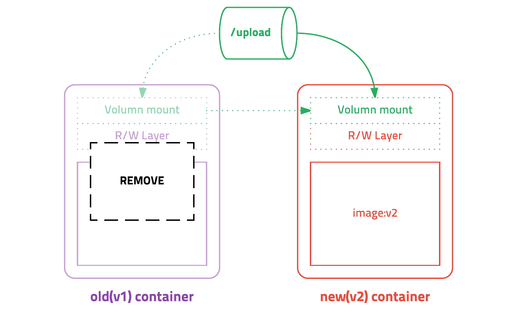
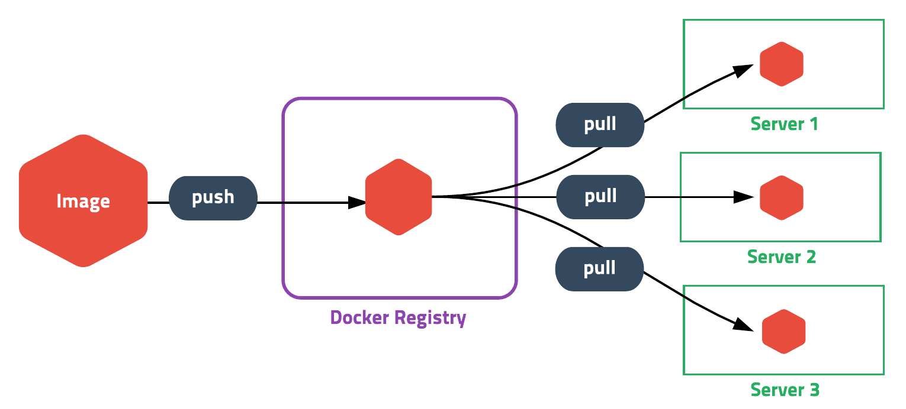

# 도커

> 참고 자료 : [https://cultivo-hy.github.io/docker/image/usage/2019/03/14/Docker정리/](https://cultivo-hy.github.io/docker/image/usage/2019/03/14/Docker%EC%A0%95%EB%A6%AC/)
>

## 1. 도커(Docker)란

<br>

📌 도커

- 컨테이너 기반의 오픈소스 가상화 플랫폼
- 즉, 컨테이너를 관리하는 플랫폼

<br>

📌 도커의 장점과 활용

- 프로그램의 배포 및 관리를 단순하게 해줌
    - ∵ 다양한 프로그램, 실행환경을 컨테이너로 추상화하고 동일한 인터페이스 제공
- 백엔드 프로그램, DB 서버, 메세지 큐 등 어떤 프로그램도 컨테이너로 추상화 가능 + 조립 PC, AWS 등 어디서든 실행 가능

<br>

## 2. 컨테이너(Container)란

<br>

📌 프로그램의 서로 다른 실행 환경

- 프로그램 실행을 위해 OS, 라이브러리, 필요한 파일 등 실행 환경이 필요
- 하나의 시스템 위에서 둘 이상의 프로그램을 동시에 실행하려고 한다면 문제가 발생 가능
    - ex. 프로그램 A, B가 동일한 라이브러리를 사용하지만 다른 버전이 필요한 경우
    - ex. 프로그램 A, B의 OS가 다른 경우
- 두 프로그램을 위한 시스템을 각각 준비하면 되지만 이는 비용이 많이 발생함
- 이러한 문제점을 해결하는 것이 컨테이너

<br>

📌 컨테이너

- 다른 실행 환경과의 간섭을 막고 프로그램 실행의 독립성을 확보해주는 OS 수준의 격리 기술
- 컨테이너 ≒ 프로그램 + 실행환경 + OS, 시스템 자원을 사용할 수 있는 API

<br>

📌 가상 머신(Virtual Machine)과 컨테이너 비교

| **구분** | **가상 머신 (Virtual Machine)** | **컨테이너 (Container)** |
| --- | --- | --- |
| **가상화 수준** | 하드웨어 가상화 | 운영체제 수준 가상화 |
| **구동 방식** | 하이퍼바이저 위에 게스트 OS 구동 | 호스트 OS의 커널을 공유하며 직접 실행 |
| **운영체제** | 각 VM이 독립적인 OS 필요 | OS 커널을 공유, 별도의 OS 필요 없음 |
| **리소스 사용량** | 무겁고 메모리/CPU 사용량이 많음 | 가볍고 메모리/CPU 사용량이 적음 |
| **시작 속도** | OS 부팅 필요 → 느림 | 즉시 실행 가능 → 빠름 |
| **격리 수준** | 강력한 보안 격리 | 가벼운 격리, 커널 공유로 인한 보안 이슈 가능성 |

<br>



<br>

📌 컨테이너 vs 도커

- 컨테이너 : 격리된 실행 환경을 제공하는 기술
- 도커 : 프로그램을 쉽게 설치하고 실행할 수 있게 도와주는 기술로, 컨테이너, 이미지, 네트워크, 보안 같은 것들을 관리

<br>

## 3. 이미지(Image)

### 3.1 이미지

<br>

📌 이미지

- 컨테이너 실행에 필요한 파일과 설정 값을 포함하고 있는 것
- 변하지 않음(Immutable)
- 컨테이너는 이미지를 실행한 상태
    - 추가되거나 변하는 값은 이미지가 아니라 컨테이너에 저장됨
- 같은 이미지에서 여러 개의 컨테이너를 생성할 수 있음
- 컨테이너 상태가 변경되거나 삭제되더라도 이미지는 변하지 않음

<br>



<br>

### 3.2 레이어 방식

<br>

📌 도커 이미지의 용량과 문제점

- 도커 이미지의 용량은 MB~GB
    - ∵ 컨테이너를 실행하기 위한 모든 정보를 담고 있으므로
- ∴ 기존 이미지에 수정이 생겼다고 다시 이를 다운 받는 것은 비효율적
- 도커는 이 문제를 해결하기 위해 레이어(Layer)라는 개념을 사용

<br>

📌 레이어 방식

- 유니온 파일 시스템을 이용해서 여러 개의 레이어를 하나의 파일 시스템으로 사용할 수 있게 해줌
- 이미지는 여러 개의 읽기 전용 레이어로 구성됨
    - 파일이 추가/수정되면 새로운 레이어가 생성됨

<br>

📌 레이어 방식 예시

- `우분투 이미지 = A + B + C`라고 할 때
- 우분투 이미지를 베이스로 만든 Nginx는 `Nginx 이미지 = A + B + C + nginx`
- 이때 Nginx 설정 파일을 수정하면 `A + B + C`는 제외하고 `nginx`만 다시 다운받으면 되므로 효율적으로 이미지 관리

<br>

📌 컨테이너의 레이어 구조

- 컨테이너 = 이미지 레이어 + 읽기-쓰기 레이어
- 컨테이너가 실행 중에 생성하는 파일이나 수정 사항은 읽기-쓰기 레이어에 저장됨
- 이미지 레이어는 그대로 유지되므로 여러 개의 컨테이너를 생성해도 최소한의 용량만 사용

<br>

### 3.3 이미지 경로

<br>



<br>

📌 이미지 경로

- 이미지는 URL 방식으로 관리
- 경로에 태그를 붙일 수 있음

<br>

📌 이미지 경로 에시

- ubuntu 14.04 이미지
    - `docker.io/library/ubuntu:14.04` or `docker.io/library/ubuntu:trusty`
    - `docker.io/library`는 생략가능 → ∴`ubuntu:14.04`

<br>

### 3.4 Dockerfile

<br>

📌 Dockerfile

- 이미지 생성 과정을 기록한 파일
- DSL(Domain-specific language) 언어 사용
- 서버에 프로그램을 설치하기 위한 과정을 따로 적지 않고 Dockerfile로 관리

<br>

📌 Dockerfile 예시

```docker
# 베이스 이미지 : Vert.x 3.3.1이 설치된 Debian 기반 이미지
FROM subicura/vertx3:3.3.1  

ADD build/distributions/app-3.3.1.tar /  
# 로컬의 app-3.3.1.tar 파일을 컨테이너 루트 디렉토리에 복사 (압축 자동 해제됨)

ADD config.template.json /app-3.3.1/bin/config.json
# 설정 파일을 컨테이너의 지정된 경로로 복사

ADD docker/script/start.sh /usr/local/bin/
# 시작 스크립트를 /usr/local/bin/ 디렉토리에 복사하여 실행 가능하도록 설정

RUN ln -s /usr/local/bin/start.sh /start.sh
# /usr/local/bin/start.sh의 심볼릭 링크를 /start.sh로 생성 (간편 실행용)

EXPOSE 8080  
# 컨테이너가 외부와 통신할 수 있도록 8080 포트를 개방 (웹 서버 용도로 사용 가능)
EXPOSE 7000  
# 7000 포트 개방 (내부 서비스 간 통신용으로 추정)

CMD ["start.sh"]  
# 컨테이너가 시작될 때 기본적으로 start.sh 스크립트를 실행
```

<br>

# 4. 도커 기본 명령어

<br>

🎲 자주 사용하는 옵션

| 옵션 | 설명 |
| --- | --- |
| -d | detached mode(백그라운드 모드) |
| -a | 모든 요소 표시 |
| -p | 호스트와 컨테이너의 포트를 연결 (포워딩) |
| -v | 호스트와 컨테이너의 디렉토리를 연결 (마운트) |
| -e | 컨테이너 내에서 사용할 환경변수 설정 |
| –name | 컨테이너 이름 설정 |
| –rm | 프로세스 종료 시 컨테이너 자동 제거 |
| -it | -i와 -t를 동시에 사용한 것으로 터미널 입력을 위한 옵션 |

<br>

**🔍 이미지 목록 확인하기**

```docker
docker images [OPTIONS] [REPOSITORY[:TAG]]
```

<br>

**📦 이미지 빌드하기**

- 도커 이미지를 생성하는 명령어

```docker
docker build [OPTIONS] PATH | URL | -
```

<br>

**⬇️ 이미지 다운로드하기 (Pull)**

- 기본적으로 docker hub에서 이미지를 다운

```docker
docker pull [OPTIONS] NAME[:TAG|@DIGEST]
```

<br>

**⬆️ 이미지 업로드하기 (Push)**

```docker
docker push [OPTIONS] NAME[:TAG]
```

<br>

**🗑️ 이미지 삭제하기 (rmi)**

- 이미지 ID를 입력해서 삭제
    - 컨테이너가 실행 중이면 삭제 불가
    - ∵ 컨테이너는 이미지 레이어를 기반으로 실행 중이므로

```docker
docker rmi [OPTIONS] IMAGE [IMAGE...]
```

<br>

**🚀 컨테이너 실행하기**

- 이미지를 실행해서 컨테이너를 생성 및 실행

```docker
docker run [OPTIONS] IMAGE[:TAG|@DIGEST] [COMMAND] [ARG...]
```

<br>

**🔍 컨테이너 목록 확인하기**

```docker
docker ps [OPTIONS]
```

<br>

**🛑 컨테이너 중지하기 (stop)**

```docker
docker stop [OPTIONS] CONTAINER [CONTAINER...]
```

<br>

**🗑️ 컨테이너 제거하기 (rm)**

```docker
docker rm [OPTIONS] CONTAINER [CONTAINER...]
```

<br>

📈 **컨테이너 로그 보기 (logs)**

```docker
docker logs [OPTIONS] CONTAINER
```

<br>

**⚡ 컨테이너 명령어 실행하기 (exec)**

- 실행중인 컨테이너에 들어가거나 컨테이너의 파일을 실행

```docker
docker exec [OPTIONS] CONTAINER COMMAND [ARG...]
```

<br>

# 5. 도커 이미지 만들기

<br>

📌 이미지를 만드는 방법

- 도커는 컨테이너의 상태를 그대로 이미지로 저장

<br>

📌 애플리케이션을 도커 이미지로 만드는 과정(패키징)

- 리눅스 컨테이너에서 실행 중인 애플리케이션을 이미지로 만드는 경우
- 앱의 파일을 컨테이너로 복사하고 필요한 설치 작업을 수행
    - **`COPY`**: 애플리케이션 파일을 컨테이너로 복사
    - **`RUN`**: 설치 스크립트 실행 또는 패키지 설치 수행

    ```
    # 예시
    
    COPY ./app /app               # 로컬의 app 디렉터리를 컨테이너의 /app에 복사
    RUN apt-get update && \       # 필요한 패키지 설치
        apt-get install -y curl && \
        chmod +x /app/install.sh && \
        /app/install.sh           # 애플리케이션 설치 스크립트 실행
    ```

- 설치된 앱과 그 설정 상태를 그대로 이미지로 저장

<br>



<br>

# 6. 도커 컨테이너 커밋(commit)하기

<br>

📌 컨테이너 커밋

- 실행 중인 컨테이너의 상태를 새로운 이미지로 저장하는 방법
- 컨테이너 내부에서 수정한 파일, 설치한 패키지, 환경 설정 등이 모두 이미지로 저장됨

```bash
docker commit [컨테이너_ID 또는 이름] [새로운_이미지_이름]
```

<br>

📌 컨테이너 커밋 시점

- 컨테이너 내부에서 직접 수정한 작업을 빠르게 이미지로 저장하고 싶을 때
- 환경 설정을 임시 보관하고 싶을 때
- 도커 파일 없이 간단한 이미지 생성이 필요할 때

<br>

📌 일관적인 배포 환경을 위해서 커밋보다는 도커 파일을 사용하는 것이 더 좋음

<br>

# 7. 도커 이미지 Push 하기

<br>

📌 이미지 푸시

- 도커 이미지를 로컬에서 Docker Hub에 업로드하는 과정

| **단계** | **명령어** | **설명** |
| --- | --- | --- |
| 1️⃣ Docker Hub 로그인 | `docker login` | 계정 인증 |
| 2️⃣ 이미지 태그 추가 | `docker tag ubuntu-cpp-driver sangunlee/ubuntu-cpp-driver` | 업로드를 위한 태그 지정 |
| 3️⃣ Docker Hub로 이미지 Push | `docker push sangunlee/ubuntu-cpp-driver` | Docker Hub에 이미지 업로드 |
| 4️⃣ 이미지 확인 | `docker images` | 로컬 이미지 목록 확인 |

<br>

📌 이미지 태그 추가

- 이미지를 Docker Hub에 업로드하려면 → 레포지토리 형식으로 태그를 추가해야함
- 태그 형식

    ```
    <도커ID>/<이미지이름>:<태그>
    ```

    - 태그(`:latest`) 생략 시 기본값은 `latest`

<br>

# 8. DockerFile

## 8.1 Dockerfile

<br>

📌 Dockerfile

- 도커 이미지를 생성하기 위한 명령어 모음이 저장된 파일
- 도커가 이미지를 자동으로 빌드하는 스크립트 역할

<br>

📌 도커 파일의 기본 구조

```
# 1️⃣ 베이스 이미지 설정
FROM ubuntu:20.04

# 2️⃣ 작성자 정보 (선택 사항)
MAINTAINER sangunlee6@example.com

# 3️⃣ 패키지 설치
RUN apt-get update && apt-get install -y curl

# 4️⃣ 애플리케이션 파일 복사
COPY ./app /usr/src/app

# 5️⃣ 작업 디렉토리 설정
WORKDIR /usr/src/app

# 6️⃣ 컨테이너 시작 시 실행할 명령어
CMD ["python3", "app.py"]
```

<br>

📌 도커 파일의 주요 명령어

- **`FROM`**: 어떤 이미지를 기반으로 할지 지정 (ex: `ubuntu`, `node`, `alpine`)
- **`MAINTAINER`**: 이미지 작성자 정보 (현재는 `LABEL` 사용 권장)
- **`RUN`**: 컨테이너 내부에서 명령어를 실행 (ex: 패키지 설치)
- **`COPY`**: 로컬 파일을 컨테이너로 복사
- **`WORKDIR`**: 작업 디렉토리 설정
- **`CMD`**: 컨테이너가 시작될 때 실행할 기본 명령어 설정

<br>

📌 Dockerfile vs Docker Compose

| **구분** | **Dockerfile** | **Docker Compose** |
| --- | --- | --- |
| 목적 | 이미지 생성 자동화 | 여러 컨테이너를 한 번에 관리 |
| 형식 | 명령어 기반 스크립트 | YAML 포맷 구성 파일 |
| 실행 방식 | `docker build`, `docker run` | `docker-compose up` |
| 관계 | Dockerfile로 만든 이미지를 Compose에서 사용 | Compose가 여러 Dockerfile을 조합 가능 |

<br>

## 8.2 도커 파일로 이미지 빌드하기

<br>

📌 기본 명령어

```bash
docker build -t <이미지_이름>:<태그> <Dockerfile_경로>
```

- `<Dockerfile_경로>` 도커 파일의 내용으로 이미지 생성
- 생성된 이미지의 이름이 `<이미지_이름>:<태그>`

<br>

📌 `docker build` 명령어 과정

- docker build 명령어 실행 → 도커 파일에 정의된 명령어를 한 줄씩 실행
- 실제 명령어가 실행되므로 빌드 시간이 소요됨
- 빌드가 완료되면 **`Successfully built xxxxxxxx`** 메시지 출력됨

<br>

📌 도커 필드 과정의 반복적인 구조

- 도커 빌드는 명령어마다 아래 과정을 반복하여 최종 이미지를 완성

  1️⃣ 임시 컨테이너 생성

  2️⃣ 명령어 수행 (RUN, COPY 등)

  3️⃣ 결과를 이미지로 저장

  4️⃣ 임시 컨테이너 삭제

  5️⃣ 새로운 임시 컨테이너 생성 후 다음 명령어 수행


<br>

📌 도커 이미지 레이어 및 캐시

- 명령어를 실행할 때마다 이미지 레이어가 저장됨
- 도커 파일이 변경되지 않았다면 기존 레이어를 캐시처럼 재사용해서 빌드 속도 최적화

<br>

# 9. 컨테이너 업데이트



<br>

📌 도커 컨테이너 업데이트 과정

1. 새 버전 이미지를 다운(pull)
2. 기존 컨테이너 삭제(stop, rm)
3. 새 이미지로 새 컨테이너 실행(run)

<br>

📌 컨테이너 업데이트 시 데이터 관리

- 컨테이너 삭제 시 유지해야하는 데이터는 반드시 외부 스토리지에 저장
    - 옵션 1 : AWS S3 같은 클라우드 서비스
    - 옵션 2 : 데이터 볼륨을 컨테이너에 추가
- 데이터 볼륨을 사용하면 해당 디렉터리는 컨테이너와 별도로 저장됨

  → ∴ 컨테이너를 삭제해도 데이터가 지워지지 않음

<br>

# 10. 이미지 저장소



<br>

📌 Docker Registry

- 빌드한 도커 이미지를 저장하고 공유하는 이미지 저장소
- 이미지 저장소에 이미지를 푸시해서 공유할 수 있고, 이미지를 풀 받아서 사용 가능

<br>

📌 대표적인 Docker Registry

| **이름** | **설명** |
| --- | --- |
| **Docker Hub** | 가장 널리 사용되는 공개 Docker 레지스트리 |
| **AWS ECR** | AWS의 관리형 Docker 레지스트리 |
| **GitHub Container Registry** | GitHub의 Docker 이미지 저장소 |
| **Private Registry** | 조직 내에서 운영하는 개인용 레지스트리 |

<br>

# 11. 배포하기

<br>

📌 배포 프로세스

1. 이미지 빌드: 애플리케이션과 의존성을 모두 포함한 Docker 이미지 생성
2. 이미지 푸시: Docker Hub에 이미지 업로드
3. 이미지 풀: 배포 서버에서 이미지 다운로드
4. 컨테이너 실행: 단 한 줄의 명령어로 서비스 시작

```bash
docker run -d -p 80:80 myapp:1.0
```

<br>

📌 기존 방식 vs 컨테이너 배포 방식

| **항목** | **기존 배포 방식** | **컨테이너 배포 방식** |
| --- | --- | --- |
| **환경 의존성** | OS, 프레임워크, 라이브러리 설치 필요 | 모든 의존성을 포함한 이미지 사용 |
| **배포 도구** | FTP 등 다양 | Docker CLI 또는 Kubernetes 사용 |
| **배포 프로세스** | 복잡한 설정 → 빌드 → 테스트 → 배포 | 이미지 다운로드 → 컨테이너 실행 |
| **일관성** | 개발 환경과 운영 환경이 다르면 에러 발생 가능 | 어디서나 동일한 이미지로 일관성 유지 |
| **배포 속도** | 새로운 서버 설정 시 시간이 많이 소요됨 | 이미지 다운로드 후 빠르게 배포 가능 |
| **유지보수** | 의존성 업데이트, 환경 설정 변경이 번거로움 | 이미지 재빌드 후 재배포하면 끝 |